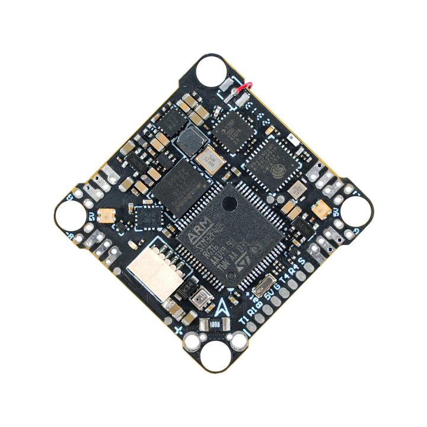
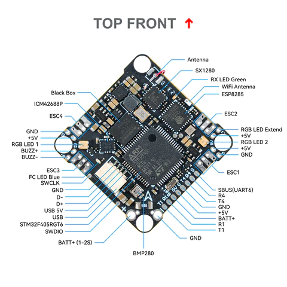
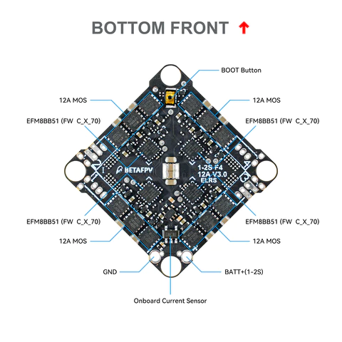
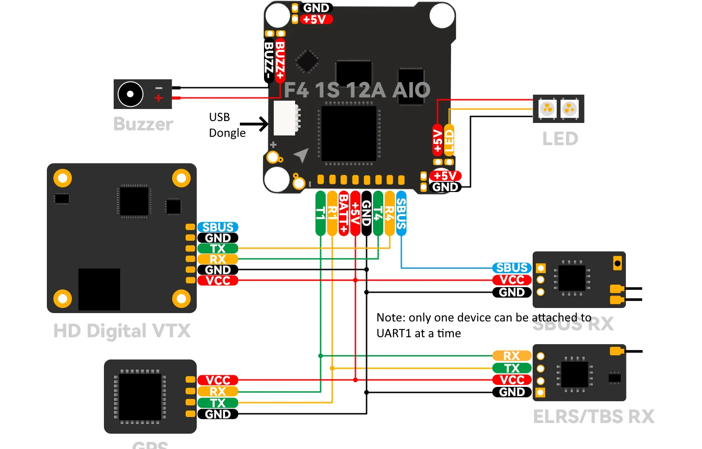

.. _common-betafpvf405 :

========================
BETAFPV F4 1S 12A AIO V3 
========================

The BETAFPV F4 1S 12A AIO V3 is a small autopilot for 1-2S tiny whoop quadcopter applications with integrated 12A(25A peak) ESC and ELRS receiver.

the above image and some content courtesy of `BETAFPV <http://betafpv.com/>`__

.. note::

	Due to flash memory limitations, this board does not include all ArduPilot features.
        See :ref:`Firmware Limitations <common-limited_firmware>` for details.

.. warning:: this firmware only applies to the F405 variant of the autopilot.

Specifications
==============

-  **Processor**

   -  STM32F405RGT6 ARM (168MHz)
   -  16MByte flash for logging

-  **Sensors**

   -  ICM-42688P IMU (accel, gyro)
   -  BMP-280 barometer
   -  Voltage & 234A current sensor

-  **Power**

   -  1S - 2S Lipo input voltage with voltage monitoring
   -  5V, 2A BEC for internal and peripherals including air unit power

-  **Interfaces**

   -  4 Motor outputs
   -  SBUS input with inversion for optional use instead of internal ELRS RX
   -  3x UARTs/serial for GPS and other peripherals, 4th UART internally tied to ELRS board
   -  USB-C port on remote dongle

-  **Size and Dimensions**

   - 20.5 x 20.5 mounting holes
   - 4.68g

Where to Buy
============

`BETAFPV <https://betafpv.com/collections/brushless-flight-controller/products/f4-1s-12a-aio-brushless-flight-controller-v3-0>`__

Pinout
======

Wiring Diagram
==============

Default UART order
==================

The UARTs are marked Rn and Tn in the above pinouts. The Rn pin is the
receive pin for UARTn. The Tn pin is the transmit pin for UARTn.

 - SERIAL0 -> USB
 - SERIAL1 -> USART1 (GPS) (DMA capable)
 - SERIAL3 -> UART3 (Internally connected to ELRS module)
 - SERIAL4 -> UART4 (DJI)
 - SERIAL6 -> UART6 (RX pin only USER/SBUS alternate) (via inverter from SBUS pin, DMA capable) 

Serial protocols shown are defaults, but can be adjusted to personal preferences.

Servo/Motor Outputs
===================

Internally connected to integrated 4in1 ESC with BlueJay firmware. Bi-Directional DShot capable and are configured as such by default.

RC Input
========

UART3 is tied internally to a 2.4GHz ELRS receiver module and defaulted to that protocol.

There is a pin provided for SBUS input also, but the :ref:`SERIAL3_PROTOCOL<SERIAL3_PROTOCOL>` would have to be changed to something other than "23", and the :ref:`SERIAL6_PROTOCOL<SERIAL6_PROTOCOL>` set to "23", instead.

.. note:: UART1 is configured by default for GPS but can be re-tasked for RC input for CRSF.etc. by changing its :ref:`SERIAL1_PROTOCOL<SERIAL1_PROTOCOL>` to "23". You can also have more than one receiver in the system at a time (usually used for long range hand-offs to a remote TX). See :ref:`common-multiple-rx` for details.

Any UART can be used for RC system connections in ArduPilot also, and is compatible with all protocols except PPM (SBUS requires external inversion on other UARTs). See :ref:`common-rc-systems` for details.

OSD Support
===========

The BETAFPV F4 1S 12A AIO V3  supports DJI HD air units with telemetry using UART4 RX/TX. See :ref:`common-msp-osd-overview-4.2` for more info.

Battery Monitor Configuration
=============================
These settings are set as defaults when the firmware is loaded (except :ref:`BATT_AMP_PERVLT<BATT_AMP_PERVLT>` which needs to be changed from the default value). However, if they are ever lost, you can manually set the parameters:

Enable Battery monitor.

:ref:`BATT_MONITOR<BATT_MONITOR>` =4

Then reboot.

:ref:`BATT_VOLT_PIN<BATT_VOLT_PIN>` 12

:ref:`BATT_CURR_PIN<BATT_CURR_PIN>` 11

:ref:`BATT_VOLT_MULT<BATT_VOLT_MULT>` 11.0

:ref:`BATT_AMP_PERVLT<BATT_AMP_PERVLT>` 70.8

Connecting a GPS/Compass module
===============================

This board does not include a GPS so an :ref:`external GPS <common-positioning-landing-page>` can be connected to allow operation of position holding/tracking modes (ie LOITER,etc.).

.. warning:: since a compass cannot be attached, yaw information can only be determined with a GPS attached and using ArduPilot's internal GSF yaw estimator. This yaw estimator is particularly sensitive to vibration and could result in erratic operation, or even a crash, if vibration is moderate or severe. Therefore, using positioning modes is not recommended.

Firmware
========
This board does not come with ArduPilot firmware pre-installed. Use instructions here to load ARduPilot the first time :ref:`common-loading-firmware-onto-chibios-only-boards`.

Firmware for this board can be found `here <https://firmware.ardupilot.org>`_ in  sub-folders labeled
"BETAFPV-F405".

[copywiki destination="plane,copter,rover,blimp"]

