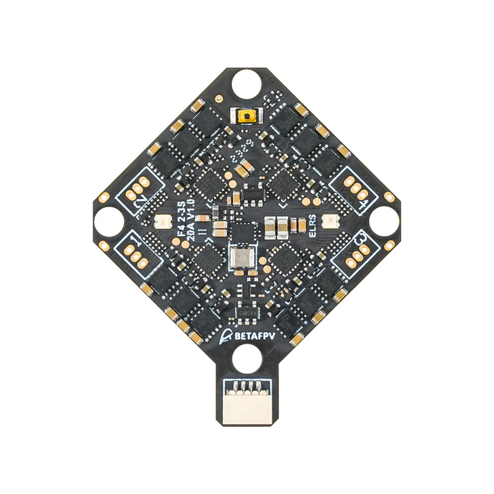
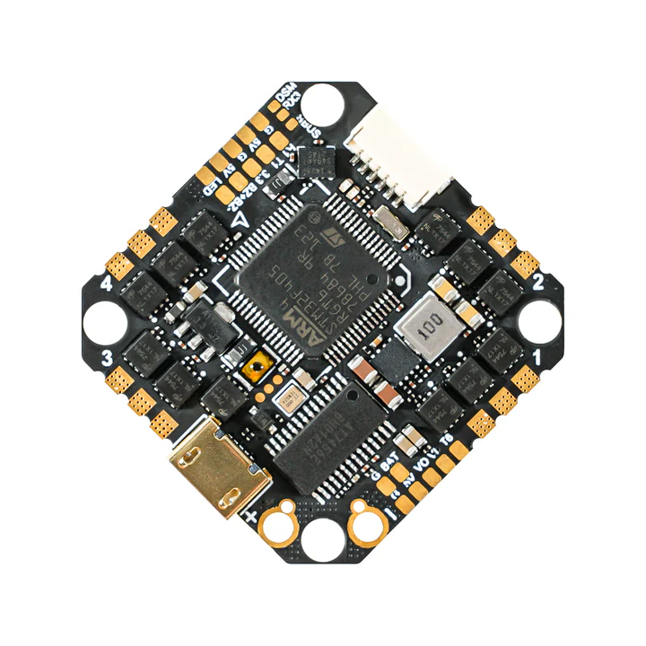
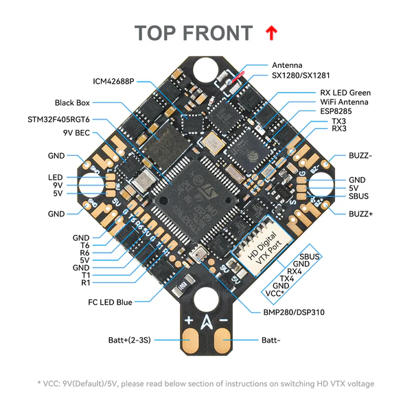
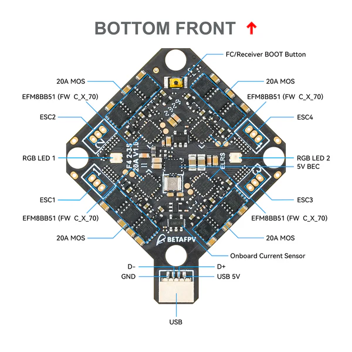
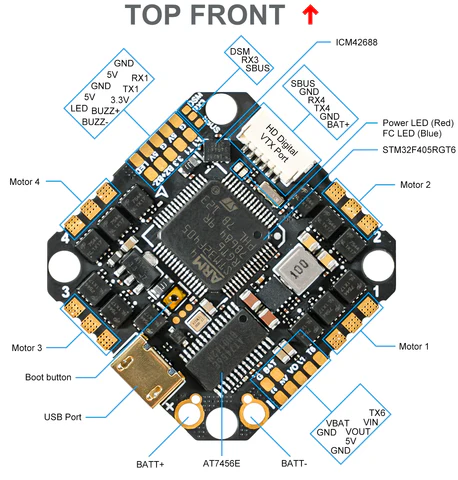
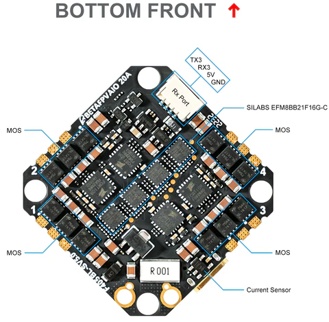

.. _common-betafpvf405 :

===================
BETAFPV F405 Family
===================

The BETAFPV F405 family are autopilots intended for smaller size ("Whoop") multicopters. ArduPilot supports the following units:

* `BETAFPV F4 1S 12A AIO Brushless Flight Controller V3 <https://betafpv.com/collections/brushless-flight-controller/products/f4-1s-12a-aio-brushless-flight-controller-v3-0>`__. Referred to hereafter as the " Whoop AIO" for brevity.
* `BETAFPV F4 2-3S 20A AIO FC V1 <https://betafpv.com/collections/flight-controller-1/products/f4-2-3s-20a-aio-fc-v1>`__. Referred to hereafter as the "AIO" for brevity.
* `BETAFPV F405 4S 20A Toothpick Brushless Flight Controller V5 <https://betafpv.com/collections/flight-controller-1/products/f405-4s-20a-toothpick-brushless-flight-controller-v5-blheli_s-icm42688>`__. Referred to hereafter as the "Toothpick" for brevity.

Whoop AIO
=========

.. image:: ../../../images/betafpvf405.png
    :target: ../_images/betafpvf405.png
    :width: 450px

AIO
===

Toothpick
=========

the above image and some content courtesy of `BETAFPV <http://betafpv.com/>`__

.. note:: Due to flash memory limitations, this board does not include all ArduPilot features. See :ref:`Firmware Limitations<common-limited_firmware>` for details. In addition, it is being built only for Copter on the `Firmware server <https://firmware.ardupilot.org>`__. Also note, that with the exception of a special firmware version of the AIO variant that allows disabling the integrated ELRS receiver to allow an external compass to be used along with a GPS, it is recommended that only ACRO, STABILIZE, and ALTHOLD (requires Baro) modes of Copter are used for safest operation.

.. warning:: this firmware only applies to the F405 variants of the autopilot.

Functional Differences
======================

============ ================= ============== ======================
Unit         Integrated ELRS    Baro?          Size/Weight
============ ================= ============== ======================
Whoop        Yes                BMP280         26mmx26mm mtg/4.23g
AIO          Yes                BMP210/DPS310  26mmx26mm mtg/5.58g
Toothpick    No                 No             25.5mmx25.5mm mtg/8.35g
============ ================= ============== ======================

Specifications
==============

-  **Processor**

   -  STM32F405RGT6 ARM (168MHz)
   -  16MByte flash for logging

-  **Sensors**

   -  ICM-42688P IMU (accel, gyro)
   -  Voltage & 234A current sensor

-  **Power**

   -  Whoop: 1S - 2S Lipo input voltage with voltage monitoring
   -  AIO:   2S - 3S Lipo input voltage with voltage monitoring
   -  Totthpick: 2s -4s Lipo input voltage with voltage monitoring
   -  5V, 2A BEC for internal and peripherals including air unit power

-  **Interfaces**

   -  Integrated 4 in 1 ESC with current monitoring and telemetry
       - Whoop: 12A
       - AIO: 20A
       - Toothpick: 20A
   -  SBUS input with inversion for optional use instead of internal ELRS RX
   -  UARTs/serial for GPS and other peripherals
       - Whoop: 3
       - AIO: 4
       - Toothpick: 4
   -  USB-C port on remote dongle

Where to Buy
============

`BETAFPV <https://betafpv.com/collections/brushless-flight-controller>`__

Pinout
======
Whoop
-----

.. image:: ../../../images/betafpvf405_top.png
    :target: ../_images/betafpvf405_top.png

.. image:: ../../../images/betafpvf405_bottom.png
    :target: ../_images/betafpvf405_bottom.png

AIO
---

Toothpick
---------

Default UART order
==================

The UARTs are marked Rn and Tn in the above pinouts. The Rn pin is the
receive pin for UARTn. The Tn pin is the transmit pin for UARTn.

Whoop
-----
 - SERIAL0 -> USB
 - SERIAL1 -> USART1 (GPS) (DMA capable)
 - SERIAL3 -> UART3 (RCin,ELRS internal module)
 - SERIAL4 -> UART4 (DisplayPort)
 - SERIAL5 -> UART5 (not pinned out)
 - SERIAL6 -> UART6 (USER,SBUS pin inverted and tied to RX6 as alternate RC input,DMA capable)

AIO
---
 - SERIAL0 -> USB
 - SERIAL1 -> USART1 (GPS) (DMA capable)
 - SERIAL3 -> UART3 (RCin,ELRS internal module - can be freed up through board modifications, see https://betafpv.com/products/f4-2-3s-20a-aio-fc-v1?_pos=1&_sid=a0000be76&_ss=r))
 - SERIAL4 -> UART4 (DisplayPort)
 - SERIAL5 -> UART5 (USER, RX pin only via inverter from SBUS pin)
 - SERIAL6 -> UART6 (USER, DMA capable)

Toothpick
---------
 - SERIAL0 -> USB
 - SERIAL1 -> USART1 (GPS) (DMA capable)
 - SERIAL3 -> UART3 (RCin,SBUS pin inverted and tied to RX6 as alternate RC input,DMA capable)
 - SERIAL4 -> UART4 (DisplayPort)
 - SERIAL5 -> UART5 (not pinned out)
 - SERIAL6 -> UART6 (USER, DMA capable)

Serial protocols shown are defaults, but can be adjusted to personal preferences.

Servo/Motor Outputs
===================

Internally connected to integrated 4in1 ESC with BlueJay firmware. Bi-Directional DShot capable and are configured as such by default.

.. note:: for users migrating from BetaflightX quads, the first four outputs M1-M4 have been configured for use with existing motor wiring using these default parameters:

- :ref:`FRAME_CLASS<FRAME_CLASS>` = 1 (Quad)
- :ref:`FRAME_TYPE<FRAME_TYPE>` = 12 (BetaFlightX) 

RC Input
========

On the Whoop and AIO versions, UART3 is tied internally to a 2.4GHz ELRS receiver module and defaulted to that protocol. On the Toothpick the SBUS pin is inverted and tied to UART3 RX and supports all ArduPilot unidirectional protocols except PPM.

All units have an SBUS input which is inverted and tied to a UART:

* Whoop would need :ref:`SERIAL6_PROTOCOL<SERIAL6_PROTOCOL>` set to "23" and :ref:`SERIAL3_PROTOCOL<SERIAL3_PROTOCOL>` set to some other protocol in order to function as a unidirectional RC input.
* AIO would need :ref:`SERIAL5_PROTOCOL<SERIAL5_PROTOCOL>` set to "23" and :ref:`SERIAL3_PROTOCOL<SERIAL3_PROTOCOL>` set to some other protocol in order to function as a unidirectional RC input.
* Toothpick uses this as it main RCinput by default since it has no internal ELRS module.

Any UART can be used for RC system connections in ArduPilot also, and is compatible with all protocols except PPM (SBUS requires external inversion on other UARTs). See :ref:`common-rc-systems` for details.

OSD Support
===========
The units supports HD air units with telemetry using UART4 RX/TX. See :ref:`common-msp-osd-overview-4.2` for more info.

Battery Monitor Configuration
=============================
These settings are set as defaults when the firmware is loaded (except :ref:`BATT_AMP_PERVLT<BATT_AMP_PERVLT__AP_BattMonitor_Analog>` which needs to be changed from the default value). However, if they are ever lost, you can manually set the parameters:

Enable Battery monitor.

:ref:`BATT_MONITOR<BATT_MONITOR>` =4

Then reboot.

:ref:`BATT_VOLT_PIN<BATT_VOLT_PIN__AP_BattMonitor_Analog>` 12

:ref:`BATT_CURR_PIN<BATT_CURR_PIN__AP_BattMonitor_Analog>` 11

:ref:`BATT_VOLT_MULT<BATT_VOLT_MULT__AP_BattMonitor_Analog>` 11.0

:ref:`BATT_AMP_PERVLT<BATT_AMP_PERVLT__AP_BattMonitor_Analog>` 70.8

Connecting a GPS/Compass module
===============================

This board does not include a GPS and compass so an :ref:`external GPS <common-positioning-landing-page>` can be connected to allow operation of position holding/tracking modes (ie LOITER,etc.). However, only the AIO has the ability to disconnect its ELRS module to provide the required access to the UART3 RX/TX pins to attach an I2C compass. This also requires special firmware (see below) be installed to convert these pins from UART use to I2C use with RX3 becoming SDA and TX3 becoming SCL.

.. warning:: since a compass cannot be normally attached, only ACRO, STABILIZE, and ALTHOLD (if the unit has a BARO) modes are recommended. GSF (:ref:`common-compassless`)can be used, but requires pre-flight actions to converge it before taking off, and it is susceptible to failures in flight.

Firmware
========
This board does not come with ArduPilot firmware pre-installed. Use instructions here to load ArduPilot the first time :ref:`common-loading-firmware-onto-chibios-only-boards`.

Firmware for this board can be found `here <https://firmware.ardupilot.org>`_ in  sub-folders labeled
"BETAFPV-F405". For the AIO version, a firmware labeled "BETAFPV-F405-I2C" is provided to allow I2C devices to be attached if the hardware modification metioned above is made to disconnect the ELRS module from those signals.

[copywiki destination="plane,copter,rover,blimp"]

