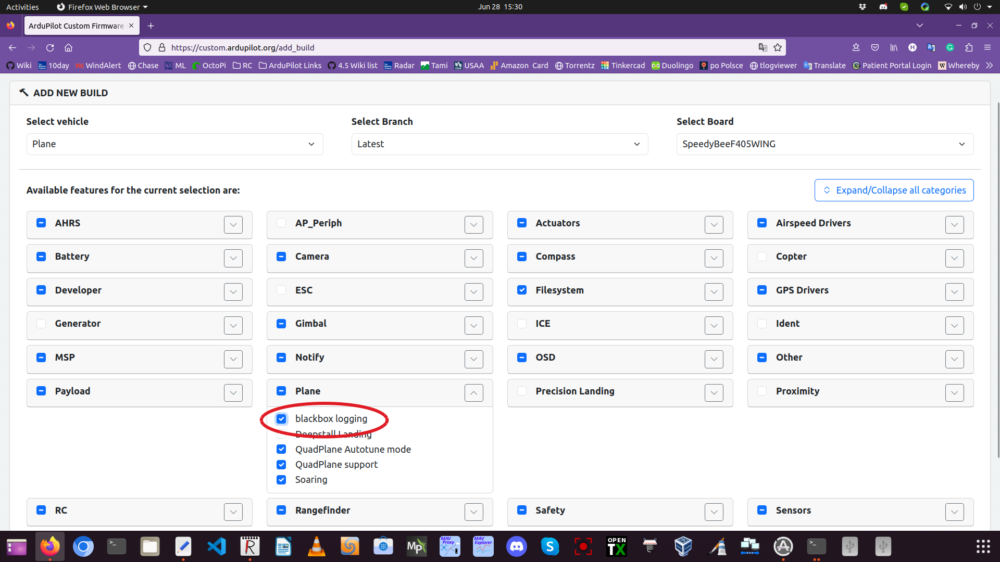

.. _common-blackboxlogger:

=====================================
Plane BlackBox Logger using ArduPilot
=====================================

BlackBox loggers are commonly used to capture aircraft position, attitude, and speed information on aircraft without an autopilot. Using an autopilot and GPS, an a custom version of ArduPilot Plane firmware, such a logger can be implemented.
Compass is not required, and usually not recommended, or at least disabled, due to possible magnetic interference since the logger position may be close to power wiring in the vehicle.

The firmware can be obtained for any ArduPilot supported autopilot by using the `Custom Firmware Build Server <https://custom.ardupilot.org>`__.

The default options for the autopilot can be left enabled, and just the enable the Plane:blackbox logging check box and build and then flash to the autopilot.

The GPS should be configured, and all the normal setup calibrations should be done as if it were a normal plane autopilot. However, it will not have any outputs functions, or servos/motors attached. It merely "rides along" to record information.

In order to function properly, it will need to auto arm itself in the air. 

The ``BBOX_SPD`` parameter should be set to a speed in meters/second when the arming will occur after the vehicle is launched and flying, . Default is 5m/s.

Logs collected can be downloaded from the SD card after the flight. See :ref:`common-downloading-and-analyzing-data-logs-in-mission-planner`.

.. note:: while not required, it is possible to route the aircraft's power system through the autopilot's power monitor, if one is attached, to log current and voltage also. Likewise, an airspeed sensor could be attached to the logger to record actual airspeed instead of only ground speed. Estimated airspeed and wind speed will be logged, even if no airspeed sensor is used.