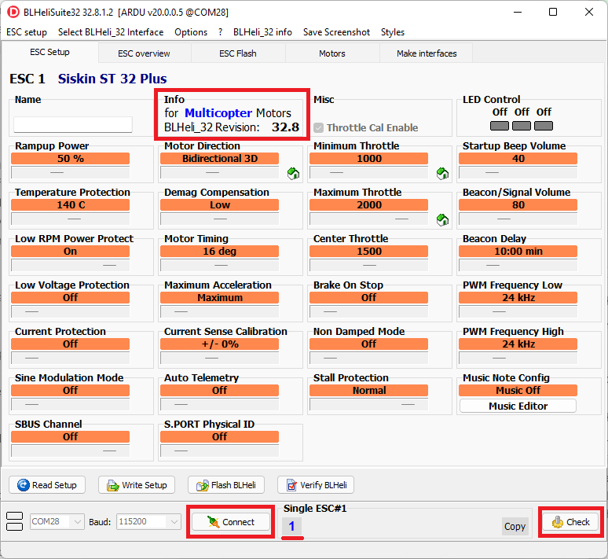

.. _common-blheli32-passthru:

==========================
BLHeli32 and BLHeli_S ESCs
==========================

The BLHeli firmware and configuration applications were developed to allow the configuration of ESCs and provide additional features. ESCs with this firmware allow configuring timing, motor direction, LEDs, motor drive frequency, etc.  Before attempting to use BLHeli please follow the :ref:`DShot setup instructions <common-dshot-escs>`.

This page includes setup instructions for the following features

- Pass-Through support allows the BLHeli application to be used to configure the ESCs while remaining connected to the autopilot
- :ref:`Reversible DShot <blheli32-reversible-dshot>` (aka 3D mode) allows the motor to be spun in either direction
- :ref:`Bi-directional DShot <bidir-dshot>` allows the ESCs to send RPM back to the autopilot without the need for an additional telemetry connection
- :ref:`ESC Telemetry <blheli32-esc-telemetry>` allows the ESCs to send RPM, voltage and current information back to the autopilot so that it can be logged, viewed in real-time or even allow the removal of a :ref:`battery monitor <esc-telemetry-based-battery-monitor>`

"BLHeli" covers covers multiple (sometimes competing) projects providing ESCs firmware and accompanying configuration software

- BLHeli was the original open source software that is no longer maintained and is not available on modern ESCs
- `BLHeli32 <https://github.com/bitdump/BLHeli>`__ is closed source and based on 32bit ARM MCUs.  All modern BLHeli ESCs use BLHeli32
- `BLHeli_S <https://github.com/bitdump/BLHeli>`__ is open source and 16bit.  This is no longer actively maintained but the last published version, 16.7, is installed by default on "BLHeli_S" ESCs when shipped from the factory
- `BLHeli_S JESC <https://jflight.net>`__ is paid, closed source software and 16bit allowing it to run on lower end hardware
- `BLHeli_S BlueJay <https://github.com/mathiasvr/bluejay>`__ is free, open source software and 16bit

Pass-Through Support
--------------------

The Pass-Through feature allows BLHeli32 and BLHeli_S ESCs to be upgraded and configured using the corresponding BLHeliSuite32 or BLHeliSuite application (running on the user's PC) while the ESCs remain connected to the autopilot.  To use this feature please follow these steps

- Download and install `BLHeliSuite32 <https://github.com/bitdump/BLHeli/releases>`__ (for use with BLHeli32 ESCs), `BLHeliSuite <https://github.com/bitdump/BLHeli>`__ (for BLHeli_S ESC) or `JESC configurator <https://github.com/jflight-public/jesc-configurator/releases>`__ (for use with BLHeli_S JESC) on your PC
- Connect your PC to the autopilot using a USB cable and then connect with a ground station (e.g. Mission Planner, QGC).
- Set :ref:`SERVO_BLH_AUTO <SERVO_BLH_AUTO>` to 1 to automatically enable pass-through on all outputs configured as motors (e.g. :ref:`SERVOx_FUNCTION <SERVO9_FUNCTION>` = "Motor1", "Motor2", etc) for multicopters and quadplanes or throttle (e.g. those with :ref:`SERVOx_FUNCTION <SERVO9_FUNCTION>` set to 70 ("throttle"), 73 ("throttle left") or 74 ("throttle right")) on rovers.  For most multicopters, quadplanes and rovers this will do the right thing but for planes, set :ref:`SERVO_BLH_MASK <SERVO_BLH_MASK>` to enable pass-through on the appropriate servo outputs.
- If your PC is connected to the autopilot using a telemetry radio (instead of using USB cable as recommended above) set :ref:`SERVO_BLH_PORT <SERVO_BLH_PORT>` to the autopilot port connected to the telemetry radio.  Beware that this is does NOT specify the port used for :ref:`ESC telemetry <blheli32-esc-telemetry>` feedback to your autopilot!
- If using a safety switch ensure it is pushed (or disabled by setting :ref:`BRD_SAFETY_DEFLT <BRD_SAFETY_DEFLT>` = 0).  (``BRD_SAFETYENABLE`` in older firmware versions)
- Disconnect the ground station (but leave the USB cable connected)
- Start the ESC configuration software and connect to the autopilot's COM port by selecting "BLHeli32 Bootloader (Betaflight/Cleanflight)" from the interfaces menu.  Press "Connect" and "Read Setup".  You should be able to upgrade and configure all connected ESCs

  .. image:: ../../../images/blhelisuite32.jpg
    :target: ../_images/blhelisuite32.jpg
    :width: 450px

.. note::
   ArduPilot firmware supports the pass-through protocol with up-to-date BLHeli32 firmware and BLHeliSuite32, or BLHeli_S firmware and BLHeliSuite only.

.. warning::
   For pass-through to function, the autopilot must be configured to use one of the DShot protocols.  If you wish to eventually use one of the other protocols (e.g. PWM, OneShot125) that the ESC supports, you may still configure the ESCs using Pass-Through (e.g. change motor directions, set min/max values, etc) but then finally re-configure the autopilot to *not* use DShot.  Once the autopilot and ESCs are rebooted the ESC should auto-detect that the ESCs are no longer using DShot.

..  youtube:: np7xXY_e5sA
    :width: 100%

.. _blheli32-reversible-dshot:

Reversible DShot ESCs
---------------------

Reversible DShot (aka 3D mode) allows the motor to be spun in either direction which is important for Rover, Boats and :ref:`Planes with reverse thrust <plane:reverse-thrust-setup>`.

Currently, only BLHeli32 and BLHeli_S capable reversible DShot ESCs are supported. In order to use one, the output which drives it must be designated with the appropriate bit in the :ref:`SERVO_BLH_3DMASK<SERVO_BLH_3DMASK>` bitmask parameter. This will map the outputs 1000-1500-2000 values to the correct digital values for the ESC to provide FullReverse-Idle-FullForward range operation, respectively.

If :ref:`DShot commands <dshot-commands>` have been enabled then ArduPilot will automatically configure the ESCs to reversible mode (3D mode) at startup, according to the :ref:`SERVO_BLH_3DMASK<SERVO_BLH_3DMASK>`. Enabling :ref:`DShot commands <dshot-commands>` will allow the other DShot commands to be sent to any other ESC configured as DShot by the DShot mask parameters discussed in :ref:`DShot setup instructions <common-dshot-escs>`.

Otherwise, you must manually configure the ESCs' "Motor Direction" to "Bidirectional 3D" as shown below.

  .. image:: ../../../images/blheli-reversible-dshot.png
    :target: ../_images/blheli-reversible-dshot.png
    :width: 450px

.. note:: Currently, ArduPilot only supports the use of reversible ESCs for Plane and Rover, not Copter.

.. _blheli32-esc-telemetry:

ESC Telemetry
-------------

If the ESC has this capability, it allows monitoring and logging of performance data that previously required additional sensors (like power modules and RPM sensors). The detailed data provided by every ESC allows real-time decisions and individual ESC or motor performance tuning and failure analysis. Note that a given ESC may or may not have a specific sensor's data transmitted via telemetry. It is common for 4 in 1 escs to provide voltage and current sensors but not transmit the data via telemetry, but rather by direct connection to the autopilot. Check the ESC data sheet and connection information for details.
 
.. note:: ArduPilot does not currently support the polling of the ESCs for telemetry data via throttle idle messages over the signal line in non DShot protocols.

Connecting the ESCs Telemetry wire
----------------------------------

.. image:: ../../../images/dshot-pixhawk.jpg
    :target: ../_images/dshot-pixhawk.jpg
    :width: 600px

Connect all ESC telemetry wires to a single serial port's RX pin on the autopilot (above diagram uses Serial5 as an example).  A pin or wire for ESC telemetry is pre-soldered on most BLHeli32 ESCs. If the wire isn't pre-soldered you will need to solder it yourself. CubePilot serial port pinsouts can be found :ref:`here <common-thecube-overview>`.

Set the following parameters to enable BLHeli32 telemetry feedback to the autopilot's serial port:

- :ref:`SERIALx_PROTOCOL <SERIAL5_PROTOCOL>` 16 (= ESC telemetry) where "x" is the autopilot serial port number connected to the ESCs telemetry wire.  The mapping between serial port numbering and UART physical ports for you autopilot should be documented in its description page linked :ref:`here <common-autopilots>`.

- :ref:`SERVO_BLH_TRATE <SERVO_BLH_TRATE>` defaults to 10 and normally does not need to be changed. this enables telemetry at a 10Hz update rate from the ESC.  If using the :ref:`harmonic notch feature <common-imu-notch-filtering>` this can be raised to 100.

- :ref:`SERVO_BLH_POLES <SERVO_BLH_POLES>` defaults to 14 which applies to the majority of brushless motors and normally does not need to be changed.  Adjust as required if you're using motors with a pole count other than 14 to calculate true motor shaft RPM from ESC's e-field RPM.

ESC Telemetry Logging and Reporting
-----------------------------------

The autopilot requests status information from one ESC at a time, cycling between them. This information is logged to the onboard log's ESCn messages and can be viewed in any :ref:`ArduPilot compatible log viewer <common-logs>`.

- RPM
- Voltage
- Current
- Temperature
- Total Current

The RCOU messages are also written to the onboard logs which hold the requested output level sent to the ESCs expressed as a number from 1000 (meaning stopped) to 2000 (meaning full output).

This data can also be viewed in real-time using a ground station.  If using the Mission Planner go to the Flight Data screen's status tab and look for esc1_rpm.

.. image:: ../../../images/dshot-realtime-esc-telem-in-mp.jpg
    :target: ../_images/dshot-realtime-esc-telem-in-mp.jpg
    :width: 450px

.. note::

   Sending BLHeli32 telemetry data to the GCS requires the telemetry connection use MAVLink2.  ArduPilot uses MAVLink2 by default on the USB port but if another port is used it may be necessary to set the SERIALx_PROTOCOL parameter to 2 (where "x" is the serial port number used for the telemetry connection).

In addition, some telemetry values can be displayed on the integrated :ref:`on-board OSD <common-osd-overview>`, if your autopilot has one.

.. _esc-telemetry-based-battery-monitor:

Use as Battery Monitor
======================

By setting a battery monitor instance to BLHeli32 ESC type (for example :ref:`BATT2_MONITOR<BATT2_MONITOR>` = 9), all connected BLHeli32 ESCs with connected telemetry wiring to the configured autopilot serial port, will be aggregated as a single source. The voltages reported will be averaged, the currents totaled, and the consumed current accumulated.

.. _bidir-dshot:

Bi-directional DShot
====================

[site wiki="rover"]
.. warning::

   Bi-directional DShot does not work with Rover (`see issue here <https://github.com/ArduPilot/ardupilot/issues/20372>`__)
[/site]

Newer versions of BLHeli32 (32.7 and higher) and BLHeli_S (16.73 and higher) support returning motor RPM values over the DShot signal line. Supporting bi-directional DShot requires exclusive use of one or more DMA channels and thus not all versions of ArduPilot support it. Versions that support bi-directional DShot natively are listed below.  For other autopilots please load the ArduPilot firmware version ending in "-bdshot".

- BeastF7, BeastF7v2, BeastH7, BeastH7v2
- FlywooF745, FlywooF745Nano
- KakuteF4Mini, KakuteF7Mini, KakuteH7Mini

Only the lowest 4 DShot capable servo outputs can be used.  For autopilots with an IOMCU (e.g. Pixhawk, CubeOrange) this means AUX1 to AUX4 can be used.  For Pixracer and other autopilots without a separate IOMCU coprocessor this means outputs 1 to 4 can be used.

Setup
-----

First ensure that you have an appropriate version of BLHeli32 or BLHeli_S installed on your ESCs. The majority of ESCs do not come pre-installed with these versions. The official 32.7 version of BLHeli32 supports bi-directional DShot. Official versions of BLHeli_S do not support bi-directional DShot, you will need to either buy a version from `BLHeli_S JESC <https://jflight.net/index.php?route=common/home&language=en-gb>`__ or use `BLHeli_S BlueJay <https://github.com/mathiasvr/bluejay>`__. If you try and enable bi-directional DShot with the wrong firmware version then unpredictable motor operation can occur.

Set the following parameters to enable BLHeli32 and BLHeli_S bi-directional DShot:

- :ref:`SERVO_BLH_BDMASK <SERVO_BLH_BDMASK>`: a bitmap used to enable BLHeli32 or BLHeli_S bi-directional DShot support. On autopilots without IOMCU this would normally be set to 15 to indicate four active channels. On autopilots with an IOMCU this can be set to 3840 to indicate four active AUX channels (bi-directional DShot will only work on the AUX outputs).

- :ref:`SERVO_BLH_POLES <SERVO_BLH_POLES>` defaults to 14 which applies to the majority of brushless motors and normally does not need to be changed. Adjust as required if you're using motors with a pole count other than 14 to calculate true motor shaft RPM from ESC's e-field RPM (small motors might have 12 poles).
