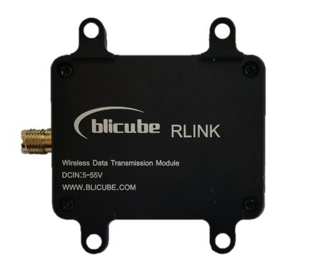

.. _common-blicube-rlink:
[copywiki destination="plane,copter,rover,blimp"]
=============
Blicube RLINK
=============

RLINK is a long-distance wireless data link communication module developed by blicube.LLC, supporting Point to Point and Point to Multipoint. Using two RLINK modules to form a pair of data links for mutual communication, when one connected to the device end and the other connected to the computer end. With three or more RLINK modules, it can be used for Point to Multipoint.

Based on built-in P900 module, RLINK has the characteristics of high transmission power, high link rate, high receiving sensitivity, etc. The ground-to-air communication distance is up to 30+KM, the transmitting power can reach 1W , besides the module supports wide voltage input (5～55V) and high-speed frequency hopping. The module has the operating temperature range of -40 to 80 degrees, with shell of CNC aviation aluminum alloy materials.

Specifications
==============

=======================    ==============
Item 	                     Specification
=======================    ==============
Frequency 	               902-928MHz
Spreading Method           Frequency Hopping
Encryption 	               Optional(see –AES option)
Range 	                   Up to 60 KM(in theory)
Forward Error Detection    Hamming/
                           BCH/
                           Golay/
                           Reed-Solomon
Error Detection 	       32 bits of CRC, ARQ
Output Power 	           100mW-1W（20-30dBm）
Serial Interface 	       3.3V TTL
Baud Rate 	               57600（default & changeable）
Link Rate 	               57.6 – 276 kbps
Sensitivity (@10^-4) 	   114 dBm @ 57.6 kbps
-                          112 dBm @ 115.2 kbps
-                          109 dBm @ 172.8 kbps
-                          107 dBm @ 230.4 kbps
Blocking 	               +/- 1 MHz > 55 dBc
-                           +/- 2.5 MHz > 60 dBc
-                           +/- 5 MHz > 65 dBc
-                           > 930 MHz > 70 dBc
-                           < 890 MHz > 70 dBc
Supply Voltage 	           5～55v
Antenna Interface 	       SMA
Size 	                   50mm * 38mm * 14mm
Weight 	                   39g
=======================    ==============

Where to Buy
============

`AliExpress <https://pt.aliexpress.com/item/1005003061008680.html>`__

`User Manual <https://github.com/ThomasVon2021/RLINK_P900/blob/master/Docs/RLINK%20User%20Manual%20V2.0%20.pdf>`__
==================================================================================================================

