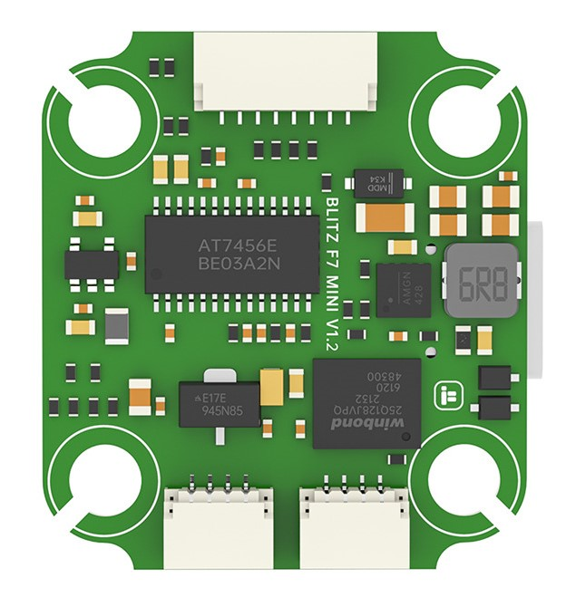
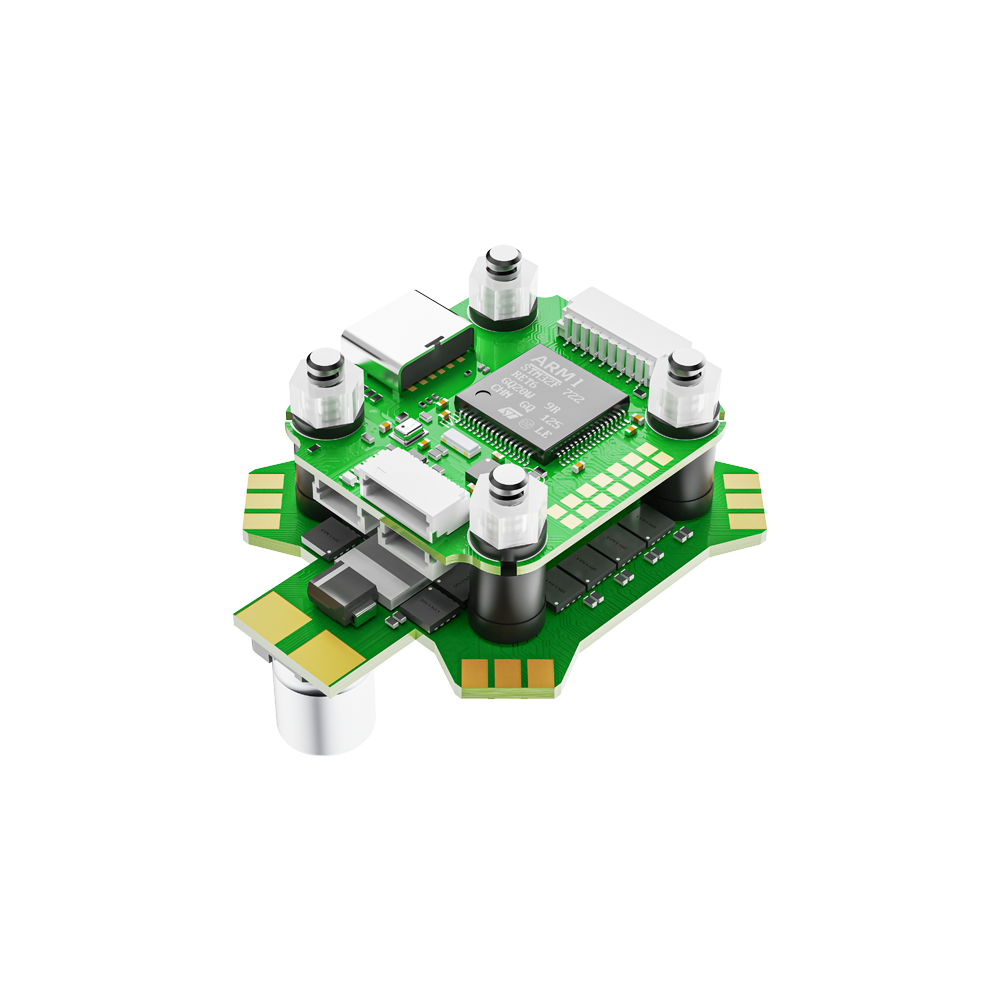
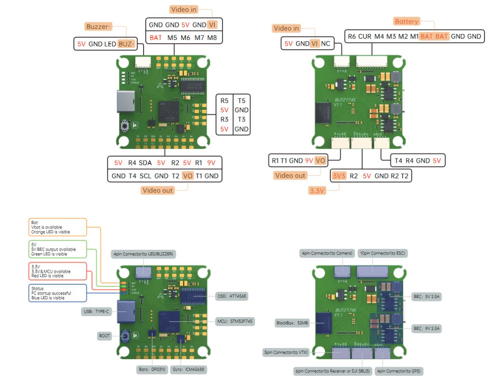
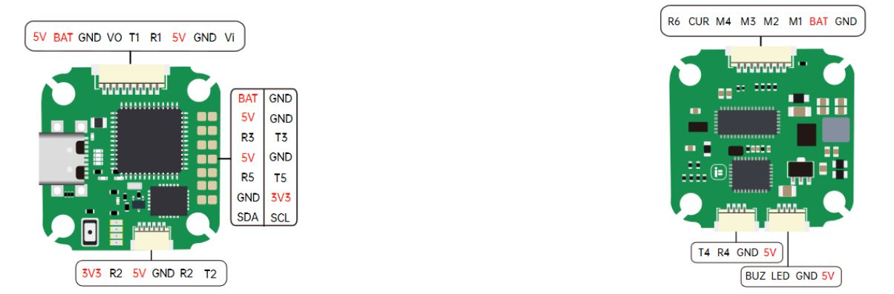

.. _common-blitz-f745:

=======================
iFlight BLITZ F745/Mini
=======================

.. image:: ../../../images/BLITZ-F745.png
    :target: ../_images/BLITZ-F745.png
    :width: 50%

BLITZ F745

BLITZ MINI

BLITZ MINI STACK

*above image and some content courtesy of* `iFlight <http://https://www.iflight.com>`__

Where to Buy
============

- Available from many retailers including `iFlight <https://shop.iflight.com>`__

Specifications
==============

-  **Processor**

   -  STM32F745 32-bit processor, 216 MHz
   -  AT7456E OSD
   -  32 MB (16MB on Mini) flash for logging

-  **Sensors**

   -  ICM42688 IMU (accel and gyro only, no compass)
   -  DPS310 barometer

-  **Power**

   -  2S  - 6S Lipo input voltage with voltage monitoring
   -  5V, 2.5A BEC for perpherals
   -  19V, 2A BEC for powering Video Transmitter

-  **Interfaces**

   -  9x PWM outputs (8 motor outputs[4 on Mini], and 1 LED output)
   -  1x RC input pre-configured on a UART
   -  6x total UARTs/serial for GPS and other peripherals
   -  1x I2C port for external compass
   -  USB-C port
   -  External current monitor input

Pinout
======

Mini
----

UART Mapping
============

The UARTs are marked Rn and Tn in the above pinouts. The Rn pin is the
receive pin for UARTn. The Tn pin is the transmit pin for UARTn. Default protocols are shown below but may be changed by the user.

   -  SERIAL0 -> USB
   -  SERIAL1 -> UART1 (DisplayPort)
   -  SERIAL2 -> UART2 (RC input) DMA-enabled
   -  SERIAL3 -> UART3 (GPS) DMA-enabled
   -  SERIAL4 -> UART4 (USER) DMA-enabled
   -  SERIAL5 -> UART5 (USER)
   -  SERIAL6 -> UART6 (ESC Telemetry)

Any UART may be re-tasked by changing its protocol parameter.

.. note::UART3 is used for GPS not UART4 as shown in typical wiring diagram on iFLight website

RC Input
========

RC input is configured on the R2 (UART2_RX) pin. It supports all RC protocols except PPM. See :ref:`common-rc-systems` for details for a specific RC system. :ref:`SERIAL2_PROTOCOL<SERIAL2_PROTOCOL>` is set to "23", by default, to enable this.

- FPort requires connection to T2 and :ref:`SERIAL2_OPTIONS<SERIAL2_OPTIONS>` be set to "7".

- CRSF also requires a T2 connection, in addition to R2, and automatically provides telemetry. Set :ref:`SERIAL2_OPTIONS<SERIAL2_OPTIONS>` to "0".

- SRXL2 requires a connecton to T2 and automatically provides telemetry.  Set :ref:`SERIAL2_OPTIONS<SERIAL2_OPTIONS>` to "4".

Any UART can be used for RC system connections in ArduPilot also, and is compatible with all protocols except PPM. See :ref:`common-rc-systems` for details.

OSD Support
===========

The autopilot  supports OSD using :ref:`OSD_TYPE<OSD_TYPE>` 1 (MAX7456 driver). The defaults are also setup to allow DJI Goggle OSD support on UART4. Both the internal analog OSD and the DisplayPort OSD can be used simultaneously by setting :ref:`OSD_TYPE2<OSD_TYPE2>` = 5 (setup by default)

PWM Output
==========

The  BLITZ F745 supports up to 9 PWM outputs (PWM 9 defaults to serial LED output). Outputs 1-4 are available via a JST-SH connector, others via solder pads. All outputs support DShot, as well as all PWM types. The first 4 outputs support bi-directional DShot also.

The PWM is in 3 groups:

 - PWM 1-4 in group1
 - PWM 5-8 in group2
 - PWM 9 in group3

Channels within the same group need to use the same output rate, whether PWM or Dshot. If
any channel in a group uses DShot then all channels in the group need
to use DShot.

.. note:: for users migrating from BetaflightX quads, the first four outputs M1-M4 have been configured for use with existing motor wiring using these default parameters:

- :ref:`FRAME_CLASS<FRAME_CLASS>` = 1 (Quad)
- :ref:`FRAME_TYPE<FRAME_TYPE>` = 12 (BetaFlightX)

LED Output
==========

The LED output is configured by default to support :ref:`NeoPixel LED strings<common-serial-led-neopixel>`.

Battery Monitoring
==================

The board has a built-in voltage sensor via the B+ pin, but no internal current sensor. An external current sensor can be connected to the CUR pin. Default parameters for both internal voltage and external current monitoring are set by default to the below for use with any Holybro Tekko32 F4 4in1 ESC.

The correct battery setting parameters are:

 - :ref:`BATT_MONITOR<BATT_MONITOR>` 4
 - :ref:`BATT_VOLT_PIN<BATT_VOLT_PIN__AP_BattMonitor_Analog>` 13
 - :ref:`BATT_CURR_PIN<BATT_CURR_PIN__AP_BattMonitor_Analog>` 12
 - :ref:`BATT_VOLT_MULT<BATT_VOLT_MULT__AP_BattMonitor_Analog>` 11
 - :ref:`BATT_AMP_PERVLT<BATT_AMP_PERVLT__AP_BattMonitor_Analog>` 50 but varies depending on external current sensor

Compass
=======

This autopilot does not have a built-in compass, however you can attach an external compass using I2C on the SDA and SCL pads.

Firmware
========

Firmware for these boards can be found `here <https://firmware.ardupilot.org>`_ in  sub-folders labeled "BlitzF745".

Loading Firmware
================

Initial firmware load can be done with DFU by plugging in USB with the
bootloader button pressed. Then you should load the "with_bl.hex"
firmware, using your favourite DFU loading tool.

Once the initial firmware is loaded you can update the firmware using
any ArduPilot ground station software. Later updates should be done with the
\*.apj firmware files.

[copywiki destination="plane,copter,rover,blimp"]
