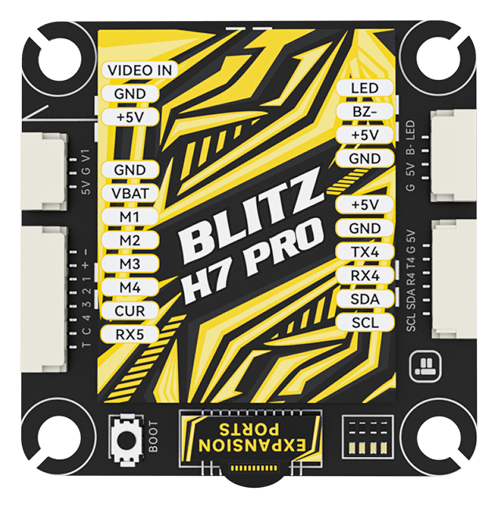
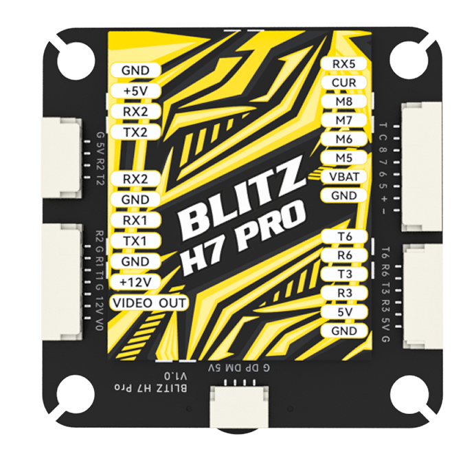
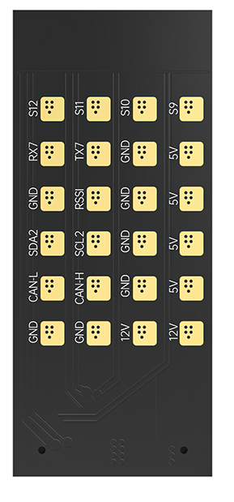

.. _common-blitzh743pro:

======================
iFlight BLITZ Pro H743
======================

.. image:: ../../../images/
    :target: ../_images/

The BLITZ H743 Pro is a flight controller produced by `iFlight <https://shop.iflight.com/BLITZ-H7-Pro-Flight-Controller-Pro2203>`_.

Specifications
==============

-  **Processor**

   -  STM32H743 32-bit processor, 480 MHz
   -  AT7456E OSD

-  **Sensors**

   -  ICM42688 IMU (accel and gyro only, no compass)
   -  DPS310 barometer

-  **Power**

   -  2S  - 8S Lipo input voltage with voltage and current monitoring
   -  5V, 2.5A BEC for perpherals
   -  12V, 2A Switched BEC for powering Video Transmitter

-  **Interfaces**

   -  13x PWM outputs (12 motor outputs and 1 LED output)
   -  1x RC input pre-configured on a UART
   -  7x total UARTs/serial for GPS and other peripherals
   -  microSD Card
   -  2x I2C port for external compass,airspeed,etc.
   -  1x CAN port
   -  USB-C port
   -  External current monitor input

-  **Physical**

   -  Mount pattern: 30.5*30.5mm/?4
   -  Dimensions: 36.9*52mm
   -  Weight: 35g

Pinout
======

TOP

BOTTOM

EXPANSION BOARD

UART Mapping
============

The UARTs are marked Rn and Tn in the above pinouts. The Rn pin is the
receive pin for UARTn. The Tn pin is the transmit pin for UARTn. Default protocols are shown below but may be changed by the user.

   -  SERIAL0 -> USB
   -  SERIAL1 -> UART1 (DisplayPort)(DMA Enabled)
   -  SERIAL2 -> UART2 (RC input) DMA-enabled
   -  SERIAL3 -> UART3 (USER) DMA-enabled
   -  SERIAL4 -> UART4 (GPS) DMA-enabled
   -  SERIAL6 -> UART6 (USER)
   -  SERIAL7 -> UART7 (USER)
   -  SERIAL8 -> UART8 (ESC Telemetry)

RC Input
========
RC input is configured on the R2 (UART2_RX) pin. It supports all RC protocols except PPM. See :ref:`common-rc-systems` for details for a specific RC system. :ref:`SERIAL2_PROTOCOL<SERIAL2_PROTOCOL>` is set to "23", by default, to enable this.

- FPort requires connection to T2 and :ref:`SERIAL2_OPTIONS<SERIAL2_OPTIONS>` be set to "7".

- CRSF also requires a T2 connection, in addition to R2, and automatically provides telemetry. Set :ref:`SERIAL2_OPTIONS<SERIAL2_OPTIONS>` to "0".

- SRXL2 requires a connecton to T2 and automatically provides telemetry.  Set :ref:`SERIAL2_OPTIONS<SERIAL2_OPTIONS>` to "4".

Any UART can be used for RC system connections in ArduPilot also, and is compatible with all protocols except PPM. See :ref:`common-rc-systems` for details.

OSD Support
===========

The autopilot  supports OSD using :ref:`OSD_TYPE<OSD_TYPE>` 1 (MAX7456 driver). The defaults are also setup to allow DJI Goggle OSD support on UART4. Both the internal analog OSD and the DisplayPort OSD can be used simultaneously by setting :ref:`OSD_TYPE2<OSD_TYPE2>` = 5

PWM Output
==========
The BLITZ H743 Pro has 13 PWM outputs. The first 8 outputs support bi-directional DShot and DShot, as well as all PWM types. Outputs 9-10 support DShot, as well as all PWM types and outputs 11-12 only support PWM. Output 13 is pre-configured for serial LED.

The PWM are in in five groups:

* PWM 1-2 in group1
* PWM 3-6 in group2
* PWM 7-10 in group3
* PWM 11-12 in group4
* PWM 13 in group5

Channels within the same group need to use the same output rate. If
any channel in a group uses DShot then all channels in the group need
to use DShot.

.. note:: for users migrating from BetaflightX quads, the first four outputs M1-M4 have been configured for use with existing motor wiring using these default parameters:

- :ref:`FRAME_CLASS<FRAME_CLASS>` = 1 (Quad)
- :ref:`FRAME_TYPE<FRAME_TYPE>` = 12 (BetaFlightX) 

Video Power Control
===================

The 12V video power can be turned off/on  using GPIO 81 which is already assigned by default to RELAY2.  This relay can be controlled either from the GCS or using a transmitter channel (See :ref:`common-auxiliary-functions`)

RSSI Input
==========

The analog airspeed pin is "4" and is marked "RSSI" on the expansion board.

Battery Monitoring
==================

The board has a built-in voltage sensor and  external current sensor. The voltage sensor can handle up to 8S
LiPo batteries.

The correct battery setting parameters are:

* BATT_MONITOR 4
* BATT_VOLT_PIN 10
* BATT_VOLT_MULT 11
* BATT_CURR_PIN 11
* BATT_CURR_MULT 50

These are set by default in the firmware and shouldn't need to be adjusted

Compass
=======

The BLITZ Wing H743 does not have a builtin compass, but you can attach an external compass to I2C pins.

Firmware
========

Firmware for these boards can be found `here <https://firmware.ardupilot.org>`_ in  sub-folders labeled "BlitzH74Pro".

Loading Firmware
================

Initial firmware load can be done with DFU by plugging in USB with the
bootloader button pressed. Then you should load the "with_bl.hex"
firmware, using your favourite DFU loading tool.

Once the initial firmware is loaded you can update the firmware using
any ArduPilot ground station software. Later updates should be done with the
\*.apj firmware files.

[copywiki destination="plane,copter,rover,blimp"]