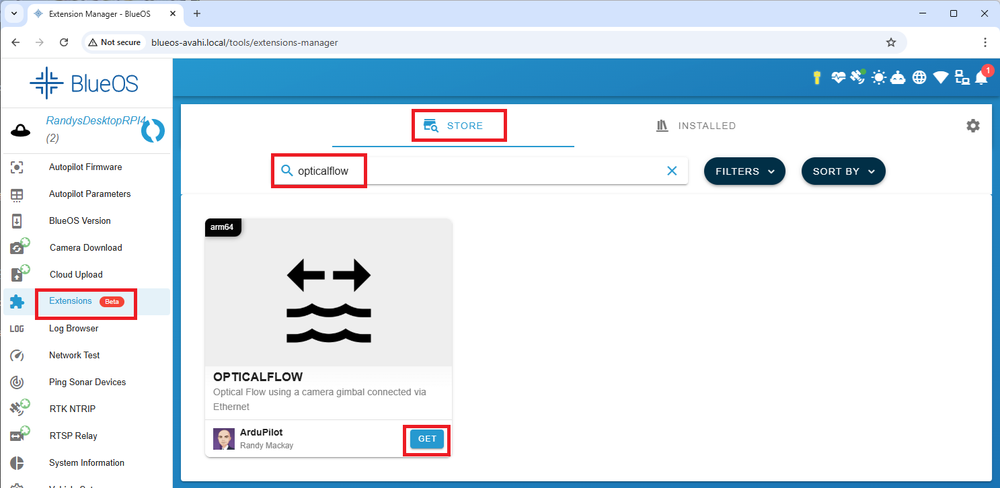
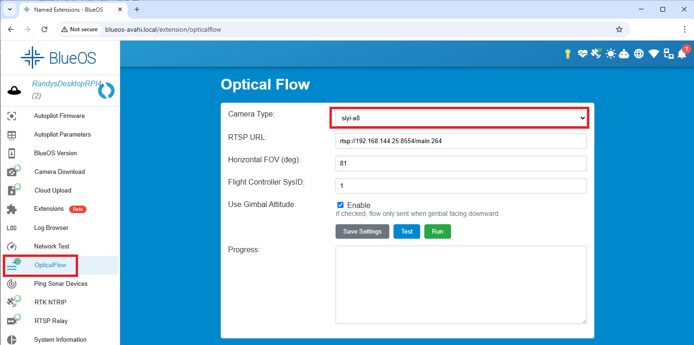

.. _common-blueos-opticalflow:

============================
BlueOS OpticalFlow Extension
============================

[copywiki destination="copter,plane,rover"]

`BlueOS's Optical Flow Extension <https://github.com/BlueOS-community/blueos-opticalflow>`__ allows a downward facing camera gimbal to be used as an optical flow sensor to improve performance in non-GPS environments.

..  youtube:: ir7LfSYoNMc
    :width: 100%

.. note::

   Support for this extension was added in ArduPilot-4.7

Hardware Required
-----------------

Please see :ref:`ArduPilot's BlueOS installation instructions <dev:companion-computer-blueos>` which also includes hardware recommendations.

Any :ref:`supported camera gimbal <common-cameras-and-gimbals>` with ethernet connectivity should work including the :ref:`Siyi <common-siyi-zr10-gimbal>`, :ref:`ViewPro <common-viewpro-gimbal>` and :ref:`XFRobot <common-xfrobot-gimbal>` camera gimbals.

The camera gimbal should be mounted on the underside of the vehicle and optical flow will only operate when the camera gimbal is pointing downwards.

A :ref:`rangefinder <common-rangefinder-landingpage>` with at least a few meters of range is also required.

BlueOS Extension Installation
-----------------------------

Once BlueOS has been :ref:`installed <dev:companion-computer-blueos>` on the companion computer:

- Ensure the companion computer is connected to the internet
- From the left menu, select "Extensions"
- Search for "opticalflow" and push the "GET" and "INSTALL" buttons 

- From the left menu, select "OpticalFlow"
- Select the "Camera Type" being used
- Adjust the RTSP URL if not using the camera gimbal's default IP address or RTSP stream
- "Flight Controller SysID" should match the vehicle's :ref:`MAV_SYSID <MAV_SYSID>` parameter (normally 1)
- Optionally adjust the Horizontal FOV to match the camera gimbal's lens

AutoPilot Configuration and Calibration
---------------------------------------

- Set :ref:`FLOW_TYPE <FLOW_TYPE>` = 5 (MAVLink) and reboot the autopilot
- Set :ref:`FLOW_OPTIONS <FLOW_OPTIONS>` = 1 (Roll/Pitch stabilised)
- Set :ref:`EK3_FLOW_DELAY <EK3_FLOW_DELAY>` = 150 (ms)
- Optionally set :ref:`EK3_OPTIONS <EK3_OPTIONS>` = 4 (Optflow may use terrain alt) to allow optical flow to be used beyond the rangefinder's maximum range
- The "Inflight Calibration" and "Log based Calibration" methods described in the :ref:`Optical Flow Sensor Testing and Setup <common-optical-flow-sensor-setup>` will not work for stabilised camera gimbals.  Instead the Extension's "Horizontal FOV" field can be adjusted if the vehicle's estimated position on the map (when using optical flow) significantly overshoots or undershoots the actual distance moved.
- Performance can be improved by setting the :ref:`sensors position parameters <common-sensor-offset-compensation>`.  For example if the camera gimbal is mounted 2cm forward and 5cm below the frame's center of rotation set :ref:`FLOW_POS_X <FLOW_POS_X>` to 0.02 and :ref:`FLOW_POS_Z <FLOW_POS_Z>` to 0.05.

Testing and Setup
-----------------

See :ref:`common-optical-flow-sensor-setup`
