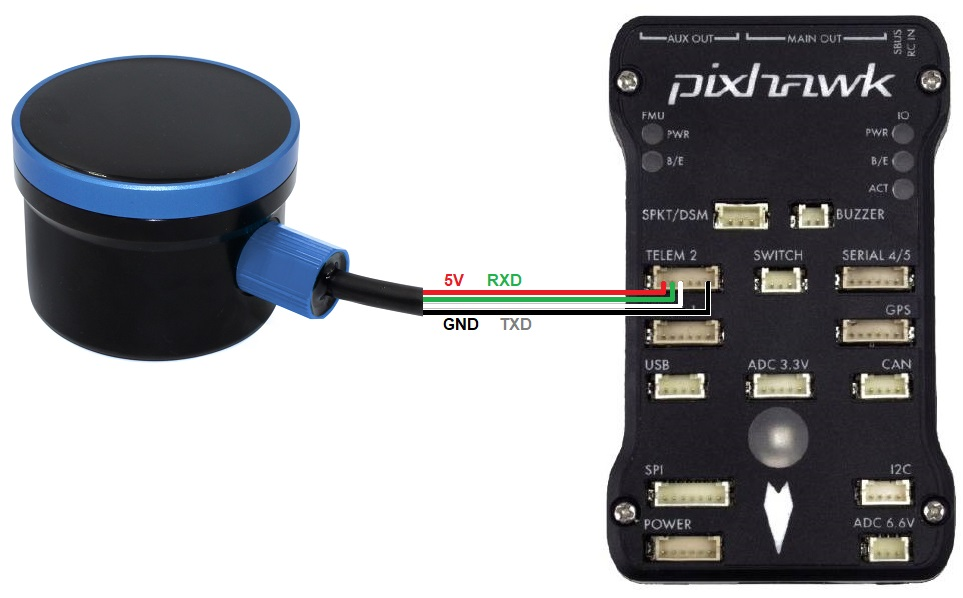

.. _common-bluerobotics-ping:

==================================
BlueRobotics Ping Underwater Sonar
==================================

The `BlueRobotics Underwater Sonar <https://bluerobotics.com/store/sensors-sonars-cameras/sonar/ping-sonar-r2-rp/>`__ is a single-beam encosounder with a maximum range of 30m, a beam width of 30deg and a maximum depth rating of 300m.  More details can be found in the `Technical Details section of the product page on BlueRobotics <https://bluerobotics.com/store/sensors-sonars-cameras/sonar/ping-sonar-r2-rp/>`__

.. note::

   Support for this sensor is available in Rover-4.0.0 (and higher)

Where to Buy
------------

- This sensor can be purchased directly from `BlueRobotics <https://bluerobotics.com/store/sensors-sonars-cameras/sonar/ping-sonar-r2-rp/>`__
- Optionally the `BLUART USB to Serial RS485 adapter <https://bluerobotics.com/store/comm-control-power/tether-interface/bluart-r1-rp/>`__ allows connecting the sensor to a PC for testing

Connecting to the Autopilot
-----------------------------------

For a serial connection you can use any spare Serial/UART port.  The diagram below shows how to connect to SERIAL2.

If the SERIAL2 port on the autopilot is being used then the following parameters should be set:

-  :ref:`SERIAL2_PROTOCOL <SERIAL2_PROTOCOL>` = 9 (Lidar)
-  :ref:`SERIAL2_BAUD <SERIAL2_BAUD>` = 115 (115200 baud)
-  :ref:`RNGFND1_TYPE <RNGFND1_TYPE>` = 23 (BlueRoboticsPing)
-  :ref:`RNGFND1_MIN_CM <RNGFND1_MIN_CM>` = 30
-  :ref:`RNGFND1_MAX_CM <RNGFND1_MAX_CM>` = 2600.  This is the distance in centimeters that the rangefinder can reliably read.
-  :ref:`RNGFND1_ORIENT <RNGFND1_ORIENT>` = 25 (down) if mounted on a boat

Testing the sensor
==================

Distances read by the sensor can be seen in the Mission Planner's Flight
Data screen's Status tab. Look closely for "sonarrange".

.. image:: ../../../images/mp_rangefinder_lidarlite_testing.jpg
    :target: ../_images/mp_rangefinder_lidarlite_testing.jpg
    :width: 450px
