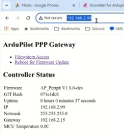

.. _common-botblox-dronenet:

================
BotBlox DroneNet
================

The `BotBlox DroneNet <https://botblox.io/dronenet-for-ardupilot/>`__ ethernet adapter allows STM32 H7 autopilots without built-in ethernet support to connect to ethernet peripherals

Where To Buy
============

The `BotBlox DroneNet can be purchased directly from BotBlox <https://botblox.io/dronenet-for-ardupilot/>`__

Optionally the `SwitchBlox Cable Adapter <https://botblox.io/switchblox-cable-adapter-for-ardupilot/>`__ may be useful to ease the ethernet port differences across device manufacturers

Connecting to the Autopilot
===========================

Connect one of the autopilot's serial ports to the DroneNet's UART port. For optimum performance the autopilot's serial port should support flow control which normally means using Serial1 or Serial2.  In the image above Serial2 is used.

Connect one of the autopilot's CAN ports to the DroneNet's CAN port.  This connection is only used to configure the DroneNet device and so it maybe removed after the configuration is completed.  In the image above the autopilot's CAN1 is used.

5V Power can be provided through the dedicated power port or through the Serial or CAN port

Install ArduPilot with PPP Support
==================================

`PPP <https://en.wikipedia.org/wiki/Point-to-Point_Protocol_over_Ethernet>`__ allows an autopilot to communicate over Ethernet using a serial port but with the exception of the CubePilot CubeOrangePlus, PPP is not included by default in the ArduPilot firmware.

- Use the `Custom Firmware Build Server <https://custom.ardupilot.org/>`__ to build a firmware that includes PPP support

.. image:: ../../../images/build-server-ppp.jpg
    :target: ../_images/build-server-ppp.jpg

- Alternatively :ref:`build the code yourself <building-the-code>` and enable PPP by adding ``--enable-PPP`` to the waf configuration step
- :ref:`Install the firmware on the autopilot <common-loading-firmware-onto-pixhawk>`

Autopilot Configuration
=======================

See the ``PPP configuration`` and ``ArduPilot Port Configuration`` sections of :ref:`common-network` but in short set these parameters:

- :ref:`CAN_P1_DRIVER <CAN_P1_DRIVER>` = 1 (First driver)
- :ref:`CAN_D1_DRIVER <CAN_D1_PROTOCOL>` = 1 (DroneCAN)
- :ref:`NET_ENABLE <NET_ENABLE>` = 1
- :ref:`SERIAL2_PROTOCOL <SERIAL2_PROTOCOL>` = 48 (PPP)
- :ref:`SERIAL2_BAUD <SERIAL2_BAUD>` = 12500000 (12.5MBaud)

To allow the autopilot to eventually communicate with other ethernet devices, the :ref:`NET_P1_TYPE <NET_P1_TYPE>`, :ref:`NET_P1_PROTOCOL <NET_P1_PROTOCOL>`, etc parameters will need to be set.
More details on the settings required can be found in the "Ethernet Conectivity" sections of the ArduPilot wiki page for the device.  For example :ref:`Siyi camera setups can be found on this page <common-siyi-zr10-gimbal>`

DroneNet Setup
==============

The DroneNet's parameters can be set using Mission Planner's DroneCAN screen or the :ref:`DroneCAN GUI tool <common-uavcan-gui>`.  The following instructions assume Mission Planner is used:

- Connect to the AutoPilot with Mission Planner 
- Open the Setup, Optional Hardware, DroneCAN/UAVCAN screen
- From the top-left drop-down select MAVLinkCAN1 (or MAVLinkCAN2 if the autopilot's CAN2 is used)
- Press "Connect" and the table should be populated with the available DroneCAN devices including "org.ardupilot.BotBloxDroneNet"
- Press the "Menu" button on the right side and select "Parameters"
- Set the following parameters and press the "Write" button

  - NET_DHCP = 0 (to disable dynamic IP assignment)
  - NET_IPADDR0 = 192 (default)
  - NET_IPADDR1 = 168 (default)
  - NET_IPADDR2 = 144
  - NET_IPADDR3 = 14
  - NET_GW_ADDR0 = 192 (default)
  - NET_GW_ADDR1 = 168 (default)
  - NET_GW_ADDR2 = 144
  - NET_GW_ADDR3 = 1

- Reboot the system or from the DroneCAN screen select "Menu", "Restart"
- On the next autopilot reboot, messages like those shown below should appear.  Note that the autopilot's IP address's final octet is one higher (e.g. "15") than the DroneNet's IP address (e.g. "14")

The IP addresses chosen above are somewhat arbitrary but work well for many systems.  In general all ethernet devices on the drone should be in the same subnet meaning the first three octets of the IP address (e.g. 192.168.144.x) should match while the last octet should be unique to each device.

DroneNet WebServer
==================

The DroneNet device has a built-in web server that can be used to update the firmware on the device

- Connect a PC to the DroneNet's ethernet
- Set the PC's IP address to be in the same subnet as the DroneNet (e.g. 192.168.144.99)
- Open a web browser and enter the DroneNet's IP address as the URL (e.g. "192.168.144.14")
- See the video linked below for more details on how to use the webserver to update the DroneNet's firmware

Video
=====

.. youtube:: bN6iDP4Zjzg
