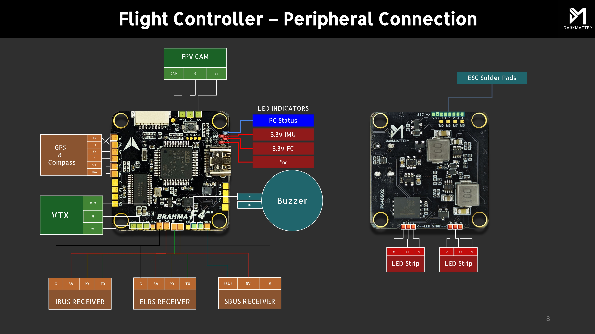

.. _common-brahmaf4:
[copywiki destination="plane,rover,copter,blimp,sub"]

=========
Brahma F4
=========
The BrahmaF4 is an autopilot manufactured by `Darkmatter® <https://thedarkmatter.in>`_

Features
========
* MCU: STM32F405RGT6, 168MHz
* Gyro: BMI270
* 32MB Onboard Flash (32 Megabyte)
* BEC output: 5V, 2A@4V
* Barometer: BMP280
* OSD: AT7456E
* 4 UARTS: (UART1, UART3, UART4, UART6)
* 9 PWM Outputs (includes 1 neopixel out that can be used for PWM)
* 5V Power Out: 2.0A max
* 9V Power Out: 2.0A max

Pinout
======

UART Mapping
============
The UARTs are marked Rx and Tx in the above pinouts.

========== ========== =======  ====================
 Name      Pad        Port     Default Protocol
========== ========== =======  ====================
 SERIAL 0  DM/DP      USB       Mavlink2
 SERIAL 1  RX1/TX1    USART 1   RCin (DMA capable)
 SERIAL 2  RX3/TX3    USART 3   ESC (T3 pin also on ESC connector)
 SERIAL 3  RX6/TX6    USART 6   GPS1 (DMAcapable)
 SERIAL 4  RX4/TX4    USART 4   MSP DisplayPort
========== ========== =======  ====================

* ESC Telemetry needs to be manually configured based upon esc used.

RC Input
========
 RC input is configured by default on the R1 and T1 (UART1) pads (CRSF or ELRS). The SBUS pad is inverted and applied to R1.

* PPM is not supported.
* FPort requires connection to T1 and :ref:`SERIAL1_OPTIONS<SERIAL1_OPTIONS>` be set to “7”.
* CRSF also requires a T1 connection, in addition to R1, and automatically provides telemetry. Set :ref:`SERIAL1_OPTIONS<SERIAL1_OPTIONS>` to “0”.
* SRXL2 requires a connecton to T1 and automatically provides telemetry. Set :ref:`SERIAL1_OPTIONS<SERIAL1_OPTIONS>` to “4”.

Any UART can be used for RC system connections in ArduPilot also, and is compatible with all protocols except PPM. See :ref:`Radio Control Systems <common-rc-systems>` for details.

OSD
===
* Use of internal MAX7456 for analog OSD/VTX is enabled by default.
* Simultaneous HD VTX OSD supportcan is configured on UART4 (DisplayPort).

PWM Outputs
===========
The autopilot supports up to 9 PWM outputs (PWM 9 is defaulted to serial LED support). Outputs 1-4 are available via a standard ESC JST-SH connector and solder pads for M5-M8. All outputs support  all PWM types. PWM 1-4 and 6-9 support DShot. PWM 1-4 support bi-directional dshot. 

The PWM is in 5 groups:

* PWM 1,2 in group1
* PWM 3,4 in group2 
* PWM 5   in group3
* PWM 6,7 in group4
* PWM 8,9 in group5

* Pads for Outputs 1-8 are available on bottom side of pcb
* ESC port is a jst-sh V-G-C-R3-1-2-3-4

  Channels within the same group need to use the same output rate. All channels in specific Timer groups are configured either as DSHOT or PWM, mixing of protocols within groups is not possible. Channel 9 is configured as NeoPixel by default but can be configured for and extra PWM output. PWM 8 cannot be used for DShot if PWM 9 is configured for NeoPixel. 

Battery Monitoring
==================
The board has a builtin voltage sensor and pin on ESC connector for external currrent sensor. Voltage sensor supports up to 6S LiPo.

The default battery configuration is:

* :ref:`BATT_MONITOR<BATT_MONITOR>` = 4
* :ref:`BATT_VOLT_PIN<BATT_VOLT_PIN__AP_BattMonitor_Analog>` = 14
* :ref:`BATT_CURR_PIN<BATT_CURR_PIN__AP_BattMonitor_Analog>` = 11 (CURR pin)
* :ref:`BATT_VOLT_MULT<BATT_VOLT_MULT__AP_BattMonitor_Analog>` = 13
* :ref:`BATT_AMP_PERVLT<BATT_AMP_PERVLT__AP_BattMonitor_Analog>` = 37

Compass
=======
The autopilot does not have a built-in compass, however you can attach an external compass using I2C on the SDA and SCL pads.

Firmware¶
=========
Firmware for this board can be found `here <https://firmware.ardupilot.org>`__  in sub-folders labeled “BrahmaF4”.

Loading Firmware¶
=================
Initial firmware load can be done with DFU by plugging in USB with the bootloader button pressed. Then you should load the “with_bl.hex” firmware, using your favourite DFU loading tool.

Once the initial firmware is loaded you can update the firmware using any ArduPilot ground station software. Later updates should be done with the \*.apj firmware files.
