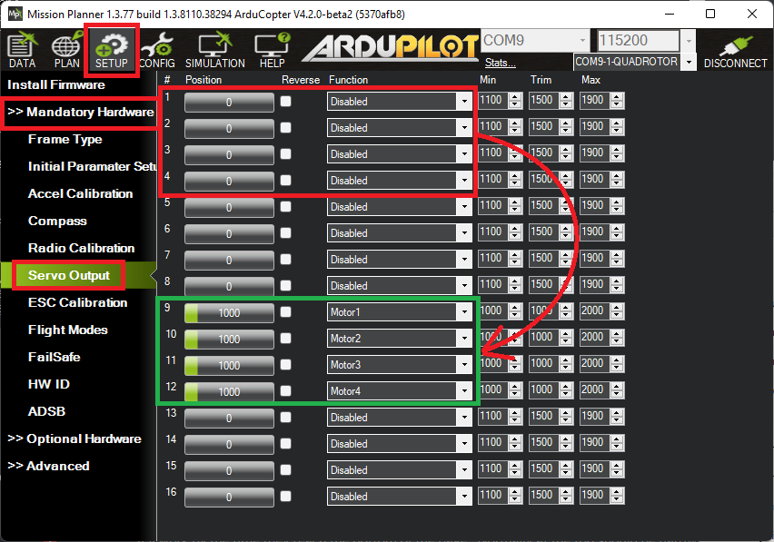
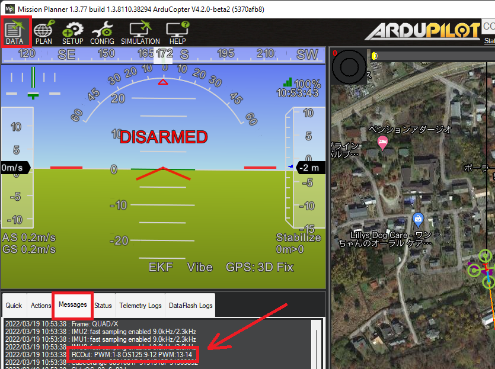

.. _common-brushless-escs:

================================
PWM, OneShot and OneShot125 ESCs
================================

Most ArduPilot vehicles use brushless motors controlled by brushless motor ESCs. The most common protocols used by these ESCs are PWM, OneShot, OneShot125, and :ref:`DShot <common-dshot-escs>`. This page describes the first three (PWM, OneShot and OneShot125).

.. warning:: Be sure your ESC can support the configuration you select for it. Damage can occur otherwise. This includes frame rates discussed below. Also be careful when switching between protocols without rebooting or re-calibrating ESCs as this can lead to uncommanded motor output.

PWM
===
These are the most common ESCs for non-copter applications and were historically the first brushless ESCs.

.. image:: ../../../images/hobbywing-esc.jpg

PWM ESCs use a periodic input pulse of width typically between 1000uS and 2000uS for zero to full power, respectively.

[site wiki="copter"]
- Set :ref:`MOT_PWM_TYPE <MOT_PWM_TYPE>` to 0/Normal (the default) and reboot the autopilot
- :ref:`MOT_PWM_MIN <MOT_PWM_MIN>` and :ref:`MOT_PWM_MAX <MOT_PWM_MAX>` specify the PWM range sent to motors (e.g. where :ref:`SERVOx_FUNCTION <SERVO1_FUNCTION>` = "Motor1", "Motor2", etc).  See :ref:`ESC Calibration <esc-calibration>` for info on aligning the autopilot's output range with the ESC's input range.
[/site]
[site wiki="rover"]
- Set :ref:`MOT_PWM_TYPE <MOT_PWM_TYPE>` to 0/Normal (the default) and reboot the autopilot
- The PWM range for each channel is specified by the corresponding :ref:`SERVOx_MIN <SERVO3_MIN>` and :ref:`SERVOx_MAX <SERVO3_MAX>` parameters.
[/site]
[site wiki="plane"]
- Forward motors will use normal PWM unless OneShot (see below) or :ref:`DShot <common-dshot-escs>` has been enabled.  The PWM range for each channel is specified by the corresponding :ref:`SERVOx_MIN <SERVO3_MIN>` and :ref:`SERVOx_MAX <SERVO3_MAX>` parameters.
- VTOL motors will use normal PWM when :ref:`Q_M_PWM_TYPE <Q_M_PWM_TYPE>` is 0/Normal (the default).  The PWM range is specified by the :ref:`Q_M_PWM_MIN <Q_M_PWM_MIN>` and :ref:`Q_M_PWM_MAX <Q_M_PWM_MAX>` parameters
- See :ref:`ESC Calibration <common-esc-calibration>` for info on aligning the autopilot's output range with the ESC's input range.

.. note:: The autopilot should be re-booted after changing the protocol type.
[/site]

The frame rate of these pulses is usually between 50Hz to 490Hz. The faster frame rates allow quicker control reactions to be sent to the motor, if the ESC has capability for those frame rates.

[site wiki="copter"]
- Set :ref:`RC_SPEED <RC_SPEED>` to change the frame rate (default is 490Hz)
[/site]
[site wiki="rover"]
- Set :ref:`SERVO_RATE <SERVO_RATE>` to change the frame rate (default is 50Hz)
[/site]
[site wiki="plane"]
- Set :ref:`SERVO_RATE <SERVO_RATE>` to change the frame rate for forward motors (default is 50hz)
- Set :ref:`Q_RC_SPEED <Q_RC_SPEED>` to change the frame rate for the VTOL esc/motors (default is 490Hz)
[/site]

.. note:: be sure of the capabilities of your ESC before selecting a higher frame rate to avoid damage to the ESC.

OneShot
=======

OneShot (not to be confused with "OneShot125") is an older protocol that uses the same pulse widths as Normal PWM but has a fixed frame rate equal to the autopilot main loop rate.  There is little advantage for using this protocol over regular PWM.

[site wiki="copter, rover"]
- Set :ref:`MOT_PWM_TYPE <MOT_PWM_TYPE>` to 1 (OneShot) and reboot the autopilot
[/site]
[site wiki="plane"]
Oneshot (not Oneshot125) loop synchronization can be added to any motor running an normal PWM ESC or servo using the :ref:`ONESHOT_MASK <ONESHOT_MASK>` bitmask. It will trigger pulses at the :ref:`SCHED_LOOP_RATE <SCHED_LOOP_RATE>`, but no lower than at 250Hz. Be sure the ESCs can handle this rate.

VTOL motors will use OneShot if :ref:`Q_M_PWM_TYPE <Q_M_PWM_TYPE>` is 1 (OneShot)
[/site]

OneShot 125
===========

The OneShot125 (sometimes confusingly shortened to just OneShot) protocol is similar to regular PWM except that the pulse widths are divided by a factor of 8 which allows faster communication from the autopilot to the ESC.  Individual pulses are sent more quickly and the overall frame rate can be increased up to 490Hz.

[site wiki="copter, rover"]
- Set :ref:`MOT_PWM_TYPE <MOT_PWM_TYPE>` to 2 (OneShot125) and reboot the autopilot
[/site]
[site wiki="plane"]
- Forward motors will use normal PWM unless OneShot or DShot has been enabled (see below) 
- VTOL motors will use OneShot125 if :ref:`Q_M_PWM_TYPE <Q_M_PWM_TYPE>` is 2 (OneShot125)
[/site]

If using an autopilot with an IOMCU (e.g. Pixhawk, CubeOrange) the ESCs should be connected to the AUX outputs and the corresponding :ref:`SERVOx_FUNCTION <SERVO9_FUNCTION>` values should be set to "Motor1", etc.  This can be most easily done using Mission Planner's "Servo Output" page

Reboot the autopilot and check the "RC banner" to confirm the output channels are setup as expected (this banner appears whenever parameters are downloaded)

.. _mixing-escs:

Mixing ESC Protocols
====================

While all the servo/motor outputs of an ArduPilot autopilot are capable of Normal PWM operation at 50Hz frame rates, not all are capable of other ESC protocols. And, usually, these configurations must apply to pre-designated groups of outputs, even if they are not all driving an ESC. So the following cautions apply:

#. The 8 "MAIN" outputs of autopilots using an IOMCU (like PixHawk and Cube), cannot be used for  protocols other than Normal PWM and OneShot. On these autopilots, only the additional "AUX" outputs can properly support OneShot125. If you attempt to set a "MAIN" output to OneShot125, then normal PWM output will occur, even though it has been set to a OneShot125 protocol.

#. For :ref:`Pixracer <common-pixracer-overview>` and :ref:`other boards <common-autopilots>` without a separate IOMCU coprocessor, all servo/motor outputs can be used.

#. Groups of outputs sharing a common timer, MUST have the same advanced configuration. Usually, these are specified in the autopilot's hardware description linked from the :ref:`common-autopilots` page. For example, if an output is configured for OneShot125 in a group, then you cannot use another output in that group for Normal PWM ESC **or** normal PWM servo operation.

.. note:: Everytime the autopilot initializes, it sends the "RC Banner" to the ground control station, showing which outputs are PWM, OneShot, OneShot125 or DShot. The remaining higher numbered outputs are assigned as GPIOs.

.. image:: ../../../images/RCOutbanner.jpg
