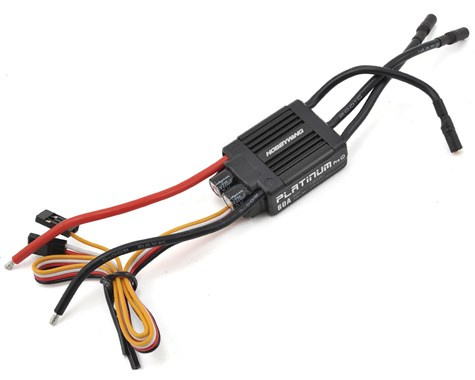
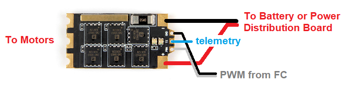

.. _common-brushless-escs:

====================
Brushless Motor ESCs
====================

The most common electric motor used with ArduPilot vehicles is brushless and requires a brushless ESC for control. Two main protocols for communicating with these ESCs are PWM and DShot. See :ref:`common-dshot` for configuration information on brushless ESCs.

PWM
===
These are the most common ESCs for non-copter applications and were historically the first brushless ESCs.

PWM ESCs use a periodic input pulse of width typically between 1000uS and 2000uS for zero to full power, respectively. The frame rate of these pulses is usually between 50Hz to 490Hz. The faster frame rates allow quicker control reactions to be sent to the motor, if the ESC has capability for those frame rates. The frame rate is controlled by :ref:`RC_SPEED<RC_SPEED>` for all vertical lift motors on a vehicle.

.. note:: be sure of the capabilities of your ESC before selecting a higher frame rate to avoid damage to the ESC.

An even faster PWM protocol is OneShot125 (sometimes shortened to just OneShot). If the ESC has this capability, then the pulse widths are divided by a factor of 8 for even faster communication from the autopilot to the ESC since the commands get to the ESC 8 times faster at any given frame rate. In addition, the capability to increase the frame rate up to 490Hz is allowed.

.. note:: OneShot (vs OneShot125) is an older protocol that uses the same pulse widths as Normal PWM, but has a higher fixed frame rate equal to the autopilot main loop rate. It has been replaced by OneShot125.

DShot
=====

Dshot is a digital ESC protocol. In contrast to traditional servo-type PWM it allows fast, high resolution digital communication. This opens the door for more precise vehicle control. This is especially useful in multirotor and quadplane applications.

..  note::
   Only try DShot on ESCs that are known to support it or you will get unpredictable results. Reverse thrust is supported in ArduPilot 4.0 and later firmware versions.

The DShot ESC protocol's key advantages are:

- all values sent to the ESC are checksum-protected
- clock differences between the ESC and autopilot don't affect flight performance
- no need to do any ESC throttle range calibration
- very high protocol frame rates are supported

While DShot is available on many ESCs, those with BLHeli32 capability, offer the most performance and often, additional features such as ESC telemetry. In addition, ArduPilot provides special programming capability for BLHeli32 ESCs via its passthrough feature (See :ref:`common-dshot` section.)

.. note::
   Recently there is a growing number of proprietary and non-proprietary 16 / 32 bit ESCs with firmware that support DShot and other digital ESC protocols, but not BLHeli_32-specific features like passthrough and telemetry. See your ESC's manual for further detail on supported features.

Where to buy
============

A `search for "BLHeli32 shopping" <https://www.google.com/search?q=blheli32&tbm=shop>`__ turns up many compatible ESCs.  Look for an ESC which includes the telemetry wire connector like the `HolyBro Tekko32 shown below <https://shop.holybro.com/holybro-tekko32-esc35a_p1074.html>`__

*image courtesy of holybro.com*

