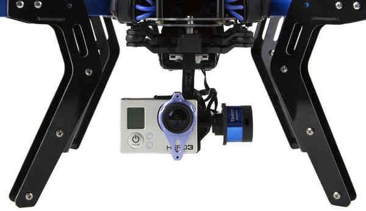

.. _common-brushless-pwm-gimbal:

[copywiki destination="plane,copter,rover"]

====================
Brushless PWM Gimbal
====================

Many camera gimbals can accept PWM input or SBUS input for controlling the roll, pitch and yaw angles.  This page describes the setup procedure to allow ArduPilot to control these gimbals.

.. warning::

    These instructions are for ArduPilot 4.3 (and higher).  For ArduPilot 4.2 (and lower) please refer to the :ref:`Servo Gimbal <common-camera-gimbal>` instructions.

Supported Gimbals
-----------------

Gimbals that accept PWM input or SBUS input to control the gimbal's *lean angle* should work.

Some gimbals accept PWM or SBUS input but only provide *rate* control.  These gimbals will not work by default but it may be possible, using the gimbal's configuration application, to configure them to interpret the input for angle control.

The list of supported gimbals is a work-in-progress.  If you would like to add a gimbal that is known to work, please `raise an issue <https://github.com/ArduPilot/ardupilot_wiki/issues>`__

Connecting to the Autopilot
---------------------------

.. image:: ../../../images/Gimbal_Pixhawk_Tarot.jpg
    :target: ../_images/Gimbal_Pixhawk_Tarot.jpg
    :width: 450px

If the gimbal has multiple PWM input ports (one for each axis), connect them to the autopilot PWM output channels.
If the gimbal accepts SBUS input then connect it to the autopilot's SBUSo (aka "SBus output") port.

Connect to the autopilot with a ground station and set the following parameters.  These settings assume the autopilot's PWM outputs 9, 10 and 11 will control the gimbal's roll, pitch and yaw angles respectively.  They also assume common angular ranges of the gimbal which may need adjusting to match the actual gimbal being used.

- :ref:`MNT1_TYPE <MNT1_TYPE>` to 7 (BrushlessPWM) and reboot the autopilot
- :ref:`MNT1_PITCH_MIN <MNT1_PITCH_MIN>` to -90 (meaning the gimbal can pitch straight downwards)
- :ref:`MNT1_PITCH_MAX <MNT1_PITCH_MAX>` to 25 (meaning the gimbal can pitch up by 25 deg)
- :ref:`MNT1_ROLL_MIN <MNT1_ROLL_MIN>` to -30 (meaning the gimbal can roll right 30 deg)
- :ref:`MNT1_ROLL_MAX <MNT1_ROLL_MAX>` to 30 (meaning the gimbal can roll left 30 deg)
- :ref:`MNT1_YAW_MIN <MNT1_YAW_MIN>` to -180 (meaning the gimbal can yaw to the left 180deg)
- :ref:`MNT1_YAW_MAX <MNT1_YAW_MAX>` to 180 (meaning the gimbal can yaw to the right 180deg)
- :ref:`MNT1_RC_RATE <MNT1_RC_RATE>` to 90 (deg/s) to control speed of gimbal when using RC targetting
- :ref:`SERVO9_FUNCTION <SERVO9_FUNCTION>` to 8 (Mount1 Roll)
- :ref:`SERVO10_FUNCTION <SERVO10_FUNCTION>` to 7 (Mount1 Pitch)
- :ref:`SERVO11_FUNCTION <SERVO11_FUNCTION>` to 6 (Mount1 Yaw)
- :ref:`RC6_OPTION <RC6_OPTION>` = 213 ("Mount Pitch") to control the gimbal's pitch rate with RC channel 6
- :ref:`RC7_OPTION <RC7_OPTION>` = 214 ("Mount Yaw") to control the gimbal's yaw rate with RC channel 7
- :ref:`RC8_OPTION <RC8_OPTION>` = 163 ("Mount Lock") to switch between "lock" and "follow" mode with RC channel 8

See the "Control with an RC transmitter" section of :ref:`this page <common-mount-targeting>` for more details on parameter changes required to control the gimbal through an RC Transmitter (aka "RC Targeting")

Configuring the Gimbal
----------------------

Connect the gimbal to your PC and using its configuration application

- if using SBUS input set the input channels to match the output channels from the autopilot

    - set roll angle input to input to channel 9
    - set pitch angle input to input to channel 10
    - set yaw angle input to input to channel 11

- If the gimbal supports "lock" and "follow" yaw control it should be configured for "follow".

Control and Testing
-------------------

See :ref:`Gimbal / Mount Controls <common-mount-targeting>` for details on how to control the gimbal using RC, GCS or Auto mode mission commands
