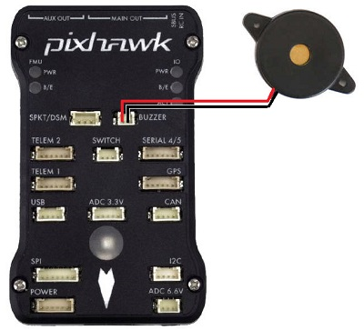

.. _common-buzzer:

[copywiki destination="copter,plane,rover"]

=======================
Buzzer (aka Tone Alarm)
=======================

A buzzer (or Tone Alarm) is used to play various :ref:`sounds <common-sounds-pixhawkpx4>` including the Arming buzz and Lost Copter Alarm (search for "Lost Copter Alarm" on :ref:`this page <channel-7-and-8-options>`).

Mounting the buzzer
===================

The sound from the buzzer can impact the accelerometers if placed too close to the flight controller which can lead to poor altitude hold performance when the buzzer is activated.
The buzzer should ideally be mounted at least 5cm away from the flight controller and the speaker (i.e. the open hole) should not be pointing directly at the flight controller.

Silencing the buzzer
====================

Some flight controllers (like the HobbyKing PixRacer) have built-in buzzers.  We recommend disabling the these buzzers by setting the following parameter:

- set :ref:`NTF_BUZZ_ENABLE <NTF_BUZZ_ENABLE>` = 0 to disable the buzzer
