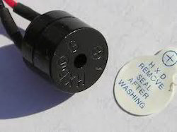

.. _common-buzzer:

[copywiki destination="copter,plane,rover"]

=======================
Buzzer (aka Tone Alarm)
=======================

.. image:: ../../../images/pixhawk_buzzer.jpg
    :target: ../_images/pixhawk_buzzer.jpg

A buzzer (or Tone Alarm) can be used to audibly indicate status changes for the vehicle. Depending on board capabilities, this can be an active device (only needs voltage applied to produce a single frequency tone), as shown below, or a passive piezo device driven by PWM capable of producing variable musical tones, as shown above. Some boards can use either type.

If a passive piezo is used, it can play various :ref:`sounds <common-sounds-pixhawkpx4>` including the Arming buzz and Lost Vehicle Alarms (search for "Lost Copter Alarm" on :ref:`this page <channel-7-and-8-options>` , "Lost Plane" in the RCx_OPTIONS, for example, :ref:`RC5_OPTION <RC5_OPTION>` , or "Lost Rover" in the :ref:`Auxiliary Functions <common-auxiliary-functions>`).

.. note:: in order to use a passive piezo buzzer to play the musical notification tones, the autopilot firmware must have defined that capability to a pin with a timer in its build definition. This is not a capability that the user can add by parameter setup, unlike the use of an active buzzer by designating a GPIO capable pin with :ref:`NTF_BUZZ_PIN<NTF_BUZZ_PIN>` .

If an active buzzer is used, it can indicate the following:

    +------------------+-----------------------------------+
    | STATUS           | Pattern                           |
    +==================+===================================+
    | ARMING           | 3 sec long Beep                   |
    +------------------+-----------------------------------+
    | ARMING FAILURE   | Single Beep                       |
    +------------------+-----------------------------------+
    | DISARMED         | Single Beep                       |
    +------------------+-----------------------------------+
    | BATTERY FAILSAFE | Single Beep repeating every 3 sec |
    +------------------+-----------------------------------+
    | EKF FAILURE      | Beeeep-Beeep-Beep-Beep            |
    +------------------+-----------------------------------+
    | LOST VEHICLE     | Beep-Beep repeating every 3 sec   |
    +------------------+-----------------------------------+

Using an active buzzer instead of a passive buzzer
==================================================

An active buzzer can be used with boards setup for a passive buzzer in two ways.

First, the active buzzer can simply replace the passive piezo, paying attention to the polarity of the buzzer (unlike passive piezo buzzers, active buzzers need to be connected with the right polarity in order to function). It will play all the sounds, however, at lower volume and without the precise tone frequencies as played with a passive buzzer.

Alternatively, you can set the :ref:`NTF_BUZZ_PIN<NTF_BUZZ_PIN>` to a GPIO pin, like those used for :ref:`relay control <common-relay>` , and attach an active buzzer to that pin with its negative lead, and apply power (usually +5V) to the buzzer's positive lead.

If an active buzzer is used, the :ref:`NTF_BUZZ_ON_LVL<NTF_BUZZ_ON_LVL>` parameter determines the pin level needed to activate it.

.. note:: For many boards, the GPIO pin numbers are assigned to PWM outputs for alternate use can only be found by looking at that board's hwdef.dat file `here <https://github.com/ArduPilot/ardupilot/tree/master/libraries/AP_HAL_ChibiOS/hwdef>`__ .

Mounting the buzzer
===================

The sound from the buzzer can impact the accelerometers if placed too close to the autopilot which can lead to poor altitude hold performance when the buzzer is activated.
The buzzer should ideally be mounted at least 5cm away from the autopilot and the speaker (i.e. the open hole) should not be pointing directly at the autopilot.

Silencing the buzzer
====================

Some autopilots (like the HobbyKing PixRacer) have built-in buzzers.  We recommend disabling the these buzzers by setting the following parameter:

- :ref:`NTF_BUZZ_TYPES<NTF_BUZZ_TYPES>` controls which types of buzzers are enabled: Pin driven buzzers (built-in or external), and/or DShot based on ESCs.
- Set ``NTF_BUZZ_ENABLE`` = 0 to disable the pin driven buzzer in firmware prior to 4.1. 

In addition, :ref:`NTF_BUZZ_VOLUME<NTF_BUZZ_VOLUME>` can be used to control the volume.
