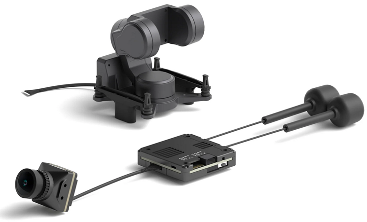
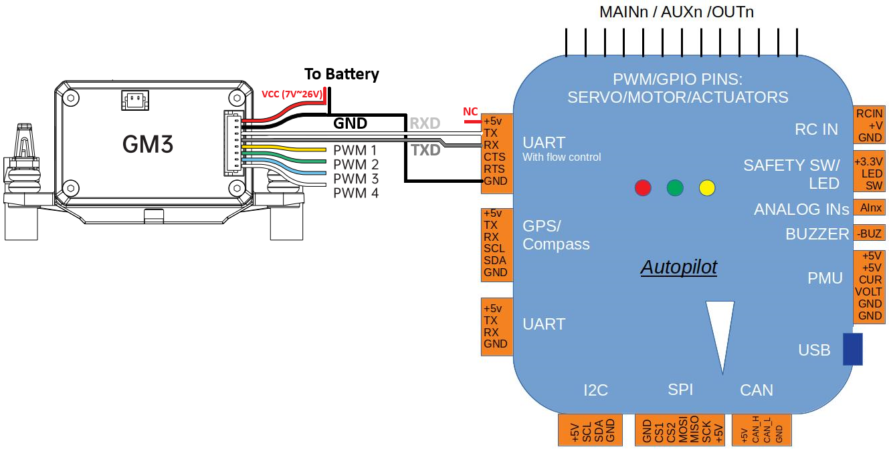
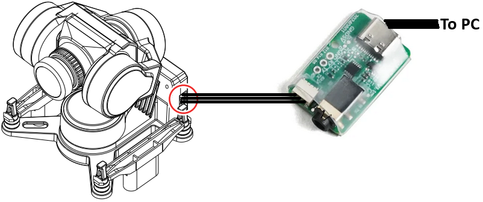
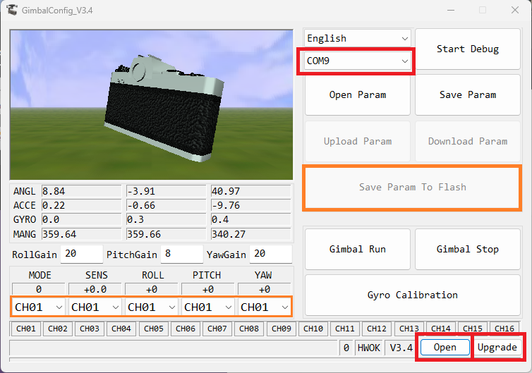

.. _common-caddx-gimbal:

[copywiki destination="plane,copter,rover"]

=============
CADDX Gimbals
=============

`CADDX <https://caddxfpv.com/products/caddxfpv-gm1-gm2-gm3.html>`__ GM1, GM2, GM3 gimbals are small 1, 2 and 3-axis gimbals weighing between 16g and 46g and can be paired with 19mm x 19mm FPV cameras

.. warning::

    Support for these gimbals is available in ArduPilot 4.6 (and higher) and requires the gimbal's firmware be 3.4 (or higher)

The `user manual can be found here <https://cdn.shopify.com/s/files/1/0036/3921/4169/files/GM_Series_Manual_V1.0_1.pdf>`__

Where and What to Buy
---------------------

- The GM1, GM2 and GM3 gimbals can be purchased directly from `CADDXFPV <https://caddxfpv.com/products/caddxfpv-gm1-gm2-gm3.html>`__
- The `GL and GM Upgrade Cable <https://caddxfpv.com/products/gl-and-gm-upgrade-cable>`__ is likely also required to upgrade the gimbal's firmware to 3.4 (or higher)

Connecting to the Autopilot
---------------------------

Connect the gimbal's RX, TX and GND pins to one of the autopilot's serial ports as shown above

Connect with a ground station and set the following parameters.  The params below assume the autopilot's telem2 port is used

- :ref:`SERIAL2_PROTOCOL <SERIAL2_PROTOCOL>` to 8 ("Gimbal")
- :ref:`SERIAL2_BAUD <SERIAL2_BAUD>` to "115" for 115200 bps
- :ref:`MNT1_TYPE <MNT1_TYPE>` to "13" ("CADDX") and reboot the autopilot
- :ref:`MNT1_PITCH_MIN <MNT1_PITCH_MIN>` to -90
- :ref:`MNT1_PITCH_MAX <MNT1_PITCH_MAX>` to 90
- :ref:`MNT1_YAW_MIN <MNT1_YAW_MIN>` to -170
- :ref:`MNT1_YAW_MAX <MNT1_YAW_MAX>` to 170
- :ref:`MNT1_RC_RATE <MNT1_RC_RATE>` to 60 (deg/s) to control speed of gimbal when using RC targetting
- :ref:`RC6_OPTION <RC6_OPTION>` = 213 ("Mount Pitch") to control the gimbal's pitch angle with RC channel 6
- :ref:`RC7_OPTION <RC7_OPTION>` = 214 ("Mount Yaw") to control the gimbal's yaw angle with RC channel 7
- :ref:`RC8_OPTION <RC8_OPTION>` = 163 ("Mount Lock") to switch between "lock" and "follow" mode with RC channel 8

Configuring the Gimbal
----------------------

Firmware upgrade instructions are in the "Upgrade" section of the `user manual <https://cdn.shopify.com/s/files/1/0036/3921/4169/files/GM_Series_Manual_V1.0_1.pdf>`__ but in short:

- Download the GimbalConfig windows application and latest gimbal firmware from the `CADDXFPV Download Center <https://caddxfpv.com/pages/download-center>`__ (look for the "Firmware / GM Gimbal Firmware" link near the bottom of the page)
- Extract the contents of the downloaded zip file and run the GimbalConfig application
- Connect the `Upgrade Cable <https://caddxfpv.com/products/gl-and-gm-upgrade-cable>`__ to the upgrade port shown below, connect the other end to your PC

- Open the GimbalConfig application, select the COM port, then "Open" and find the "CwGimbalZGV2Main_V3.4.cahf" file and push "Upgrade"

Control and Testing
-------------------

See :ref:`Gimbal / Mount Controls <common-mount-targeting>` for details on how to control the camera and gimbal using RC, GCS or Auto mode mission commands
