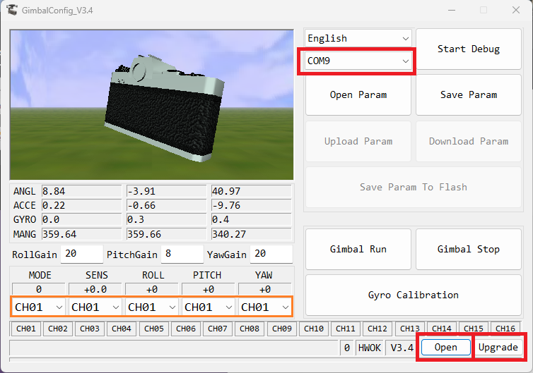

.. _common-caddx-gimbal:

[copywiki destination="plane,copter,rover,sub"]

=============
CADDX Gimbals
=============

`CADDX <https://caddxfpv.com/products/caddxfpv-gm1-gm2-gm3.html>`__ GM1, GM2, GM3 gimbals are small 1, 2 and 3-axis gimbals weighing between 16g and 46g and can be paired with 19mm x 19mm FPV cameras. The gimbal mounted camera is always stabilized against short term movements in all axes.

.. image:: ../../../images/caddxfpv-gimbal.png
    :target: https://caddxfpv.com/products/caddxfpv-gm1-gm2-gm3.html

.. warning::

    Support for these gimbals is available in ArduPilot 4.6 (and higher) and requires the gimbal's firmware be 3.4 (or higher)

The `user manual can be found here <https://cdn.shopify.com/s/files/1/0036/3921/4169/files/GM_Series_Manual_V1.0_1.pdf>`__

Where and What to Buy
---------------------

- The GM1, GM2 and GM3 gimbals can be purchased directly from `CADDXFPV <https://caddxfpv.com/products/caddxfpv-gm1-gm2-gm3.html>`__
- The `GL and GM Upgrade Cable <https://caddxfpv.com/products/gl-and-gm-upgrade-cable>`__ can be used to upgrade the gimbal's firmware to 3.4 (or higher). Any FTDI to serial adapter connected to a 3 pin .1mm SH cable can also be used.

Connecting to the Autopilot
---------------------------

.. note:: the terms "Gimbal" and "Mount" are interchangeable in ArduPilot.

.. image:: ../../../images/caddxfpv-gm3-autopilot.png
    :target: ../_images/caddxfpv-gm3-autopilot.png
    :width: 450px

Connect the gimbal's RX, TX and GND pins to one of the autopilot's serial ports as shown above

Connect with a ground station and set the following parameters.  The params below assume the autopilot's telem2 port is used. Parameters shown for use of SERIAL2 port and first MOUNT instance. RC switch channels used can be determined by user.

- :ref:`SERIAL2_PROTOCOL <SERIAL2_PROTOCOL>` to 8 ("Gimbal")
- :ref:`SERIAL2_BAUD <SERIAL2_BAUD>` to "115" for 115200 bps
- :ref:`MNT1_TYPE <MNT1_TYPE>` to "13" ("CADDX") and reboot the autopilot
- :ref:`MNT1_PITCH_MIN <MNT1_PITCH_MIN>` to -90
- :ref:`MNT1_PITCH_MAX <MNT1_PITCH_MAX>` to 90
- :ref:`MNT1_YAW_MIN <MNT1_YAW_MIN>` to -170
- :ref:`MNT1_YAW_MAX <MNT1_YAW_MAX>` to 170
- :ref:`MNT1_RC_RATE <MNT1_RC_RATE>` to 60 (deg/s) to control speed of gimbal when using RC targeting if controlling the movement RATE by RC is desired. If RC value is intended to control the ANGLE, then set it to 0.

Optional
~~~~~~~~
To allow pilot RC transmitter control of the gimbal:

- :ref:`RC6_OPTION <RC6_OPTION>` = 213 ("Mount Pitch") to control the gimbal's pitch angle with RC channel 6
- :ref:`RC7_OPTION <RC7_OPTION>` = 214 ("Mount Yaw") to control the gimbal's yaw angle with RC channel 7
- :ref:`RC8_OPTION <RC8_OPTION>` = 163 ("Mount Yaw Lock") to switch between normal yaw operation and locking mount heading with RC channel 8 (in RC Targeting mode only).
- :ref:`RC9_OPTION <RC9_OPTION>` = 185 ("Mount RP Lock") to switch between three modes of earth frame/body frame locks for the roll and pitch axis in RC targeting mode.

=============================    ==========   ===========   ===================================================================
Mount RP Lock Switch Position    Roll EF/BF   Pitch EF/BF   Description
=============================    ==========   ===========   ===================================================================
LOW                                BF            BF         FPV lock: pitch/roll RC sets locked angle with respect to mount;useful when flying via gimbal camera
MID                                BF            EF         Pitch lock: roll RC sets locked angle with respect to mount
HIGH                               EF            EF         Horizon lock:  pitch/roll RC sets locked angle with respect to horizon
=============================    ==========   ===========   ===================================================================

BF = Body frame, EF = Earth Frame

.. note :: for full FPV lock the yaw axis should not be forced to Earth frame by a Mount Yaw Lock switch. See :ref:`common-mount-targeting` for more information on mount modes, pilot/autopilot targeting controls, and axes locks.

- setting :ref:`MNT1_OPTIONS<MNT1_OPTIONS>` bit 2 (value +4) can be used to for force FPV lock as given in the above table without the need for RC switches when in RC Targeting Mount Mode.

Configuring the Gimbal
----------------------

Firmware upgrade instructions are in the "Upgrade" section of the `user manual <https://cdn.shopify.com/s/files/1/0036/3921/4169/files/GM_Series_Manual_V1.0_1.pdf>`__ but in short:

- Download the GimbalConfig windows application and latest gimbal firmware from the `CADDXFPV Download Center <https://caddxfpv.com/pages/download-center>`__ (look for the "Firmware / GM Gimbal Firmware" link near the bottom of the page)
- Extract the contents of the downloaded zip file and run the GimbalConfig application
- Connect the `Upgrade Cable <https://caddxfpv.com/products/gl-and-gm-upgrade-cable>`__ or FTDI adapter to the upgrade port shown below, connect the other end to your PC

- Open the GimbalConfig application, select the COM port, then "Open" and find the "CwGimbalZGV2Main_V3.4.cahf" file and push "Upgrade"

- Ensure the channel drop-downs highlighted in orange above are set to CH01 and then push the "Save Param To Flash" button.

.. note :: ArduPilot sets the "sensitivity" to zero in every command. If you set the sensitivity channel to "Null" above instead of CH01, then whatever sensitivity you set in the configurator GUI will not be changed to "0" by ArduPilot.

Control and Testing
-------------------

See :ref:`Gimbal / Mount Controls <common-mount-targeting>` for details on how to control the camera and gimbal using RC, GCS or Auto mode mission commands
