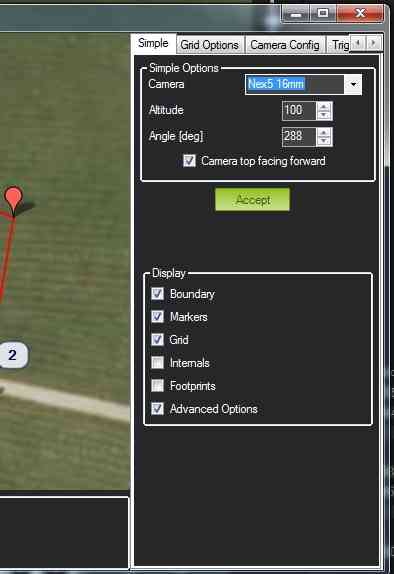
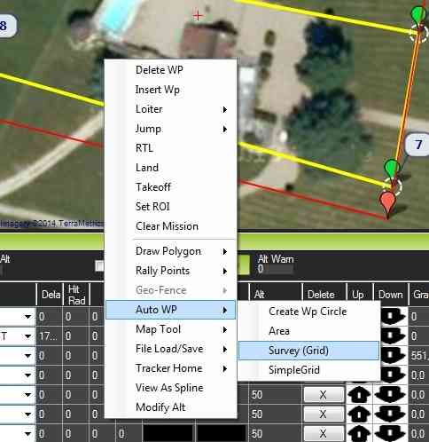

.. _common-camera-control-and-auto-missions-in-mission-planner:

===============================
Camera Control in Auto Missions
===============================

This article describes ArduPilot's camera and gimbal commands, and
explains how these can be used in Mission Planner to define camera
survey missions.  These instructions assume a :ref:`camera trigger and gimbal have already been connected and configured <common-cameras-and-gimbals>`.

Overview
========

Planning a camera mission is almost exactly the same as :ref:`planning any other mission with waypoints and events <common-planning-a-mission-with-waypoints-and-events>`. The
only difference is that in a camera mission you specify commands to
trigger the camera shutter at waypoints or at regular intervals as the
vehicle moves. If the camera is mounted on a gimbal, you can also set
the gimbal orientation, or make it track a particular point of interest.

For simple missions you can manually specify the required waypoints and
camera commands. For more complex paths and grid surveys Mission Planner
makes things easy by providing tools to automatically generating the
required mission for arbitrary regions.

Camera commands
---------------

-  ``DO_SET_CAM_TRIGG_DIST`` — Trigger the camera shutter at regular
   intervals. This is most commonly used for supporting area surveys.
-  ``DO_DIGICAM_CONTROL`` — Trigger the camera shutter once every time
   this command is called.

Camera gimbal commands
----------------------

If a camera gimbal is used, you can set the camera position (yaw, tilt,
roll) or aim it at a specific region of interest (ROI):

-  ``DO_SET_ROI`` — Target the camera towards a specified region of
   interest (position, including altitude).
-  ``DO_MOUNT_CONTROL`` — Position the gimbal with the specified roll,
   pitch and yaw.

Servo and Relay commands
------------------------

Servos and relay outputs can be connected to hardware and activated
during missions using the ``DO_SET_SERVO`` or ``DO_SET_RELAY`` commands,
respectively.

One possible use for these outputs is to control camera features other
than the shutter (for example, to set the zoom level or switch capture
from still to video).

.. note::

   The method used to connect your servo or relay to the camera, and
   what features are accessible, will depend the camera and its supported
   remote-control mechanism(s) (see the :ref:`Camera Control and GeoTagging section of the Cameras and Gimbals wiki page <common-cameras-and-gimbals>`)

Auto-mission types
==================

Mission Planner supports the following *Auto Waypoint* options. To
access these open the *Flight Plan* screen, right-click on the map and
select the option from under the *Auto WP* menu:

-  **Create WP Circle** — Create a circle of waypoints.
-  **Area** — Displays the area of the current polygon (if defined).
-  **Create Spline Circle** — A circle where the altitude of waypoints
   follows a rising spline (relevant to flying vehicles).
-  **Survey (Grid)** — Automatically create waypoints and camera control
   commands to survey a specified polygon.
-  **Survey (Gridv2)** — *Under construction!* This is a simpler grid
   control for creating a rectangular survey area.
-  **SimpleGrid** — A simple auto-created survey grid. No camera control
   is defined, so this must be added separately.

The following sections include community-provided examples of automatic
survey missions.

.. _common-camera-control-and-auto-missions-in-mission-planner_survey_grid_example:

Survey (Grid) Example
---------------------

Mission Planner's *Survey (Grid)* option automatically defines the
waypoints required to cover an arbitrary polygon, and sets
``DO_SET_CAM_TRIGG_DIST`` on relevant waypoints to ensure that pictures
are captured at regular intervals in the vehicle's path.

-  Open the *Flight Plan* tab
-  **Right click** on the map, and select **Draw Polygon \| Add PolyGon
   Point**. Create points surrounding the area to be photographed.
-  **Right click** on the map and select **Auto WP \| Survey(Grid)**:

   |surveyexample|

-  *Mission Planner* will then display a configuration screen where you
   can define the camera make/model and other parameters including teh
   overlap you want between pictures, lens size, etc.
   ``DO_SET_CAM_TRIGG_DIST`` is automatically calculated based on this
   information!

   |surveyexample2|

After clicking on **Accept**, *Mission Planner* will generate a list of
waypoints covering the specified area, and including take-off and
landing waypoints. The ``DO_SET_CAM_TRIGG_DIST`` command is called to
set the distance in meters between two camera triggers during your
mission. At the end of the mission ``DO_SET_CAM_TRIGG_DIST`` is called
again to set the parameter back to zero (stops capturing images).

The final mission with waypoints and camera triggers looks like this:

.. image:: ../../../images/mp_camera_control_mission.jpg
    :target: ../_images/mp_camera_control_mission.jpg
    :width: 450px

The test mission shown above was run. It generated 15 images, which have
been stitched together. A thumbnail of the composite image is shown
below (because the full size image is too large at about 107 MBytes).

.. image:: ../../../images/Mortierthumbnail2.jpg
    :target: ../_images/Mortierthumbnail2.jpg
    :width: 450px

Creating composite images
=========================

There are a number of good free and paid tools for creating composite
images:

-  `Pix4Dmapper <https://www.pix4d.com/>`__ - The free "discovery"
   version supports image merging.
-  `Microsoft Image Composite Editor (ICE) <http://research.microsoft.com/en-us/um/redmond/projects/ice/>`__

[copywiki destination="copter,plane,rover,planner"]