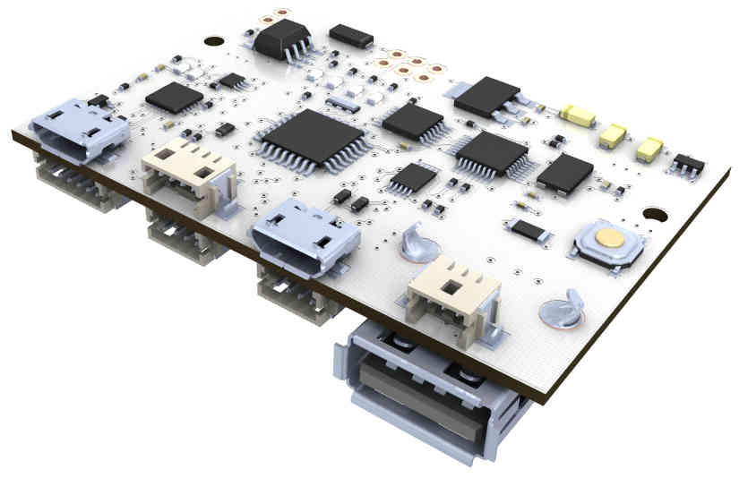
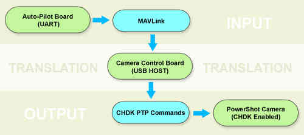
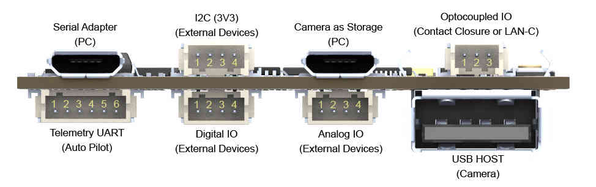
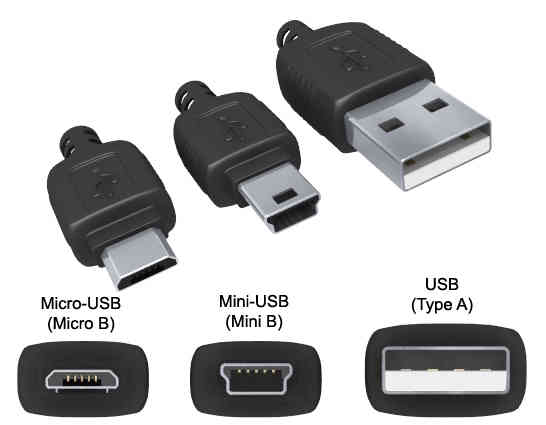
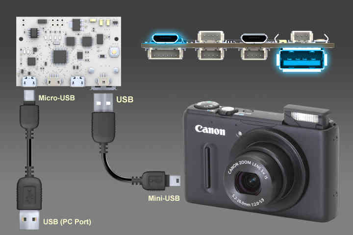
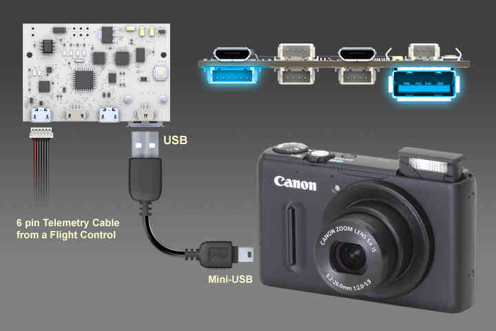
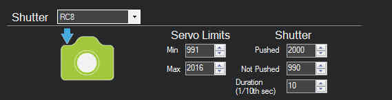
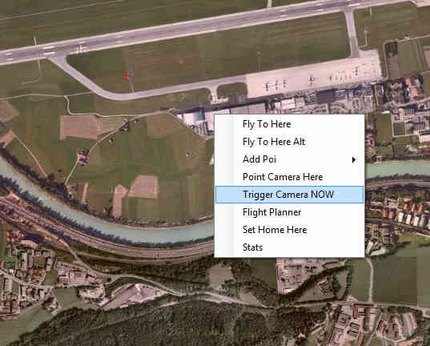
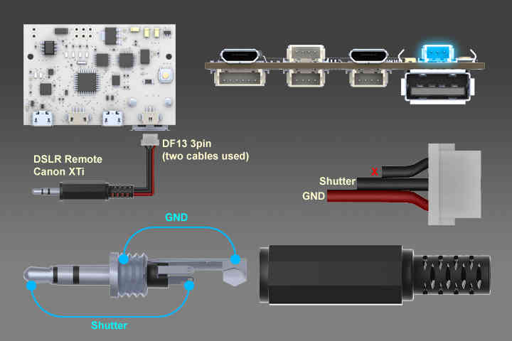

.. _common-camera-control-board:

==================================
Archived:Open Camera Control Board
==================================

.. note::

   *The Open CCB is not yet commercially available - we are actively
   seeking manufacturers. (even though this topic is archived!)* If you
   want to start making and selling this board please contact
   CraigElder@uniserve.

The Open Camera Control Board (OpenCCB) is a camera remote control
interface for aerial photography. 
It has :ref:`many features <common-camera-control-board_port_mapping>`, 
including: FTDI USB/UART adapter, USB HOST,
Digital IO, Analog IO, Optocoupled IO, etc.

Overview
========

The main camera control protocol used is known as PTP (Picture Transfer
Protocol), which was originally standardized as PIMA 15740:2000, ISO
15740:2005(V1.0), and ISO 15740:2008(V1.1).

The PTP has been supported by almost all cameras since 2005, but often
in a limited fashion. Only few cameras have the "PTP Remote Control"
feature. Canon, for example, removed the remote control feature from
their compact line (PowerShot models) in the last PS SDK in 2009
(PS-ReCSDK 1.1.0e).

Fortunately the PTP hacking extension in the `CHDK project <http://chdk.wikia.com/wiki/PTP_Extension>`__ allows us to
extend the PTP control to newer, smaller and lighter Canon PowerShot
models.

The CHDK PTP interface is described below:

    
.. _common-camera-control-board_port_mapping:

Port Mapping
============

.. raw:: html

   <table border="1" class="docutils">
   <tbody>
   <tr>
   <th colspan="6">Telemetry UART (Auto Pilot)</th>
   </tr>
   <tr>
   <td>1</td>
   <td>2</td>
   <td>3</td>
   <td>4</td>
   <td>5</td>
   <td>6</td>
   </tr>
   <tr>
   <td>5V</td>
   <td>TX</td>
   <td>RX</td>
   <td>CTS</td>
   <td>RTS</td>
   <td>GND</td>
   </tr>
   </tbody>
   </table>

   <table border="1" class="docutils">
   <tbody>
   <tr>
   <th colspan="4">I2C (3V3)</th>
   </tr>
   <tr>
   <td>1</td>
   <td>2</td>
   <td>3</td>
   <td>4</td>
   </tr>
   <tr>
   <td>GND</td>
   <td>SCA</td>
   <td>SCL</td>
   <td>3V3</td>
   </tr>
   </tbody>
   </table>

   <table border="1" class="docutils">
   <tbody>
   <tr>
   <th colspan="4">Digital IO</th>
   </tr>
   <tr>
   <td>1</td>
   <td>2</td>
   <td>3</td>
   <td>4</td>
   </tr>
   <tr>
   <td>GND</td>
   <td>D2</td>
   <td>D8</td>
   <td>D7</td>
   </tr>
   </tbody>
   </table>

   <table border="1" class="docutils">
   <tbody>
   <tr>
   <th colspan="4">Analog IO</th>
   </tr>
   <tr>
   <td>1</td>
   <td>2</td>
   <td>3</td>
   <td>4</td>
   </tr>
   <tr>
   <td>GND</td>
   <td>A1</td>
   <td>A2</td>
   <td>A3</td>
   </tr>
   </tbody>
   </table>

   <table border="1" class="docutils">
   <tbody>
   <tr>
   <th colspan="3">Optocoupled IO (LANC-C Control)</th>
   </tr>
   <tr>
   <td>1</td>
   <td>2</td>
   <td>3</td>
   </tr>
   <tr>
   <td>V+ LAN-C(5-9V)</td>
   <td>LAN-C Line</td>
   <td>GND LAN-C</td>
   </tr>
   </tbody>
   </table>

   <table border="1" class="docutils">
   <tbody>
   <tr>
   <th colspan="3">Optocoupled IO (Contact Closure Triggering)</th>
   </tr>
   <tr>
   <td>1</td>
   <td>2</td>
   <td>3</td>
   </tr>
   <tr>
   <td>NC</td>
   <td>Shutter</td>
   <td>Ground</td>
   </tr>
   </tbody>
   </table>

USB Connector Types
===================

Computer Wiring - Table Tests and Firmware Uploading
====================================================

Autopilot Wiring - Aerial Photography
=====================================

The firmware can be found `here on GitHub <https://github.com/sandrobenigno/3dr-camera-ctrl>`__.

There is also a `zip file <https://github.com/sandrobenigno/3dr-camera-ctrl/archive/master.zip>`__
of the repository.

After getting the source code, just follow the steps below:

Step 1: Set your Arduino SketchBook path to the main folder

Step 2: Select the sketch "ArduCAMPTP_CHDK_APM26"

.. note::

   If you want the camera showing lenses when connected, you need to
   change the file \__defines.h by setting AUTOSTART to 1, like here:

   ::

       #define AUTOSTART 1 //Expose lens on start (Start on Record Mode)

Step 3: Compile and upload it to CCB board

Step 4: Copy the file geoshot.lua to camera's SD card (folder:
/CHDK/SCRIPTS/)

Step 5: While the autopilot is connected to MissionPlanner,
do set the shutter just like here:

Step 6: Test shooting

After that... any other command should work... because it acts just like
a servo.

Contact Closure - Example: Canon XTi
====================================

MAVLink Detailed
================

Currently, the code is using RC Channels from MAVLink. It does work like
a virtual servo, i.e. those messages do reflect the status of every
single output channel from the autopilot.

Take a look at the most important piece of code from the file
"`MAVcomm.h <https://github.com/sandrobenigno/3dr-camera-ctrl/blob/master/ArduCAMPTP_CHDK_APM26/MAVcomm.h>`__\ ":

.. code-block:: cpp

    case MAVLINK_MSG_ID_RC_CHANNELS_RAW: //RC INPUT BYPASSED BY APM:
        {
        drone_chan[0] = mavlink_msg_rc_channels_raw_get_chan5_raw(&msg);
        drone_chan[1] = mavlink_msg_rc_channels_raw_get_chan6_raw(&msg);
        drone_chan[2] = mavlink_msg_rc_channels_raw_get_chan7_raw(&msg);
        drone_chan[3] = mavlink_msg_rc_channels_raw_get_chan8_raw(&msg);
        }

The triggering is flagged by this small piece of code from the same
file:

.. code-block:: cpp

    #ifdef DRONE_OUT
              if(cam_ctrl_state.shot  1500)) cam_ctrl_state.shot = 1;
    #endif

The flag "cam_ctrl_state.shot" is set to "1" so the board can shot and
set it back to "0".

By default, the code above is using the RC8 from the autopilot. It
is defined on the file
"`_\_defines.h <https://github.com/sandrobenigno/3dr-camera-ctrl/blob/master/ArduCAMPTP_CHDK_APM26/__defines.h>`__\ "
like shown here:

.. code-block:: cpp

    //Define what FC OUT channel is the trigger

    #define DRONE_OUT 1 //Shutter RC8

The shooting function uses some Attitude data as well:

.. code-block:: cpp

    case MAVLINK_MSG_ID_ATTITUDE:
    {
        drone_pitch = ToDeg(mavlink_msg_attitude_get_pitch(&msg));
        drone_roll = ToDeg(mavlink_msg_attitude_get_roll(&msg));
        drone_yaw = ToDeg(mavlink_msg_attitude_get_yaw(&msg));
    }
    break;

    case MAVLINK_MSG_ID_GPS_RAW_INT:
    {
        drone_lat = mavlink_msg_gps_raw_int_get_lat(&msg) / 10000000.0f;
        drone_lon = mavlink_msg_gps_raw_int_get_lon(&msg) / 10000000.0f;
        drone_fix_type = mavlink_msg_gps_raw_int_get_fix_type(&msg);
        drone_satellites_visible = mavlink_msg_gps_raw_int_get_satellites_visible(&msg);
    }
    break;

    case MAVLINK_MSG_ID_VFR_HUD:
    {
        drone_heading = mavlink_msg_vfr_hud_get_heading(&msg); // 0..360 deg, 0=north
        drone_alt_asl = mavlink_msg_vfr_hud_get_alt(&msg);
    }
    break;

That function does send attitude and GPS data to a file on the camera's
SD card. It does call and communicate with the camera through a local
`CHDK script <https://github.com/sandrobenigno/3dr-camera-ctrl/tree/master/CHDK/SCRIPTS>`__.

In order to make it work fully, the autopilot should implement
specific messages for the whole set of functions that the board will
translate into setup and triggering. You can see here the suggested
entries, though it could be expressed in many other ways on a future
implementation:

.. code-block:: cpp

    case MAVLINK_MSG_ID_DIGICAM_CONTROL: //MAV_CMD_DO_DIGICAM_CONTROL:
    {
        cam_ctrl_state.session     = mavlink_msg_digicam_control_get_session(&msg);
        cam_ctrl_state.zoom_pos    = mavlink_msg_digicam_control_get_zoom_pos(&msg);
        cam_ctrl_state.focus_lock  = mavlink_msg_digicam_control_get_focus_lock(&msg);
        cam_ctrl_state.shot        = mavlink_msg_digicam_control_get_shot(&msg);
        cam_ctrl_state.command_id  = mavlink_msg_digicam_control_get_command_id(&msg);
        cam_ctrl_state.extra_param = mavlink_msg_digicam_control_get_extra_param(&msg);
        cam_ctrl_state.extra_value = mavlink_msg_digicam_control_get_extra_value(&msg);
    }
    break; 

The main control points are these ones:

-  cam_ctrl_state.session: show's or retract the lenses
-  cam_ctrl_state.zoom_pos: does control the focal length
-  cam_ctrl_state.focus_lock: does lock or unlock the focus
-  cam_ctrl_state.shot: does shot the camera
