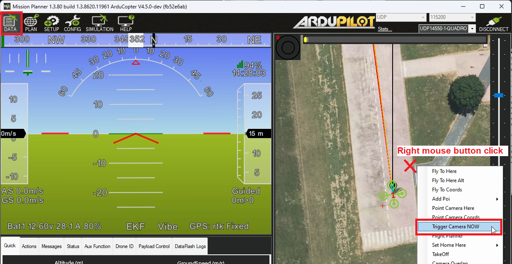

.. _common-camera-controls:

==============================
Camera Controls and Parameters
==============================

This page provides an overview of general camera setup parameters and the three different ways that cameras can be controlled.  The related page detailing :ref:`gimbal controls can be found here <common-mount-targeting>`.

Parameters
==========

ArduPilot supports up to two cameras. The following is for the first camera:

- :ref:`CAM1_TYPE<CAM1_TYPE>`: Camera shutter (trigger) type
- :ref:`CAM1_DURATION<CAM1_DURATION>`: Camera open shutter duration
- :ref:`CAM1_SERVO_ON<CAM1_SERVO_ON>`: Camera servo ON PWM value (Servo type shutter only)
- :ref:`CAM1_SERVO_OFF<CAM1_SERVO_OFF>`: Camera servo OFF PWM value (Servo type shutter only)
- :ref:`CAM1_TRIGG_DIST<CAM1_TRIGG_DIST>`: Camera trigger distance. If this value is non-zero then the camera will trigger whenever the position changes by this number of meters regardless of what mode the autopilot is in.
- :ref:`CAM1_RELAY_ON<CAM1_RELAY_ON>`: Camera relay ON value. This sets whether the relay goes high or low when it triggers. Note that you should also set RELAY_DEFAULT appropriately for your camera(Relay type shutter only).
- :ref:`CAM1_INTRVAL_MIN<CAM1_INTRVAL_MIN>`: Camera minimum time interval between photos
- :ref:`CAM1__MNT_INST<CAM1_MNT_INST>`: If the camera is associated with a MOUNTx instance, this indicates which MOUNTx instance. For example if CAM1 is associated with MOUNT2, then this value will be 2. The default value of 0 for this parameter means that the Mount instance is the same as the Camera instance, ie. CAM1 is in MOUNT1 and is the same as value "1" in this case. This allows Camera commands to be directed to the correct MOUNT instance.
- :ref:`CAM1_OPTIONS<CAM1_OPTIONS>`: if bit 0 set and camera/mount has the ability to start/stop video recording, then it will start on arm and stop on disarm events.

.. note:: be sure to set the ``CAMx_INTRVAL_MIN`` to be greater than the fastest the camera can take photos when using the camera trigger functions.

- :ref:`CAM_MAX_ROLL<CAM_MAX_ROLL>`: Maximum photo roll angle. Postpone shooting if roll is greater than limit. (0=Disable, will shoot regardless of roll).
- :ref:`CAM_AUTO_ONLY<CAM_AUTO_ONLY>`: Distance-triggering in AUTO mode only.

Control with an RC transmitter
==============================

RC :ref:`auxiliary functions <common-auxiliary-functions>` allow the pilot to control the camera features using an RC transmitter switch.

- set :ref:`RC6_OPTION <RC6_OPTION>` = 9 ("Camera Trigger") to take a picture
- set :ref:`RC7_OPTION <RC7_OPTION>` = 166 ("Camera Record Video") to start/stop recording video
- set :ref:`RC8_OPTION <RC8_OPTION>` = 167 ("Camera Zoom") to zoom in or out
- set :ref:`RC9_OPTION <RC9_OPTION>` = 168 ("Manual Focus") to focus in or out
- set :ref:`RC10_OPTION <RC10_OPTION>` = 169 ("Auto Focus") to auto focus

Control from a Ground Station
=============================

Ground stations can send MAVLink commands to control the camera.  While each GCS's interface is different below are the controls provided by Mission Planner.

Take a picture using the right-mouse-click menu, select "Trigger Camera NOW"

Use any of the auxiliary function controls listed above from the Data, Aux Functions tab.

.. image:: ../../../images/camera-controls-mp-aux-functions.png
    :target: ../_images/camera-controls-mp-aux-functions.png
    :width: 450px
    
Note that these buttons are "edge triggered" which means that to trigger a function multiple times you may need to push the "Low" or "Mid" button betrween pushes of "High".

Control during Auto mode missions
=================================

See these pages for details on controlling the camera during Auto mode missions including specifying when the camera shutter should trigger or a distance that the vehicle should travel between shots.

- :ref:`Camera Control in Auto Missions <common-camera-control-and-auto-missions-in-mission-planner>`
- :ref:`Copter Mission Command List <mission-command-list>` 
- :ref:`Mission Commands <common-mavlink-mission-command-messages-mav_cmd>` pages

Control from a Companion Computer or MAVLink
============================================

Cameras may also be controlled via MAVLink commands from a companion computer or other source.
See :ref:`dev:mavlink-camera` documentation.
