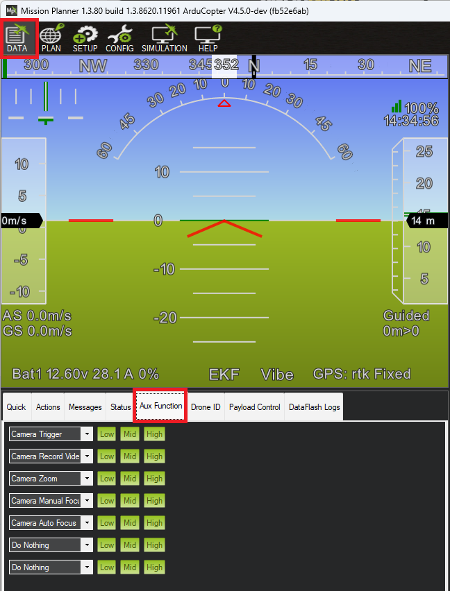

.. _common-camera-controls:

===============
Camera Controls
===============

This page provides an overview of the three different ways that cameras can be controlled.  The related page detailing :ref:`gimbal controls can be found here <common-mount-targeting>`.

Control with an RC transmitter
------------------------------

RC :ref:`auxiliary functions <common-auxiliary-functions>` allow the pilot to control the camera features using an RC transmitter switch.

- set :ref:`RC6_OPTION <RC6_OPTION>` = 9 ("Camera Trigger") to take a picture
- set :ref:`RC7_OPTION <RC7_OPTION>` = 166 ("Camera Record Video") to start/stop recording video
- set :ref:`RC8_OPTION <RC8_OPTION>` = 167 ("Camera Zoom") to zoom in or out
- set :ref:`RC9_OPTION <RC9_OPTION>` = 168 ("Manual Focus") to focus in or out
- set :ref:`RC10_OPTION <RC10_OPTION>` = 169 ("Auto Focus") to auto focus

Control from a Ground Station
-----------------------------

Ground stations can send MAVLink commands to control the camera.  While each GCS's interface is different below are the controls provided by Mission Planner.

Take a picture using the right-mouse-click menu, select "Trigger Camera NOW"

Use any of the auxiliary function controls listed above from the Data, Aux Functions tab.

    
Note that these buttons are "edge triggered" which means that to trigger a function multiple times you may need to push the "Low" or "Mid" button betrween pushes of "High".

Control during Auto mode missions
---------------------------------

See these pages for details on controlling the camera during Auto mode missions including specifying when the camera shutter should trigger or a distance that the vehicle should travel between shots.

- :ref:`Camera Control in Auto Missions <common-camera-control-and-auto-missions-in-mission-planner>`
- :ref:`Copter Mission Command List <mission-command-list>` 
- :ref:`Mission Commands <common-mavlink-mission-command-messages-mav_cmd>` pages
