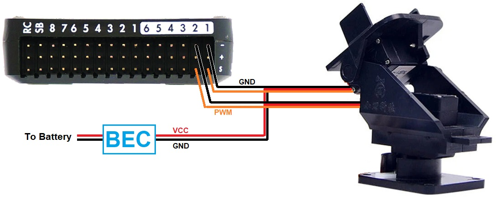
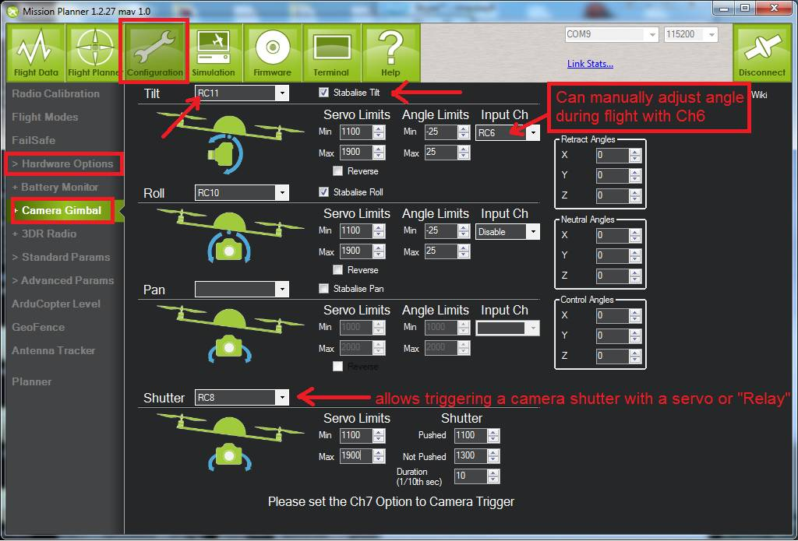
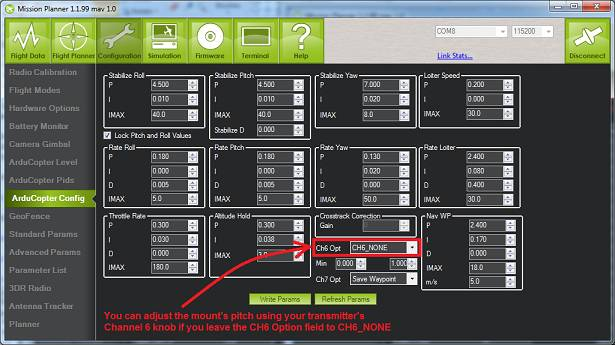

.. _common-camera-gimbal:

=========================
Camera Gimbal with Servos
=========================

This article explains how to connect a camera gimbal with servos to a
flight controller and configure it for use with ArduPilot (in Mission
Planner).

Overview
========

Copter, Plane or Rover can stabilize a gimbal with up to three axis of
motion using any of the free output channels. Combining stabilization
with input from the pilot is also possible (normally using receiver's
channel 6 tuning knob).

The examples shown below use Copter screen shots, but work exactly the
same for Plane and Rover.

A camera's shutter can be triggered from the APM once connected with a
servo or "relay". The act of triggering the shutter can be controlled
through your receiver's channel 7 switch or automatically during
missions.

For best performance, ensure that after you add the extra weight of the
camera gimbal your copter still hovers ideally at 50% throttle but
certainly no more than 70% throttle while in Stabilize mode because an
underpowered copter also has less power to recover from disturbances.

Camera mount and build
======================

The camera needs to be mounted securely to the gimbal, but in such a way
that reduces/dampens vibrations from the motor. It is difficult to
achieve both aims at the same time!

Common methods for mounting the camera on the gimbal include using: soft
foam, stiff foam, neoprene tubes (mount camera on tube side), surgical
tube, rubber bands, nylon bolt (direct stiff attachment) and velcro.
Tubes have been used mostly on traditional helicopters. We make no
specific recommendation here as there is no single obvious "best choice"
and to some extent this depends on the airframe. That said, using velcro
and rubber bands (for extra security) is quick to set up and can give
reasonable results.

Connecting the servos to a Pixhawk
==================================

Connect the gimbal to Pixhawk's auxiliary output pins. Connect tilt
(pitch) to aux out signal (s) pin 1, roll to aux out signal (s) pin 2,
and ground to an aux out ground (-) pin.

Connecting the servos to an APM2
================================

-  The gimbal's roll and pitch servo's signal wires (only the signal
   wires!) should be connected to the inner most pin (labelled S in the
   image below) of A10 and A11.

   -  **Very Important 1:** The labels on the side of the APM2 case may
      not exactly line up with the pins.
   -  **Very Important 2:** The illustration below shows the 2 rows of
      SPI pins (marked "NC" in the image) as being unpopulated but most
      APM2.x boards will also have connector pins in them.
   -  **Very Important 3: You MUST NOT hook up to the pins marked NC
      below.**

-  If you have digital servos you can assign the gimbal roll/tilt to RC5
   to RC8 outputs, if they are free.
-  Do not connect the servo's power (red) and ground (black) wires to
   the RC10 (A10) & RC11 (A11) or you may cause the APM to brownout when
   the servos move.  Instead power the servos from an external BEC or
   from the APM's rear power rail with the JP1 jumper removed.

.. image:: ../../../images/CAMERA_APM2b.jpg
    :target: ../_images/CAMERA_APM2b.jpg

.. note::

    APM2.x RC10 & RC11 outputs operate at 50hz (labeled A10 & A11
    on the case) making them acceptable for analog or digital servos while
    PWM outputs RC1 to RC8 operate at 490hz making them theoretically only
    suitable for digital servos.

For the APM 2.x board for ch9, ch10 and/or ch11 ensure that the jumper
trace(s) on the bottom of the board have not been cut and that they have
not been re-jumpered for analog use.

For APM 1: ch5, ch6, ch7 and/or ch8

Gimbal configuration through the mission planner
================================================

Under the configuration Menu, Hardware Options you will find a Camera
Gimbal set-up screen. (see image below)

For each servo/axis of your camera gimbal select the appropriate servo
channel and ensure the **"Stabilise"** checkbox is checked.

.. note::

   Modern brushless gimbals (like the :ref:`Tarot <common-tarot-gimbal>`
   and :ref:`SToRM32 <common-storm32-gimbal>`) usually come with their own
   controllers that handle gimbal *stabilisation*. For those controllers
   the **"Stabilise"** checkbox must not be checked. 

The **Servo Limits** should be adjusted to ensure the gimbal servos
don't bind.

The **Angle Limits** should correspond to the tilt angle of the gimbal
itself at the servo limits. If you find during testing that your gimbal
is not properly remaining stabilised (for example it's over or
undercorrecting as you tilt the copter), adjust the angle limits up or
down slightly.

(These are not really 'angle' limits but how much the servo is commanded
to move within the limits of the 60° most servos can move.

eg If set to -60/+60 the servo will reach -30°/+30° (its limit) when the
'copter reaches -60°/+60°

If set to -15/+15 the servo will reach -30°/+30° (its limit) when the
'copter reaches -15°/+15°)

**"Retract Angles"** refer to the position of the gimbal when the
mount's mode is "retracted" (i.e. MNT_MODE=0). "Retracted" normally
means when the gimbal is pulled into the body of the aircraft which is
generally not relevant for multicopters.

**"Neutral Angles"** refer to the position of the gimbal when the mount
is first initialised. This is normally facing straight forward.

**"Control Angles"** are parameters to allow control of the gimbal from
a ground station perhaps using a joystick. These values are overwritten
by the ground station so there's no point in updating them on the MP
screen.

If you find your gimbal is moving in the wrong direction, check the
**Reverse** checkbox.

   Mission Planner: Camera andGimbal Setup Screen

If you wish to adjust the gimbal tilt, roll or pan while flying, you can
set the input channel to "RC6" which normally corresponds to your
transmitters tuning knob.

.. note::

   If you do this you need to set your CH6 Opt to ``CH6_NONE`` in the
   Mission Planner **Standard Parameters \| Configuration** screen.

   |MPCamSetupSetCH6|

Aligning Min and Max PWM values with full throw of gimbal
---------------------------------------------------------

This section shows how to align the maximum and minimum PWM servo
settings:

-  Tilt airframe over hard left ( just past where the servo stops
   moving, or ~45 deg ), and raise the "Roll" "Servo" "Min" value until
   the servo starts to physically move a tiny bit, stop there.
-  Tilt airframe over hard right ( just past where the servo stops
   moving, or ~45 deg ), and lower the "Roll" "Servo" "Max" value until
   the servo starts to physically move a tiny bit, stop there.

-  Repeat for Pitch ( forward and backward motion)

Leveling/centering the gimbal
-----------------------------

To level and centre the gimbal:

-  Keep the airframe perfectly straight-and-level
-  If the gimbal is not quite perfectly level, tweak the hardware first,
   eg, get servo horn/s so that gimbal is as close to level as possible
   before doing next step/s .. do this by unscrewing horn from servo and
   repositioning it, and/or if using push-rods to the gimbal, by
   adjusting the length of them).
-  If "tilt" is still not quite level, you can "trim" it by adjusting
   the Tilt->Angle->Min and Tilt->Angle->Max ... BOTH by one click in
   the same direction ( eg, click both down arrows once each) This will
   ensure that the difference between them remains constant ( important
   ), but will adjust the "centre" position of the gimbal by small
   amounts ( do not do this too much as it affects the maximum throw/s
   at the extremeties by the same amount).

Common fixes for poor video
===========================

Some of the more common causes and solutions for poor video are listed
below:

-  "Jello" effect (or rolling shutter) is a by-product of using a camera
   with a CMOS sensor (GoPro, et al) caused by vibration from unbalanced
   props/motors and can be mitigated by mounting the camera on soft
   rubber, silcone, foam ear plugs or sometimes just on velcro.
-  digital and optical stabilization systems found in many cameras often
   do not perform well because of the vibrations found on many
   multicopters.

   -  Exceptions: the Sony video camera balanced steady shot system is
      very effective even at maximum 30 power zoom.

-  If you have jerky camera movement adjust the RC_Feel parameter to a
   lower number such as 50 or 25.
-  For better and smoother Yaw, use Expo control on your RC and lower
   the Acro_Yaw_P gain in APM.

It is important to remember that even with a perfect setup, photography
is an art as well as a science. Using the camera pointing straight to
ground is a good place to start, but more dramatic viewpoints can be
achieved with angles other than vertical. Mount about 40 degrees
deviation from vertical to obtain mainly ground photos but with oblique
view. About 70 degrees off vertical will give you a lot more sky giving
scenic photos
(from `Draganfly <http://www.draganfly.com/news/2008/08/23/rc-aerial-photography-get-great-pictures-tutorial/>`__).
ArduPilot will stabilise the gimbal to whatever position you set.

Shutter configuration
=====================

See :ref:`Camera Shutter Configuration in Mission Planner <common-camera-shutter-with-servo>` for information on how to
integrate shutter triggering with ArduPilot. Several (camera-specific)
mechanisms for getting the trigger signal to the camera are :ref:`discussed here <common-cameras-and-gimbals_camera_shutter_triggering>`.

