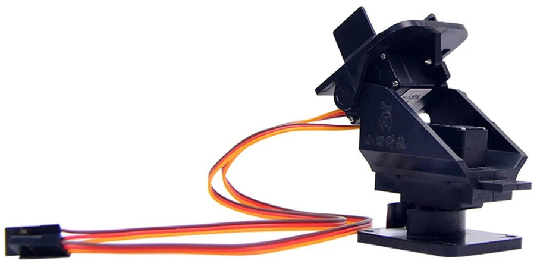

.. _common-camera-gimbal:

============
Servo Gimbal
============

ArduPilot can stabilize a servo gimbal with up to three axis of motion using any of the free PWM output channels.
Once connected the camera gimbal can be controlled by the pilot using an RC transmitter, by sending commands from the ground stations or autonomously during missions.

This article explains how to connect and configure a gimbal using simple servos to stablize the attitude of a camera.  If using ArduPilot 4.2 (or earlier) the instructions lower down on this page may also be useful for Brushless PWM Gimbals.

Supported Gimbals
=================

Any servo gimbal accepting PWM input should work.  Specific examples include

- Adafruit Mini Pan-Tilt Kit
- `Quanum Pan-Tilt Servo Gimbal <https://hobbyking.com/en_us/quanum-servo-based-pan-tilt.html>`__

Mounting the Camera and Gimbal
==============================

The camera needs to be mounted securely to the gimbal, but in such a way
that reduces/dampens vibrations from the motor.

Common methods for mounting the camera on the gimbal include using soft
foam, stiff foam, neoprene tubes (mount camera on tube side), surgical
tube, rubber bands, nylon bolts (direct stiff attachment) and velcro.

Connecting to the Autopilot
===========================

Connect the gimbal's roll, pitch, and/or yaw servos signal and ground pins to the autopilot's PWM output pins as shown below.  Most autopilots do not provide power on the servo rail meaning a separate BEC is required.

.. image:: ../../../images/pixhawk_to_gimbal_connection.jpg
    :target: ../_images/pixhawk_to_gimbal_connection.jpg

Configuration (4.3 or higher)
=============================

.. note::

   Mission Planner includes a "Camera Gimbal" configuration screen but it has not yet been updated to work with ArduPilot 4.3 (and higher).

Connect to the autopilot with a ground station and set the following parameters. These settings assume the autopilot's PWM outputs 9, 10 and 11 will control the gimbal's roll, pitch and yaw angles respectively. They also assume common angular ranges of the gimbal which may need adjusting to match the actual gimbal being used.

.. note:: Currently up to two mounts can be supported, MNT1 and MNT2. The following parameters are for the first mount. The second mount has the same parameters.

- :ref:`MNT1_TYPE <MNT1_TYPE>` to 1 (Servo) and reboot the autopilot
- :ref:`MNT1_PITCH_MIN <MNT1_PITCH_MIN>` to -90 (meaning the gimbal can pitch straight downwards)
- :ref:`MNT1_PITCH_MAX <MNT1_PITCH_MAX>` to 25 (meaning the gimbal can pitch up by 25 deg)
- :ref:`MNT1_ROLL_MIN <MNT1_ROLL_MIN>` to -30 (meaning the gimbal can roll right 30 deg)
- :ref:`MNT1_ROLL_MAX <MNT1_ROLL_MAX>` to 30 (meaning the gimbal can roll left 30 deg)
- :ref:`MNT1_YAW_MIN <MNT1_YAW_MIN>` to -180 (meaning the gimbal can yaw to the left 180deg)
- :ref:`MNT1_YAW_MAX <MNT1_YAW_MAX>` to 180 (meaning the gimbal can yaw to the right 180deg)
- :ref:`MNT1_RC_RATE <MNT1_RC_RATE>` to 90 (deg/s) to control speed of gimbal when using RC targetting

Typical input and output assignments are shown below, but any unused RC input channel or autopilot output channels can be assigned for some or all of these functions.

- :ref:`SERVO9_FUNCTION <SERVO9_FUNCTION>` to 8 (Mount1 Roll)
- :ref:`SERVO9_MIN <SERVO9_MIN>` and :ref:`SERVO9_MAX <SERVO9_MAX>` to match the min and max range of the roll servo
- :ref:`SERVO10_FUNCTION <SERVO10_FUNCTION>` to 7 (Mount1 Pitch)
- :ref:`SERVO10_MIN <SERVO10_MIN>` and :ref:`SERVO10_MAX <SERVO10_MAX>` to match the min and max range of the pitch servo
- :ref:`SERVO11_FUNCTION <SERVO11_FUNCTION>` to 6 (Mount1 Yaw)
- :ref:`SERVO11_MIN <SERVO11_MIN>` and :ref:`SERVO11_MAX <SERVO11_MAX>` to match the min and max range of the yaw servo
- :ref:`RC6_OPTION <RC6_OPTION>` = 213 ("Mount Pitch") to control the gimbal's pitch rate with RC channel 6
- :ref:`RC7_OPTION <RC7_OPTION>` = 214 ("Mount Yaw") to control the gimbal's yaw rate with RC channel 7
- :ref:`RC8_OPTION <RC8_OPTION>` = 163 ("Mount Lock") to switch between "lock" and "follow" mode with RC channel 8

Control and Testing
===================

See :ref:`Gimbal / Mount Controls <common-mount-targeting>` for details on how to control the gimbal using RC, GCS or Auto mode mission commands

Configuration Using Mission Planner (4.2 or lower)
==================================================

Under the SETUP/Optional Hardware Menu, you will find a ``Camera
Gimbal`` set-up screen. (see image below)

The **Type** box should be set to the type of gimbal. "Servo" for either non-stabilized manual control, or ArduPilot stabilization, or use of an external gimbal stabilizer. The autopilot will need to be rebooted in order for this to take effect and allow changes to the options below.

For each axis (**PITCH, ROLL, YAW**) of your camera gimbal select the appropriate output
channel (although shown as "RCx" in the above, MP will now show the labels for output channel choices correctly as "SERVOx" in current MP releases) that you connected above and ensure the appropriate **"Stabilise"** checkbox is checked (DO NOT CHECK YAW, however, its not supported) .

.. note:: if only directional control is desired without correcting for vehicle attitude, then leave the **"Stabilise"** checkbox unchecked.

The **Servo Limits** should be adjusted to ensure the gimbal servos
don't bind.

The **Angle Limits** should correspond to the rotation angle of the gimbal
itself at the servo limits. If you find during testing that your gimbal
is not properly remaining stabilised (for example it's over or
under correcting as you rotate the copter), adjust the angle limits up or
down slightly.

(These are not really 'angle' limits but how much the servo is commanded
to move within the limits set by the Min/Max parameters set in **Servo Limits**.

eg. If set to -60/+60 the output will reach Min/Max (its limit) when the
'copter reaches -60°/+60°. If set to -15/+15 the servo will reach Min/Max (its limit) when the
'copter reaches -15°/+15°)

**Retract Angles** refer to the position of the gimbal when the
mount's mode is "retracted" (i.e. MNT1_DEFLT_MODE=0). "Retracted" normally
means when the gimbal is pulled into the body of the aircraft which is
generally not relevant for multicopters.

**Neutral Angles** refers to the position of the gimbal when the mount
is first initialized. This is normally facing straight forward.

**Control Angles** are parameters to allow control of the gimbal from
a ground station perhaps using a joystick. These values are overwritten
by the ground station so there's no point in updating them on the MP
screen.

If you find your gimbal is moving in the wrong direction, check the
**Reverse** checkbox.

.. figure:: ../../../images/MPCameraAndGimbalSetupScreen.jpg
   :target: ../_images/MPCameraAndGimbalSetupScreen.jpg

   Mission Planner: Camera and Gimbal Setup Screen

If you wish to adjust the gimbal yaw, pitch, or roll while flying, you can
set the RC controls for roll, pitch, or yaw using the **Input channel** selection box.

.. tip:: If only manual yaw and/or pitch is desired using servos, you can use this setup without stabilization. In addition, by extending the ``SERVO LIMITS`` you can sometimes obtain almost 180-degree servo rotation, on some servos. Increase them slowly, testing as you do, and do not overextend the PWM values. Stop when the motion stops increasing.

Aligning Min and Max PWM values with the full throw of the gimbal
-----------------------------------------------------------------

This section shows how to align the maximum and minimum PWM servo
settings:

- Roll the airframe over hard left (just past where the servo stops moving, or ~45 deg), and raise the "Roll" "Servo" "Min" value until the servo starts to physically move a tiny bit, stop there.
- Roll the airframe over hard right (just past where the servo stops moving, or ~45 deg), and lower the "Roll" "Servo" "Max" value until the servo starts to physically move a tiny bit, stop there.

- Repeat for Pitch (forward and backward motion)

Leveling/centering the gimbal
-----------------------------

To level and center the gimbal:

-  Keep the airframe perfectly straight-and-level
-  If the gimbal is not quite perfectly level, tweak the hardware first, eg, get servo horn/s so that the gimbal is as close to level as possible before doing the next step(s). Do this by unscrewing the horn from the servo and repositioning it, and/or if using push-rods to the gimbal, by adjusting the length of them.
-  If "pitch" is still not quite level, you can "trim" it by adjusting the ``MNT_PITCH_MIN`` and ``MNT_PITCH_MAX`` ... BOTH by one click in the same direction (e.g. click both down arrows once each) This will ensure that the difference between them remains constant (important), but will adjust the "center" position of the gimbal by small amounts (do not do this too much as it affects the maximum throw/s at the extremities by the same amount).

Shutter configuration
=====================

See :ref:`Camera Shutter Configuration in Mission Planner <common-camera-shutter-with-servo>` for information on how to integrate shutter triggering with ArduPilot.

See :ref:`common-cameras-and-gimbals` page for links to various triggering methods.

See :ref:`common-mount-targeting` for mount control and targeting information.

Other Parameters
================

Since servos in the gimbal may react slower to position/angle changes in the vehicle's roll and pitch as the vehicle moves about a target, the camera shot may have some visible lag in it. This can be reduced by using these parameters to have the gimbal outputs move a bit ahead of the movements of the vehicle.

Revs 4.3 or higher
------------------

- :ref:`MNT1_LEAD_RLL<MNT1_LEAD_RLL>` 
- :ref:`MNT1_LEAD_PTCH<MNT1_LEAD_PTCH>`

Revs 4.2 or lower
-----------------

- ``MNT_LEAD_RLL``
- ``MNT_LEAD_PTCH``
