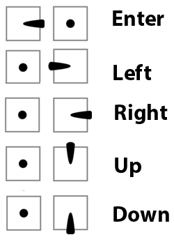

.. _common-camera-runcam:

=====================
RunCam Camera Support
=====================

*Note that this feature will be released in ArduPilot 4.1*

Description
===========

RunCam devices support the `Runcam Device Protocol <https://support.runcam.com/hc/en-us/articles/360014537794-RunCam-Device-Protocol>`_ which is the serial communication protocol initially developed for the RunCam Split and analog cameras.

The protocol itself supports not only full camera OSD menu navigation but also triggering recording on split style cameras as well as communicating the available SD-card space, syncing the current date, writing to the OSD and turning the camera or WiFi function (if available) on and off.

Not all features of the protocol are currently supported in ArduPilot and not all features of the protocol are supported on all cameras. In particular it is important to distinguish between cameras that support the "5-button protocol" (generally camera -only devices such as the RunCam Racer) and cameras that support the "2-button protocol" (generally split-style cameras). These two protocols originated from the 5-key external OSD keyboard and 2 buttons present on split-style cameras. Equally important is to understand that the RunCam device protocol is almost a direct mapping from the hardware - so the way that you would physically press a button is the way that the protocol is invoked. The only caveat here is that the 5-button protocol recognizes keys being released, whereas the 2-button protocol does not, leading to some limitations in the way that menus and options can be navigated.

Lately, similar to TBS Smartaudio and IRC Tramp, other companies (for instance Caddx) have started to adopt support for the protocol in their cameras.
Currently supported features in ArduPilot

* Full camera OSD control
* Starting/Stopping recording on split style cameras

Setup
=====

* One free non-inverted UART on the FC is required (TX and RX). Connect TX to RX, RX to TX and GND to GND. Pinouts for serial ports on The Cube can be found :ref:`here <common-pixhawk-serial-mapping>`. Check the :ref:`board documentation<common-autopilots>` for other boards.

  .. image:: ../../../images/camera-runcam-fc-setup.jpg
    :target:  ../_images/camera-runcam-fc-setup.jpg
    :width: 450px

  On some camera-only devices the pinout is labeled such that TX should be connected to TX and RX to RX. If your RunCam device is not recognized try reversing the signal wires. Not all cameras support a UART ground pin - they expect to get ground from the power supply.

  The camera must be in UART control mode. On split-style cameras this should be the default. On camera-only devices you will need to follow the procedure for putting the device in UART control mode. Consult your RunCam manual for more details.

  Note that so-called "Joystick control" is not supported and some devices only support joystick control, so be careful when selecting the RunCam model you are going to use. The following devices have been tested successfully - RunCam Split 3s Micro, RunCam Split 2s, RunCam Racer 3.

* In order to recognize the RunCam serial protocol on the UART, set the UART serial protocol to 26. So for instance for serial port 5, set :ref:`SERIAL5_PROTOCOL <SERIAL5_PROTOCOL>` = 26 (RunCam protocol). The correlation between serial port numbering and UART physical ports for your autopilot should be documented in its description page linked :ref:`here <common-autopilots>`.

  When the camera is connected correctly and the serial port configured correctly you will see a message similar to the following at boot: ``APM: RunCam initialized, features 0x0077, 2-key OSD`` otherwise you will see ``APM: RunCam device not found``.

  The camera must be powered and fully booted in order to accept commands. This can take some time and the delay between the flight controller booting and the camera being probed can be controlled through :ref:`CAM_RC_BT_DELAY <CAM_RC_BT_DELAY>`. The camera will be probed repeatedly until :ref:`CAM_RC_BT_DELAY <CAM_RC_BT_DELAY>` elapses, but once that has expired the camera will not be probed again.

* Some split-style cameras support three modes - video standby, video start and picture mode. It is not possible to tell from the RunCam device protocol whether this is the type of camera in use and so this must be configured. Set :ref:`CAM_RC_TYPE <CAM_RC_TYPE>` 2. All other cameras should be fine with the default.

* In order to control start and stop of video recording from a radio transmitter set a free rc channel to ``RCx_OPTION`` = 78 to enable triggering from that RC input channel. If the switch is in the low position then video recording is stopped, if in the high position then video recording is started.

* In order to control entering the OSD menu set a free rc channel to ``RCx_OPTION`` = 79. If the switch is in the low position then the OSD menu is exited, if in the high position then the OSD menu is entered. The OSD menu can also be entered by default through rolling hard right while disarmed.

OSD Menu Control
================

A big part of the RunCam feature is support for the OSD menu. The OSD menu allows various properties of a connected camera to be controlled via RC stick gestures. The easiest way to enter the OSD menu is to push the stick for Roll hard right. This gesture is enabled by default but can be changed by setting :ref:`CAM_RC_CONTROL <CAM_RC_CONTROL>`. Once in the menu, the Pitch stick will allow you to navigated between menu items and Roll right will usually allow you to select items or navigate into sub-menus. The OSD menu can only be entered while disarmed.

The transmitter sticks can be used to control the OSD menu as follows:

Split-style cameras differ significantly from regular RunCams in terms of what gestures are allowed. On a RunCam with UART control the stick gestures match the operation of the remote keyboard that can be used with the camera. The roll and pitch stick gestures correspond to up, down, left and right on the keyboard and yaw corresponds to enter. On a Split-style camera pitch up and down have the same effect of cycling through menu items and enter is roll right. Although every effort has been made to make the user interfaces of the two-camera styles consistent, deficiencies in the RunCam remote protocol make this challenging. The two most obvious differences are:

* Split-style cameras allow exit from a sub-menu through the left gesture whereas regular RunCams' require the exit menu option to be selected.
* Split-style cameras allow exit from the OSD through the left gesture whereas regular RunCams' require the use of the configured exit OSD command (either a TX switch or yaw left).

OSD Menu and OSD Interaction
============================

One of the features of the ArduPilot implementation of OSD menu control is that the flight controller will switch off the regular flight OSD when the camera OSD is entered. It will also prevent arming whilst in OSD mode. When the OSD menu is exited the regular flight OSD will be re-enabled and arming allowed.
