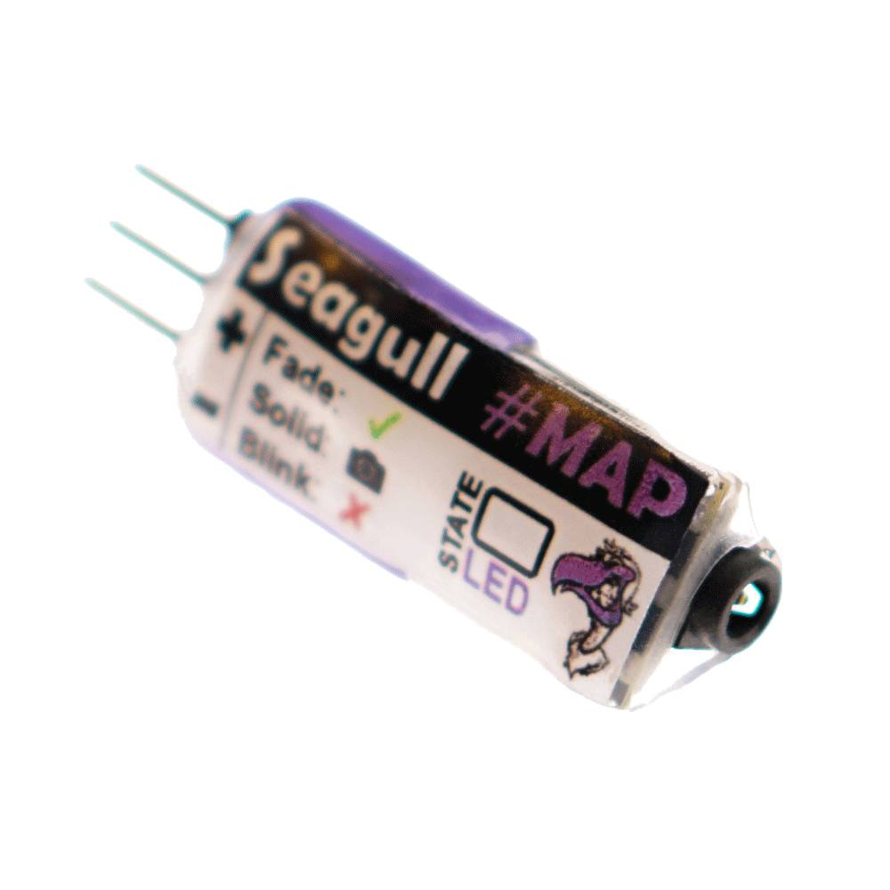
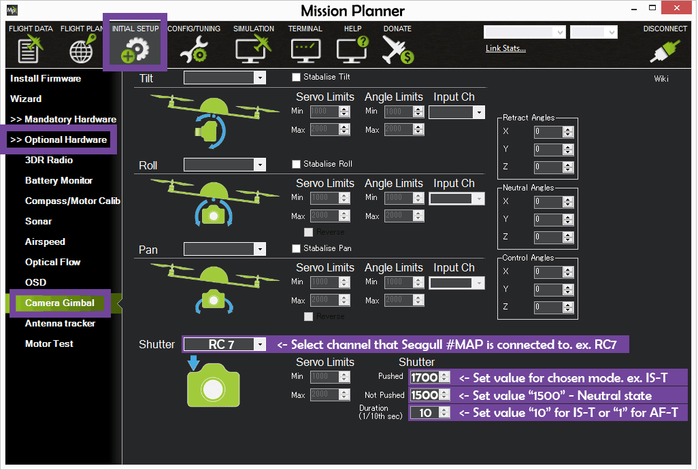
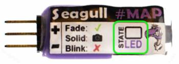

.. _common-camera-shutter-triggering-for-sony-multiport-connectors-using-seagull-map:

==========================================================================
Camera Shutter Triggering for Sony MultiPort Connectors using Seagull #MAP
==========================================================================

This article shows how to implement automatic camera shutter triggering
for cameras equipped with the Sony MultiPort™ connector using `Seagull #MAP <http://www.seagulluav.com/product/seagull-map2/>`__.

   Seagull #MAP from Seagull UAV

Overview
========

ArduPilot allows you to :ref:`configure a servo or relay output as the control signal for the camera shutter <common-camera-shutter-with-servo>` so that it can be used in
:ref:`Camera Missions <common-camera-control-and-auto-missions-in-mission-planner>`.
Additional hardware is required to convert the shutter activation signal
to the format expected by the particular camera.

The `Seagull #MAP <http://www.seagulluav.com/product/seagull-map2/>`__
provides everything needed to connect a Pixhawk to a :ref:`supported Sony MultiPort™ equipped camera <common-camera-shutter-triggering-for-sony-multiport-connectors-using-seagull-map_compatible_cameras>` in order to automate
camera shutter triggering.

The board supports two trigger modes: AF-T (Autofocus-Trigger, 1 sec
pre-AF then trigger) and IS-T (Instant-Trigger, instant trigger as soon
as camera locks focus). The mode used is determined by the servo PWM
output set in the :ref:`Camera Shutter Configuration <common-camera-shutter-with-servo>` in Mission Planner.

Seagull #MAP also supports camera on/off on Sony "Multi" cameras (only).
This feature can be used in missions by adding the commands
"Do-Set-Servo" or "Do-Repeat-Servo" in Mission Planner.

This article provides a brief overview of how to set up the board. More
detailed instructions are provided in the `Seagull #MAP Manual <http://seagulluav.com/wp-content/uploads/2015/08/Seagull-MAP-Manual.pdf>`__
and the `Seagull #MAP product support page <http://www.seagulluav.com/seagull-map-support/>`__.

.. note::

   The board also supports triggering from the RC transmitter (this
   is not covered in this article, but is demonstrated in the manual).

Parts and hardware connections
==============================

The Seagull #MAP can be `purchased from Seagull UAV <http://www.seagulluav.com/product/seagull-map/>`__ and comes with a
servo cable and one of the following cables (depending on your camera):

-  Canon: 2.5mm, N3
-  Sony: Minolta, Multi-angled, Multi-straight
-  Nikon: MC-36, MC-DC1, MC-DC1
-  Olympus CB1, E-system

Working out the correct connections is easy; the left hand side is for
the servo connector to the Pixhawk while the right hand side has a 2.5mm
jack for connecting the cable for your specific camera. You can connect
to any of Pixhawk's usable AUX ports, as discussed in :ref:`Camera Shutter Configuration in Mission Planner <common-camera-shutter-with-servo>`.

   Seagull #MAP from Seagull UAV

.. note::

   #MAP is powered by Pixhawk's power rail ( the middle pin + ).
   Ensure that the rail is powered by BEC or other power source ranging
   from 3.5-5.5 Volts in order for #MAP to function properly.

Camera shutter configuration in Mission Planner
===============================================

The :ref:`Camera Shutter Configuration in Mission Planner <common-camera-shutter-with-servo>` article explains how to
configure Pixhawk AUX output as a servo camera trigger.

The parameters used to configure this particular hardware are listed
below. Note that you have to set different shutter pushed and duration
values depending on which mode you want to support for camera
triggering.

-  ``CAM_TRIG_TYPE``: 0 (Servo).
-  ``Shutter (Port)``: Depends on the connected output - e.g. RC10 for
   AUX2.
-  ``Shutter Pushed``:

   -  ``AF-T``: 1300 μS (1200 to 1400 μS).
   -  ``IS-T``: 1700 μS (1600 to 1800 μS).

-  ``Shutter Not Pushed``: 1500us (in range 1400 - 1600 μS)
-  ``Shutter Duration``: Set the value "1" for AF-T mode or "10" for
   IS-T mode

   Mission Planner: Camera Setupusing Seagull #MAP

Video Guides
============

Quick Guide

..  youtube:: gEAq8xwdTh4
    :width: 100%

Mission Planner Configuration

..  youtube:: epjcvfZSepc
    :width: 100%

Set up transmitter

..  youtube:: _gx-LADRxrg
    :width: 100%

Troubleshooting
===============

To determine what state *Seagull #MAP* is currently in - simply read the
output of the "STATE LED" and match it with the "Action" in the table
below.

   #MAP: STATE LED

The following table shows the STATE LED readout for the different states
/ modes.

+-------------------------+--------------------------------------------------------------------------+
| **STATE LED**           | Action                                                                   |
+=========================+==========================================================================+
| **Blinking**            | No Signal - check connections and mode values                            |
+-------------------------+--------------------------------------------------------------------------+
| **Fading**              | Ready - waiting for next command                                         |
+-------------------------+--------------------------------------------------------------------------+
| **Solid on**            | Active in one of the 3 modes – return to "Neutral" before next command   |
+-------------------------+--------------------------------------------------------------------------+
| **Fade >> Solid on**    | AF-T mode activated - return to "Neutral" before next command            |
+-------------------------+--------------------------------------------------------------------------+
| **Blink >> Solid on**   | IS-T mode activated - return to "Neutral" before new command             |
+-------------------------+--------------------------------------------------------------------------+
| **Blink >> Solid on**   | Camera On/Off activated (Only Sony "Multi" cameras)                      |
+-------------------------+--------------------------------------------------------------------------+

.. _common-camera-shutter-triggering-for-sony-multiport-connectors-using-seagull-map_compatible_cameras:

Compatible cameras
==================

The list of compatible cameras (November 2015) is reproduced below.

+-----------------------+-----------------------------------------------------------------------------------------------------------------------------------------------------------------------------------------------------------------------------------------------------------------------------------------------------------------------------------------------------------------------------------------------------------------------------------------------------------------------------------------------------------------------------------------------------------------------------------------------------------------------------------------------------------------------------------------------------------------------------------------------------------------------------------------------------------------------------------------------------------------------------------------------------------------------------------------------------------------------------------------------------------------------------------------------------------------------------------------------------------------------------------------------------------------------------------------------------------------------------------------------------------------------------------------------------------------------------------------------------------------------------------------------------------------------------------------------------------------------------------------------------------------------------------------------------------------------+
| **Brand**             | Canon, Nikon, Sony, Olympus, Pentax                                                                                                                                                                                                                                                                                                                                                                                                                                                                                                                                                                                                                                                                                                                                                                                                                                                                                                                                                                                                                                                                                                                                                                                                                                                                                                                                                                                                                                                                                                                                   |
+-----------------------+-----------------------------------------------------------------------------------------------------------------------------------------------------------------------------------------------------------------------------------------------------------------------------------------------------------------------------------------------------------------------------------------------------------------------------------------------------------------------------------------------------------------------------------------------------------------------------------------------------------------------------------------------------------------------------------------------------------------------------------------------------------------------------------------------------------------------------------------------------------------------------------------------------------------------------------------------------------------------------------------------------------------------------------------------------------------------------------------------------------------------------------------------------------------------------------------------------------------------------------------------------------------------------------------------------------------------------------------------------------------------------------------------------------------------------------------------------------------------------------------------------------------------------------------------------------------------+
| **Model**             | A100, A200, A300, A350, A450, A500, A55, A550, A560, A580, A700, A850, A900, D1, D100 (w. MD-D100), D1h, D1x, D2, D200, D2H, D2Hs, D2X, D3, D300, D3X, D4, D4s, D700, D800, D800E, D810, D810A, EOS 1000D, EOS 10D, EOS 1100D, EOS 1D (mk 1,2,3), EOS 1Ds (mk 1,2,3), EOS 20D, EOS 300D, EOS 30D, EOS 350D, EOS 400D, EOS 40D, EOS 450D, EOS 500D, EOS 50D, EOS 550D, EOS 5D (mk 1,2,3), EOS 5Ds, EOS 5Dsr, EOS 600D, EOS 60D, EOS 7D (mk 1,2), EOS D30, EOS D60, Rebel T1i, Rebel T2i, Rebel T3i, Rebel T4i, Rebel T5i, Rebel T6i, Rebel X, Rebel Xi, Rebel Xsi, Rebel XT, Rebel Xti, A3000, A3500, A5000, A5100, A6000, A7 (mk1, mk2), A7R (mk1, mk2), A7S (mk1, mk2), A58, A77 (mk2) – not mk1 !, C2500L, C5060, C7070, C8080, COOLPIX A, COOLPIX P7700, COOLPIX P7800, D, D3100, D3200, D3300, D5000, D5100, D5200, D5300, D5500, D600, D610, D7000, D70s, D7100, D7200, D750, D80, D90, Df, DL, DL2, DS, DS2, E-1, E-10, E-100RS, E-20, E-20N, E-3, E-30, E-300, E-410, E-5, E-510, E-520, E-620, E-M1, E-M10, E-M5, E-P3, E-PL2, E-PL3, E-PM1, EOS 1D (mk1, mk2, mk3), EOS 1Ds (mk1, mk2, mk3), EOS 5D (mk1, mk2, mk3), EOS 7D (mk1, mk2), EP-1, EP-2, Gx-1L, HX300, HX400, HX50, HX60, HX90v, K10, K100D, K110D, NEX-3N (no other NEX supported), QX1, QX30, RX10 (mk 1,2), RX10 (mk1, mk2), RX100 (mk 2,3,4) – NOT mk 1, RX100 (mk2, mk3, mk4) – not mk1 !, RX1R, SH-1, SH-21, SH-25, SH-50, SH-60, SP-100EE, SP-510UZ, SP-550UZ, SP-560UZ, SP-5655UZ, SP-570UZ, SP-590UZ, Stylus 1, SZ-10, SZ-11, SZ-14, SZ-20, SZ-30MR, SZ-31MR, WX350, WX500, XZ-1, XZ-2   |
+-----------------------+-----------------------------------------------------------------------------------------------------------------------------------------------------------------------------------------------------------------------------------------------------------------------------------------------------------------------------------------------------------------------------------------------------------------------------------------------------------------------------------------------------------------------------------------------------------------------------------------------------------------------------------------------------------------------------------------------------------------------------------------------------------------------------------------------------------------------------------------------------------------------------------------------------------------------------------------------------------------------------------------------------------------------------------------------------------------------------------------------------------------------------------------------------------------------------------------------------------------------------------------------------------------------------------------------------------------------------------------------------------------------------------------------------------------------------------------------------------------------------------------------------------------------------------------------------------------------+
| **Connector shape**   | Straight, Angled                                                                                                                                                                                                                                                                                                                                                                                                                                                                                                                                                                                                                                                                                                                                                                                                                                                                                                                                                                                                                                                                                                                                                                                                                                                                                                                                                                                                                                                                                                                                                      |
+-----------------------+-----------------------------------------------------------------------------------------------------------------------------------------------------------------------------------------------------------------------------------------------------------------------------------------------------------------------------------------------------------------------------------------------------------------------------------------------------------------------------------------------------------------------------------------------------------------------------------------------------------------------------------------------------------------------------------------------------------------------------------------------------------------------------------------------------------------------------------------------------------------------------------------------------------------------------------------------------------------------------------------------------------------------------------------------------------------------------------------------------------------------------------------------------------------------------------------------------------------------------------------------------------------------------------------------------------------------------------------------------------------------------------------------------------------------------------------------------------------------------------------------------------------------------------------------------------------------+

Technical specifications
========================

+--------------------+------------------------------------------------------------------------+
| **Weight**         | 1.9g ( ~ 12g with cables - depending on cable type )                   |
+--------------------+------------------------------------------------------------------------+
| **Dimensions**     | 33.5 x 11.3 x 7.5 mm                                                   |
+--------------------+------------------------------------------------------------------------+
| **Voltage**        | 3.5 – 5.5 volts ( 5 volts recommended – do NOT exceed 5.5 volts !! )   |
+--------------------+------------------------------------------------------------------------+
| **Current**        | 30mA max ( when STATE LED is Solid ON - varies when Fading )           |
+--------------------+------------------------------------------------------------------------+
| **Input signal**   | Standard R/C PWM between 1000 – 2000μS                                 |
+--------------------+------------------------------------------------------------------------+

References
==========

-  `Purchase Seagull #MAP <http://www.seagulluav.com/product/seagull-map2/#tab-description>`__
-  `#MAP Setup
   Overview/Support <http://www.seagulluav.com/seagull-map-support/>`__ - `Seagull #MAP Manual <http://seagulluav.com/wp-content/uploads/2015/08/Seagull-MAP-Manual.pdf>`__
-  `diydrones.com discussion <http://diydrones.com/profiles/blogs/seagull-map-uav-camera-trigger-with-100-camera-models-supported>`__.
