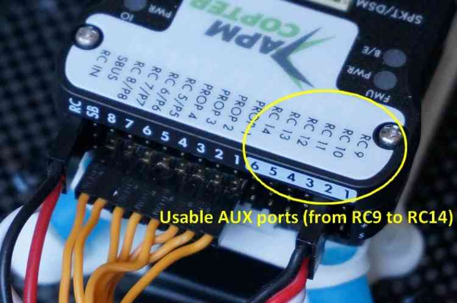

.. _common-camera-shutter-with-servo:

===============================================
Camera Shutter Configuration in Mission Planner
===============================================

This article explains how to configure Mission Planner to trigger the
camera shutter with a servo or relay.

Overview
========

ArduPilot allows you to configure a particular port (servo or relay) as
the camera trigger, which will then be activated when 
:ref:`camera commands are specified in missions <common-camera-control-and-auto-missions-in-mission-planner>`.

This article explains what settings you need to configure for both
servos and relays, and covers both Pixhawk and APM.

.. note::

   The servo or relay port signal must be converted into a format
   (infrared, cable or whatever) understood by your particular camera. The
   configuration settings will depend on the hardware that is used to
   perform this conversion. Some useful hardware configurations and
   settings are linked from the section 
   :ref:`Setting values for different cameras <common-camera-shutter-with-servo_setting_values_for_different_cameras>`. 

Shutter configuration with Pixhawk
==================================

Pixhawk has 6 AUX Ports (AUX1-AUX6, referred to as RC9-RC14 in *Mission
Planner*) that can be configured as :ref:`servos <common-servo>`,
:ref:`relays <common-relay>`, or 
:ref:`digital inputs or outputs <common-pixhawk-overview_pixhawk_digital_outputs_and_inputs_virtual_pins_50-55>`.
The image and configuration below is for the Pixhawk with RC10/AUX2
connected to camera control hardware and configured as either a servo or relay.

   Pixhawk Detail View highlighting AUXPorts

.. tip::

   From Plane 3.5.0 (at time of writing not in current Copter
   3.3/Rover 3.5 releases) you can monitor and log *exactly* when the was
   camera triggered. For more information see the 
   :ref:`Enhanced camera trigger logging <common-camera-shutter-with-servo_enhanced_camera_trigger_logging>` 
   section below.

First set the camera trigger output type using the ``CAM_TRIGG_TYPE``
setting:

-  Open *Mission Planner* and then click on **CONFIG/TUNING \| Full
   Parameters List**.
-  Set :ref:`CAM_TRIGG_TYPE` to 0 for a servo (output PWM signal) or 1 for a 
   :ref:`relay <common-relay>` (Note: although ArduPilot supports
   multiple relay channels only the first relay can be used as a camera
   trigger). The image below shows the camera trigger set as a servo.

   .. figure:: ../../../images/cam_trigg_dist1.jpg
      :target: ../_images/cam_trigg_dist1.jpg

      Mission Planner: Configuring Camera Trigger Output Type

The actual port used for the shutter is set and configured in the
*Camera Gimbal Configuration Screen*:

-  Open **Initial setup \| Optional Hardware \| Camera Gimbal**. The
   shutter settings are shown in the section at the bottom.

   .. figure:: ../../../images/missionplannercameragimbalscreen.jpg
      :target: ../_images/missionplannercameragimbalscreen.jpg

      Mission Planner: Camera Gimbal Configuration Screen

-  The *Shutter* drop-down list is used to set the connected camera
   trigger port. Here we have selected RC10, which corresponds to AUX2
   on the Pixhawk.
-  The Shutter *Duration* setting specifies how long the servo/relay
   will be held in the *Pushed* state when the shutter is activated, in
   tenths of a second. Above the value is 10, so the pushed state is
   held for one second.
-  **For Servos only (settings ignored for relay outputs):**

   -  The Shutter *Pushed* and *Not Pushed* settings hold PWM signal
      values that will be sent when the servo is in those states.
   -  The *Servo Limits* setting specifies the range of PWM signal
      values within which the servo will not bind.

      
.. _common-camera-shutter-with-servo_enhanced_camera_trigger_logging:

Enhanced camera trigger logging
===============================

.. note::

   This functionality was first introduced in Plane 3.5.0. At time of
   writing it is not yet present in Copter 3.3/Rover 3.5 releases).

ArduPilot logs TRIG messages when it *triggers* the camera. You can
additionally set up ArduPilot to log CAM messages when the camera has
actually fired, by monitoring a 
:ref:`digital input pin <common-pixhawk-overview_pixhawk_digital_outputs_and_inputs_virtual_pins_50-55>`
that has been connected to the camera hot shoe. This more accurately
logs the exact time that pictures are recorded.

You will need to configure one of the AUX pins as a digital
output/input, and connect it to the camera flash hotshoe (a universal
camera hot shoe is required). The pin should be held for at least 2
milliseconds for reliable trigger detection.

The main steps are:

#. Open *Mission Planner* and then click on **CONFIG/TUNING \| Full
   Parameters List**
#. Set at least two of the AUX pins as digital output/inputs using the
   BRD_PWM_COUNT parameter, as described in 
   :ref:`digital outputs <common-pixhawk-overview_pixhawk_digital_outputs_and_inputs_virtual_pins_50-55>`.
#. Set :ref:`CAM_FEEDBACK_PIN <CAM_FEEDBACK_PIN>`
   to the pin number connected to the hotshoe.
#. Set :ref:`CAM_FEEDBACK_POL <CAM_FEEDBACK_POL>`
   to indicate whether the feedback pin (hotshoe voltage) goes high or
   low when the picture is taken.

Shutter configuration with APM 2.x
==================================

APM2.x has dedicated servo and relay ports, so unlike for Pixhawk, there
is no need to separately specify the trigger type (``CAM_TRIGG_TYPE``).
Pins **A10** or **A11** are used for servos (*Mission Planner* refers to
these as RC10 and RC11, respectively). Pin **A9** is used for relays on
APM2.x (*Mission Planner* refers to this as *Relay* in the shutter
selection drop-down.)

.. figure:: ../../../images/apm2_analog_pins2.jpg
   :target: ../_images/apm2_analog_pins2.jpg
   
   APM Analog Pins

All configuration is done in the *Camera Gimbal Configuration Screen*.
The configuration settings are exactly the same as for Pixhawk, except
that you need to select **Relay** in *Shutter* drop-down list for a
relay shutter trigger.

Manually trigger the camera shutter
===================================

.. warning::

   This feature is currently only supported on Copter.

You can configure the CH7 switch as a manual trigger for the camera
shutter and use it to capture images during normal (non auto) flight.

.. tip::

   This is also useful for manually testing if the shutter is being
   activated correctly.

-  Open *Mission Planner* and then click on **CONFIG/TUNING \| Full
   Parameters List**
-  Set the value of ``CH7_OPT`` to 9

   .. figure:: ../../../images/cam_trigg_dist1.jpg
      :target: ../_images/cam_trigg_dist1.jpg

      Mission Planner: Set CH7 as Manual Trigger

.. _common-camera-shutter-with-servo_setting_values_for_different_cameras:

Setting values for different cameras
====================================

The actual values needed for servo/relay settings depends on what
hardware is used to send the shutter signal to the camera. The following
topics describe the hardware setup and configuration settings for a
number of specific cameras/camera types:

-  `Camera Shutter Tutorial using
   Stratosnapper <common-pixhawk-auto-camera-trigger-without-chdk>`__ -
   shows how to connect to a camera with an IR interface. The
   Stratosnapper can also be used to connect to cameras using other
   cables and protocols
-  :ref:`Camera Shutter with Relay and CHDK on APM <common-apm-to-chdk-camera-link-tutorial>` - shows how to set
   up a relay port to send a signal to a Canon camera running CHDK (on
   APM2.x)

If these aren't suitable for your hardware configuration, we recommend
you check your hardware manual for information about servo/relay inputs
that are accepted.

.. note::

   The :ref:`CHDK Camera Control Tutorial <common-chdk-camera-control-tutorial>` is not a good
   example of integrating with the camera shutter, because it does not use
   the standard shutter configuration explained in this article. This is
   however a good example of how you can access other features of a Canon
   camera using CHDK (for example, the zoom).
