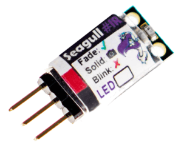

.. _common-camera-trigger-seagull-ir:

==================================
Camera Triggering using Seagull IR
==================================

The `Seagull IR <https://www.seagulluav.com/product/seagull-ir/>`__ is a low cost infrared camera trigger device that supports a wide range of camera brands and models (`see compatible camera list here <https://www.seagulluav.com/product/seagull-ir/>`__).  More detailed instructions on how to setup IR are provided in the `Seagull IR Manual <https://www.seagulluav.com/manuals/Seagull_IR-Manual.pdf>`__ as well as the `Seagull IR Support <https://www.seagulluav.com/seagull-ir-support/>`__ page.

The board supports the following two modes:

-  **Picture** (Shutter trigger)
-  **Video Record** (only for **Sony** cameras)

[copywiki destination="copter,plane,rover"]