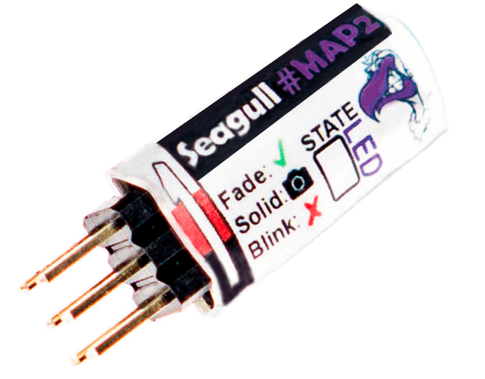

.. _common-camera-trigger-seagull-map2:

====================================
Camera Triggering using Seagull MAP2
====================================

This article shows how connect and configure the `Seagull MAP2 <https://www.seagulluav.com/product/seagull-map2/>`__ so that ArduPilot can trigger a camera shutter from the pilot's transmitter or during :ref:`camera missions <common-camera-control-and-auto-missions-in-mission-planner>`.  More detailed instructions are provided in the `Seagull MAP2 Manual <https://www.seagulluav.com/manuals/Seagull_MAP2-Manual.pdf>`__ and `Seagull MAP2 product support page <https://www.seagulluav.com/seagull-map2-support>`__.

The list of supported cameras can be found `here on Seagull UAVs Cable Finder page <https://www.seagulluav.com/map-cable-finder/>`__

The board supports two trigger modes which are determined by the servo PWM output set in the :ref:`Camera Shutter Configuration <common-camera-shutter-with-servo>` in Mission Planner:

- **AF-T** ("AutoFocus-Trigger") : 1 second pre-focus followed by trigger
- **IS-T** ("Instant-Trigger") : instant trigger as soon as camera locks focus

If used with Sony "Multi" cameras, Seagull MAP2 also supports turning the camera on or off  using "Do-Set-Servo" or "Do-Repeat-Servo" commands

.. note::

   The board also supports triggering from the RC transmitter (this
   is not covered in this article, but is demonstrated in the manual).

Parts and hardware connections
==============================

The Seagull MAP2 can be `purchased from Seagull UAV <https://www.seagulluav.com/product/seagull-map2/>`__ and comes with a
servo cable included. The camera cables has to be purchased separately - please use the `Cable Finder <https://www.seagulluav.com/map-cable-finder/>`__ page to determine which cable is needed.

Below is a list of the cables offered by Seagull UAV:

-  Canon: E3, N3
-  Sony: Minolta S1, S2 (Multi-Angled), S2 (Multi-Straight)
-  Nikon: DC0, DC2
-  Olympus: UC1, E-system
-  Panasonic: RS1
-  Samsung: NX
-  Fujifilm: RR-80, RR-90
-  Sigma: CR-31
-  Apple: IOS

The 3-pin servo connector should be connected to the autopilot's rear servor rail.  You can connect to any of Pixhawk's usable AUX ports, as discussed in :ref:`Camera Shutter Configuration in Mission Planner <common-camera-shutter-with-servo>`.

On the opposite side of the MAP2, is a 2.5mm jack for connecting the cable for your specific camera.

.. note::

   MAP2 is powered by Pixhawk's power rail (the middle pin +).
   Ensure that the rail is powered by BEC or other power source ranging
   from 3.5-5.5 Volts in order for MAP2 to function properly.

Camera shutter configuration in Mission Planner
===============================================

The :ref:`Camera Shutter Configuration in Mission Planner <common-camera-shutter-with-servo>` article explains how to
configure Pixhawk AUX output as a servo camera trigger.

The parameters used to configure this particular hardware are listed
below. Note that you have to set different shutter pushed and duration
values depending on which mode you want to support for camera
triggering.

-  ``CAM_TRIG_TYPE``: 0 (Servo).
-  ``Shutter (Port)``: Depends on the connected output - e.g. RC10 for
   AUX2.
-  ``Shutter Pushed``:

   -  ``AF-T``: 1300 μS (1200 to 1400 μS).
   -  ``IS-T``: 1700 μS (1600 to 1800 μS).

-  ``Shutter Not Pushed``: 1500us (1400 to 1600 μS).
-  ``Shutter Duration``: Set the value **"1"** for AF-T mode or **"10"** for
   IS-T mode.

.. figure:: https://www.seagulluav.com/wp-content/uploads/2016/03/smap2_mp.png
   :target: https://www.seagulluav.com/wp-content/uploads/2016/03/smap2_mp.png

   Mission Planner: Camera Setup using Seagull MAP2

Video Guides
============

Mission Planner Configuration

..  youtube:: epjcvfZSepc
    :width: 100%

Set up transmitter

..  youtube:: BYQqEgfCCe8
    :width: 100%

Troubleshooting
===============

To determine what state **Seagull MAP2** is currently in - simply read the
output of the "STATE LED" and match it with the "Action" in the table
below.

.. figure:: https://www.seagulluav.com/wp-content/uploads/2016/03/smap2_stateled-300x111.png
   :target: https://www.seagulluav.com/wp-content/uploads/2016/03/smap2_stateled-300x111.png

   MAP2: STATE LED

The following table shows the STATE LED readout for the different states
/ modes.

+--------------------------------+--------------------------------------------------------------------------+
| **STATE LED**                  | Action                                                                   |
+================================+==========================================================================+
| **Blinking**                   | No Signal - check connections and mode values                            |
+--------------------------------+--------------------------------------------------------------------------+
| **Fading**                     | Ready - waiting for next command                                         |
+--------------------------------+--------------------------------------------------------------------------+
| **Solid on**                   | Active in one of the 3 modes – return to "Neutral" before next command   |
+--------------------------------+--------------------------------------------------------------------------+
| **Fade >> Solid on**           | Keep alive mode activated - return to "Neutral" before next command      |
+--------------------------------+--------------------------------------------------------------------------+
| **Fade >> Solid on**           | AF-T mode activated - return to "Neutral" before next command            |
+--------------------------------+--------------------------------------------------------------------------+
| **Fade >> Solid on** (repeat)  | Timelapse mode activated - return to "Neutral" before next command       |
+--------------------------------+--------------------------------------------------------------------------+
| **Blink >> Solid on**          | IS-T mode activated - return to "Neutral" before new command             |
+--------------------------------+--------------------------------------------------------------------------+
| **Blink >> Solid on**          | Camera On/Off activated (Only Sony "Multi" cameras)                      |
+--------------------------------+--------------------------------------------------------------------------+

.. _common-camera-shutter-triggering-for-sony-multiport-connectors-using-seagull-map_compatible_cameras:

Technical specifications
========================

+--------------------+--------------------------------------------------------------------------+
| **Weight**         | 1.6g ( ~ 12g with cables - depending on cable type )                     |
+--------------------+--------------------------------------------------------------------------+
| **Dimensions**     | 28.6 x 10.3 x 7.7 mm                                                     |
+--------------------+--------------------------------------------------------------------------+
| **Voltage**        | 3.5 – 5.5 volts ( 5 volts recommended – **do NOT exceed 5.5 volts !** )  |
+--------------------+--------------------------------------------------------------------------+
| **Current**        | 21.75mA max                                                              |
+--------------------+--------------------------------------------------------------------------+
| **Input signal**   | Standard R/C PWM between 1000 – 2000μS                                   |
+--------------------+--------------------------------------------------------------------------+

[copywiki destination="copter,plane,rover"]