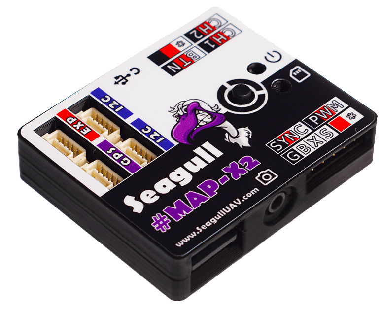

.. _common-camera-trigger-seagull-mapx2:

======================================
Camera Triggering using Seagull MAP-X2
======================================

The `Seagull MAP-X2 <https://www.seagulluav.com/product/seagull-map-x2/>`__ is a precision camera shutter trigger and logger. It can be connected to Pixhawk or other ArduPilot compatible autopilot in order to automate camera shutter triggering and log the precise co-ordinates of each photo for geotagging purposes. 

The current list of compatible cameras can be found on `Seagull Cable Finder <https://www.seagulluav.com/map-cable-finder/>`__.

Seagull MAP-X2 utilizes event based logging for extra precision if used with the `Seagull SYNC2 Hot Shoe Adapter <https://www.seagulluav.com/product/seagull-sync2/>`__

The board supports 4 shutter trigger modes: 

-  **ACT** ("AutoCustomTrigger") : user is able to define required focus time and then trigger
-  **PWM** : fully customisable PWM trigger for cameras that utilze PWM triggering
-  **SST** : read event signal then trigger
-  **Timelapse** : user defined interval triggering

Seagull MAP-X2 also supports **"Camera ON/OFF"** - which is exclusive to **Sony MULTI** cameras.

More detailed instructions on how to setup MAP-X2 are provided in the `Seagull MAP-X2 Manual <https://www.seagulluav.com/manuals/Seagull_MAP-X2-Manual.pdf>`__ as well as `Seagull MAP-X2 Support <https://www.seagulluav.com/seagull-map-x2-support/>`__ page.

[copywiki destination="copter,plane,rover"]