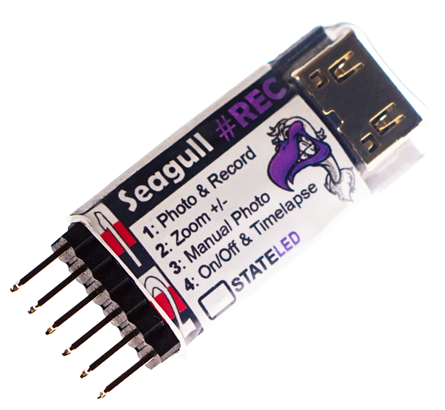

.. _common-camera-trigger-seagull-rec:

===================================
Camera Triggering using Seagull REC
===================================

`Seagull REC <https://www.seagulluav.com/product/seagull-rec/>`__ provides everything needed to connect a Pixhawk to a supported Sony MultiPort™ equipped camera in order to automate camera shutter triggering. The current list of compatible cameras `can be found here <https://www.seagulluav.com/product/seagull-rec/>`__

The board supports three shutter trigger modes: 

-  **AF-T** ("AutoFocus-Trigger", with 1 second pre-focus followed by trigger) 
-  **IS-T** ("Instant-Trigger", instant trigger as soon as camera locks focus)
-  **Manual** ("Three stage trigger control", neutral-focus-trigger)

Seagull REC also supports **"Video RECORD", "ZOOM", "Timelapse Triggering" and "Camera ON/OFF"**.

More detailed instructions on how to setup REC are provided in the `Seagull REC Manual <https://www.seagulluav.com/manuals/Seagull_REC-Manual.pdf>`__ as well as `REC Support <https://www.seagulluav.com/seagull-rec-support/>`__ page.

TIP:   The REC is only compatible with "**Sony MULTI**" cameras

[copywiki destination="copter,plane,rover"]