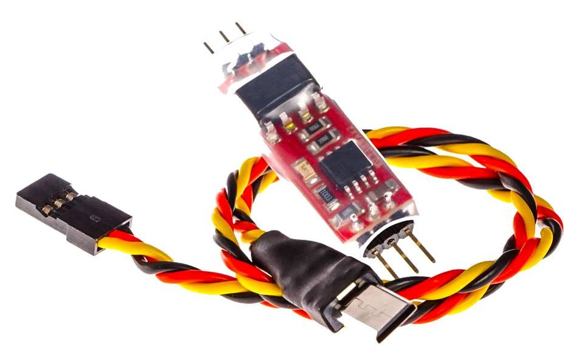

.. _common-camera-trigger-skysight-mono:

===================================================================
Camera Triggering for Sony MultiPort Connectors using SkySight MONO
===================================================================

This article shows how to setup the `SkySight MONO <http://skysight.eu/?product=skysight-mono>`__ to trigger pictures on cameras equipped with the Sony MultiPort™ connector

   `SkySightMONO <http://skysight.eu/?product=skysight-mono>`__ and CameraCable

Overview
========

ArduPilot allows you to :ref:`configure a servo or relay output as the control signal for the camera shutter <common-camera-shutter-with-servo>` so that it can be used in
:ref:`Camera Missions <common-camera-control-and-auto-missions-in-mission-planner>`.
Additional hardware is required to convert the shutter activation signal
to the format expected by the particular camera.

Farsight's `SkySight MONO <http://skysight.eu/?product=skysight-mono>`__
provides everything needed to connect a Pixhawk to a supported Sony
MultiPort™ equipped camera in order to automate camera shutter
triggering. The current list of compatible cameras is on the `product page <http://skysight.eu/?product=skysight-mono>`__.

The board supports four camera triggering modes, allowing you to trigger
the shutter in single shot and burst modes, both with and without first
setting the autofocus. The mode used is determined by the servo PWM
output set in the :ref:`Camera Shutter Configuration <common-camera-shutter-with-servo>` in Mission Planner.

This article provides a brief overview of how to set up the board
(images are reproduced courtesy of Farsight). More detailed instructions
are provided in the `SkySight MONO User Manual <http://skysight.eu/wp-content/uploads/2015/05/MONO-User-Manual.pdf>`__.

Parts and hardware connections
==============================

The SkySight MONO can be `purchased from FarSight <http://skysight.eu/?product=skysight-mono>`__, and comes with
the cables you need to connect to Pixhawk and the camera.

.. figure:: ../../../images/SkySightMono_all_connectors_DSC01078.jpg
   :target: ../_images/SkySightMono_all_connectors_DSC01078.jpg

   SkySight Mono: Board and Cables

Working out the correct connections is easy; the back of the board has
colour coded connections for the power/signal/ground, and icons to
indicate which connection is for the camera and which is for the servo.

   SykSight Mono: Board Connections

Pixhawk board
=============

Pixhawk has 6 AUX ports that may be used for triggering the camera
(AUX1-AUX6). These correspond to shutter options RC9-RC14 in *Mission
Planner*

.. image:: ../../../images/Pixhawkdetailview.jpg
    :target: ../_images/Pixhawkdetailview.jpg

.. warning::

   The MONO is powered from the Pixhawk servo power rail (middle
   pin). Ensure that the rail is :ref:`powered from a BEC <common-pixhawk-overview_powering>` or provide an alternative
   mechanism to power the board.

Camera shutter configuration in Mission Planner
===============================================

The :ref:`Camera Shutter Configuration in Mission Planner <common-camera-shutter-with-servo>` article explains how to
configure Pixhawk AUX output as a servo camera trigger.

The parameters used to configure this hardware are listed below:

``CAM_TRIG_TYPE``: 0 (Servo).

``Shutter (Port)``: RC10 (for AUX2, but this will depend on your
connected output).

``Shutter Pushed``:

-  ``IS-S``: 1300 (single shot without autofocus).
-  ``IS-B``: 1100 (burst mode without autofocus).
-  ``AF-S``: 1700 (autofocus 800ms then single shot).
-  ``AF-B``: 1900 (autofocus 800ms then burst mode).

``Shutter Not Pushed``: 1550

``Shutter Duration``: 4 (4/10 seconds - this may need to be tuned for
specific cameras)

``Servo Limits Max``\ %3

