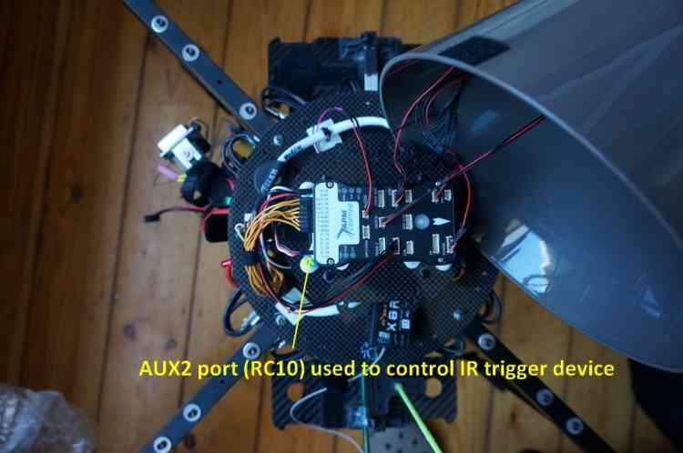

.. _common-camera-trigger-stratosnapperv2:

=======================================
Camera Triggering using StratosnapperV2
=======================================

This tutorial shows how connect the `Stratosnapper V2 <https://www.mjmulticopter.com/strato-snapper-v2.html>`__ (with an IR Module) to a Sony NEX5 so that its shutter can be triggered from the pilot's transmitter or during :ref:`camera missions <common-camera-control-and-auto-missions-in-mission-planner>`.

Where To Buy
============

This device is becoming increasingly rare but can still be found on `mjmulticopter.com <https://www.mjmulticopter.com/strato-snapper-v2.html>`__ and `ebay <https://www.ebay.com/itm/Strato-Snapper-V2-Control-For-Drone-Photography-Camera-Zoom-Or-Switch/312473455984>`__

Parts and hardware connections
==============================

The diagram below shows the required parts and general cabling. This
includes the Pixhawk, IR Trigger device (*Stratosnapper*), IR LED and
camera, and the BEC to power the *Stratosnapper*.

.. image:: ../../../images/generalhwconnectionscheme.jpg
    :target: ../_images/generalhwconnectionscheme.jpg
    :width: 450px

Pixhawk board
-------------

Pixhawk has 6 AUX ports that may be used for triggering the camera (see
AUX1-AUX6 = RC9-RC14). This tutorial uses port 2/AUX2, as shown in the
diagram below:

.. image:: ../../../images/Pixhawkdetailview.jpg
    :target: ../_images/Pixhawkdetailview.jpg
    :width: 450px

IR trigger device
-----------------

The *Stratosnapper* with its inputs/outputs is shown below. The servo
inputs can be push-buttons, sticks, two or three-way switches, etc.
These are configured using a GUI configuration utility from your PC via
USB.

Note the two servo leads are connected on the input side of
*Stratosnapper*; one of these is to power the IR module.

.. warning::

   It is not possible to power the IR module (or any other device)
   from the Pixhawk AUX ports. You must either power provide a separate BEC
   to power the IR device or power the Pixhawk outputs rail with a BEC and
   power the device off that. 

The control signal from Pixhawk can be assigned to any of the 4 servo
inputs.

The output of the *Stratosnapper* is shown below. It connects to an IR
cable, which in turn triggers a IR led that must be placed in front of
your camera IR sensor:

IR LED positioning and camera gimbal
------------------------------------

The Sony NEX5 is held in a 2-axis stabilized brushless gimbal (NEX5 not
shown). Here below a zoomed view of the IR LED positioning and gimbal:

.. image:: ../../../images/camera-trigger-stratosnapperv2-mounted.jpg
    :target: ../_images/camera-trigger-stratosnapperv2-mounted.jpg

The IR LED works well even in bright sunlight (verified in the field).
It also works some distance from the sensor (no problem within 5inches
of the Sony NEX5 sensor) and in any orientation with respect to the
sensor.

Camera shutter configuration in Mission Planner
===============================================

The :ref:`Camera Shutter Configuration in Mission Planner <common-camera-shutter-with-servo>` article explains how to
configure Pixhawk AUX output as a servo camera trigger.

The parameters used to configure this Stratosnapper/IR/NEX5 hardware are
listed below:

-  ``CAM_TRIG_TYPE``: 0 (Servo).
-  ``Shutter (Port)``: RC10 (AUX2).
-  ``Shutter Pushed``: 1800
-  ``Shutter Not Pushed``: 1100
-  ``Shutter Duration``: 10 (1 second)
-  ``Servo Limits Max``: 1900
-  ``Servo Limits Min``: 1100
-  ``CH7_OPT`` : 9 (Optional - enables manual shutter triggering on
   Copter only).

   Mission Planner: Camera GimbalSetup Screen

IR device configuration (Stratosnapper V2)
==========================================

Every IR device has its own configuration method. *Stratosnapper* comes
with a simple GUI interface to define which PWM values will trigger what
port.

The IR device configuration is explained in this video

.. vimeo:: 67660032
   :width: 400
   :height: 400

Testing and mission planning
============================

Once a camera trigger has been defined it can be used in :ref:`Camera Control and Auto Missions <common-camera-control-and-auto-missions-in-mission-planner>` to take pictures and make area surveys.

The configuration in this article was tested when creating the :ref:`Survey (Grid) Example <common-camera-control-and-auto-missions-in-mission-planner_survey_grid_example>`.
