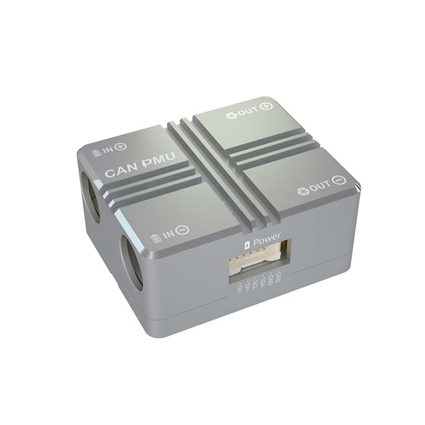
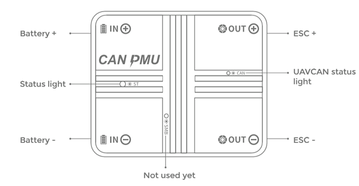
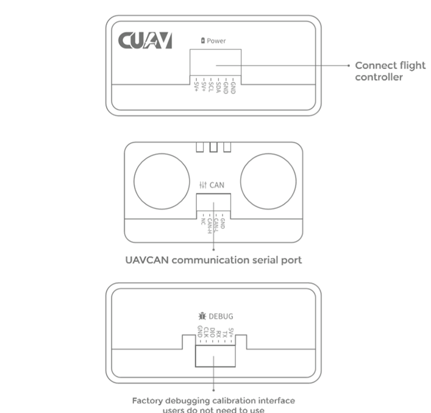
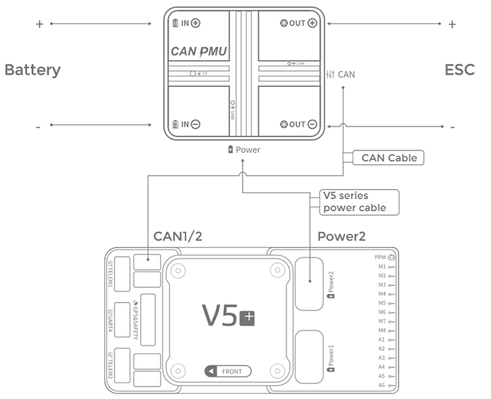
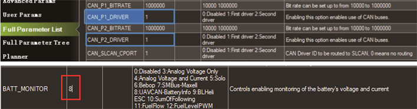

.. _common-can-pmu:

==============================
CAN PMU Power detection module
==============================

Overview
========

CAN PMU is a drone power management module with built-in STM32F4 processor running CUAV's ITT compensation algorithm to accurately measure the voltage and current of the drone's battery. It supports 6~62V voltage input, and the POWER output port can output 5V/ 8A. It uses advanced CAN bus communication and supports the standard `UAVCAN <https://new.uavcan.org/>`__ protocol. Each PMU is factory calibrated to ensure good consistency and high accuracy.

Specifications
==============

- **Processor:** STM32F412
- **Voltage Input:** 6~62V (2S-15S)
- **Max Current:** 110A
- **Voltage Accuracy:** ±0.05V
- **Current Accuracy:** ±0.1A
- **Resolution:** 0.01A/V
- **Max Output Power:** 6000W for 90s
- **Max Continuous Power:** 5000W
- **Power Port Output:** 5.4V/5A
- **Protocol:** UAVCAN
- **Operating Temp:** -20~+100℃
- **Supports firmware upgrade**
- **No calibration required**
- **Connector Types:**

  - 8mm female bullet power connectors (XT-90 battery and ESC cables provided)
  - Autopilot Power: Molex 6 pin 1.5mm #5025850670 (CUAV V5 cable provided)
  - CAN: 4 pin JST-GH (cable provided)
- **Physcial Dimensions:**

  - Size:46.5mm \* 38.5mm \* 22.5mm
  - Weight:76g

Buy
===

`CUAV store <https://store.cuav.net/index.php>`__

`Aliexpress <https://www.aliexpress.com/item/4000369700535.html>`__

Pinouts
=======

    
Connecting to the System
========================

* Connect the autopilot's UAVCAN port the module's CAN interface.
* Using a CUAV V5 series power cable, connect the module's Power interface to one of the V5 Autopilot's power interfaces.

Enable CAN PMU
==============

Set the following parameters in the Mission planner's full parameter list and restart after writing:

- :ref:`CAN_P1_DRIVER<CAN_P1_DRIVER>` to 1 if attached to CAN bus1  port or :ref:`CAN_P2_DRIVER<CAN_P2_DRIVER>` to 1 if attached to CAN bus2 port
- :ref:`BATT_MONITOR<BATT_MONITOR>` or ``BATT_MONITORx`` to 8 enable a UAVCAN battery monitor on the appropriate battery monitor port.

.. note::

 Please use Copter 3.6/Plane 3.9/Rover 3.5 firmware versions or higher.

More information
================

`CAN PMU Manual <http://manual.cuav.net/power-module/CAN-PMU.pdf>`__

`CUAV docs <http://doc.cuav.net/power-module/can-pmu>`__

`UAVCAN <https://new.uavcan.org/>`__
