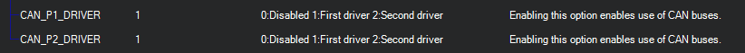
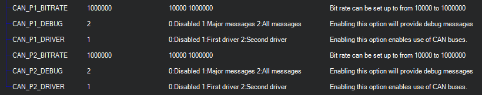
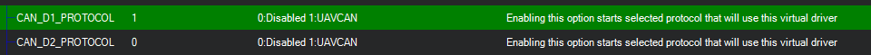

.. _common-canbus-setup-advanced:

=============
CAN Bus Setup
=============

This article shows how to setup CAN bus and what options users have
to accomplish the setup suitable for their specific needs.

.. tip::

   The :ref:`UAVCAN setup page is here <common-uavcan-setup-advanced>`.

Overview
========

A Controller Area Network (CAN bus) is a robust vehicle bus standard designed
to allow microcontrollers and devices to communicate with each other in
applications without a host computer. It is a message-based protocol, designed
originally for multiplex electrical wiring within automobiles to save on copper,
but is also used in many other contexts.

All nodes are connected to each other through a two wire bus. The wires are
120 Ω nominal twisted pair.

Most autopilots that run ArduPilot have either one or two CAN interfaces
for connection of different devices.
The setup of the interfaces can be made in a way that will provide redundancy or
maximum throughput or a mix of both.
This is accomplished with a three layer approach, where apart from the physical
interface there exist a driver layer that represents a specific protocol and a
software layer (ArduPilot) that communicates on CAN bus through these drivers.

Each physical interface can be virtually connected to one of the drivers that
represent protocols to be used.
For example, the most common scenario will be one driver of UAVCAN with both
interfaces connected to it. Such setup will provide redundancy for devices with
two CAN interfaces and full functionality for devices with one CAN interface.

Configuration settings
======================

Enabling CAN interfaces
-----------------------

Each physical port can be turned off or connected to corresponding driver with
parameter **CAN_PX_DRIVER**, where X is the number of port.
The value of this parameter is the id of driver that will be associated with this
port (interface).

For example, the most common setup will have one driver and all interfaces will be connected
to it.
The **CAN_P1_DRIVER** and **CAN_P2_DRIVER** parameters in this configuration should be set to 1 (first
driver).

    
After change of any **CAN_PX_DRIVER** the autopilot has to be rebooted for the changes to take place.

Configuration of CAN interfaces
-------------------------------

After enabling the interface and reboot two more parameters can be set for each
of the enabled interfaces.

These are:

-  **CAN_PX_BITRATE** - sets the desired rate of transfer on this interface
-  **CAN_PX_DEBUG** - allows output of debug messages

Usually the bitrate used by default is 1 Mbit.
Debug level can be set on user's preference and needs.

    
When any of the interfaces are associated with any driver, that driver will be
loaded with specified protocol.

Configuration of CAN driver
---------------------------

The driver should be set to use some protocol. Currently there is support for UAVCAN,
which is numbered 1.
The parameter **CAN_PX_PROTOCOL**, where X is the number of driver, should be filled
with the number of protocol for this driver.

    
After the change to protocol the autopilot has to be rebooted for the changes to take place.
