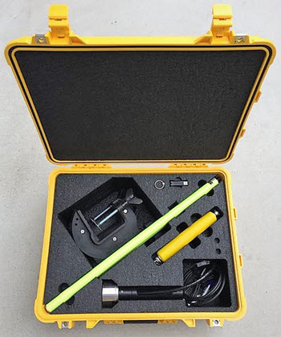
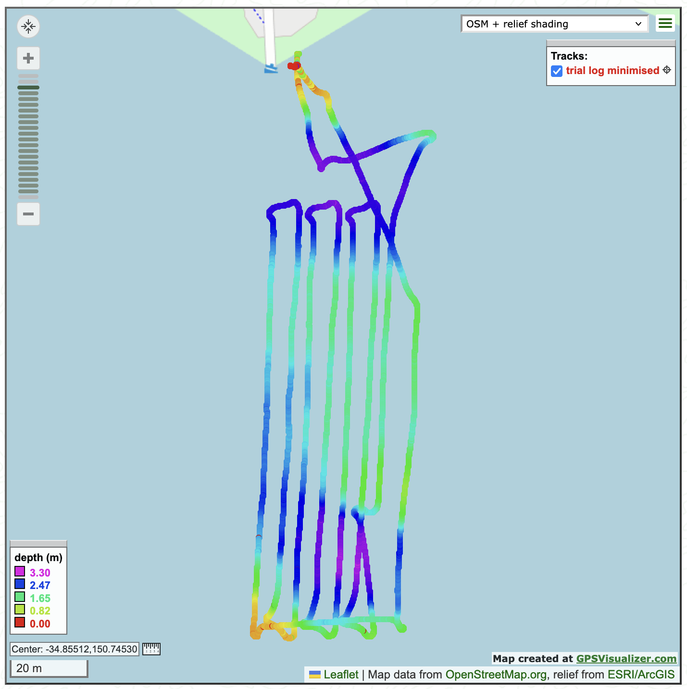
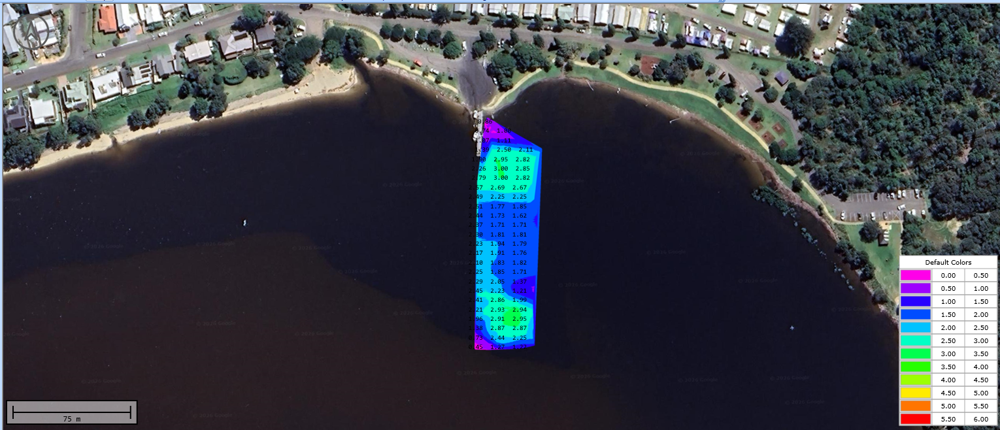
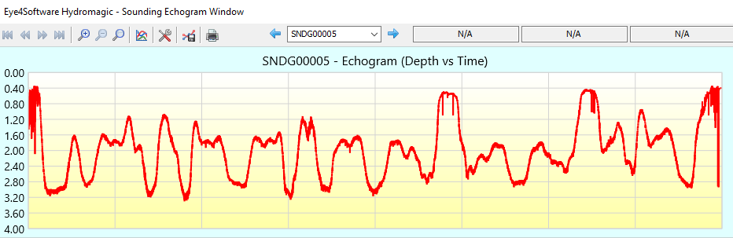

.. _common_ceeline:

================================
CEE-LINE Single-Beam Echosounder
================================

The `CEE-LINE single-beam echosounder <https://ceehydrosystems.com/products/single-beam-echo-sounders/cee-line/>`__ can be connected to the autopilot allowing high-resolution, high-reliabiltiy depth data to be obtained live.

Hardware Setup
--------------

A standard CEE-LINE kit contains a USB cable.  To work with ardupilot you will need to purchase a CEE-LINE ardupilot cable, available from `CEE HydroSystems <https://ceehydrosystems.com/>`__.  Connect the CEE-LINE ardupilot cable to one of the serial ports (in this example we use Telem2).  The CEE-LINE ardupilot cable is built specifically to connect to telemetry ports and it should not be possible to plug it in incorreclty.  The CEE-LINE will be powered from the Telem2 port, no further connections are required.

The CEE-LINE is small and can fit into even very small boats.

.. image:: ../../../images/ceeline_inplace.jpg
    :width: 400px

Configuration
-------------

If the autopilot's Serial2 port (aka Telem2) is used then the following parameters should be set:

-  :ref:`SERIAL2_PROTOCOL <SERIAL2_PROTOCOL>` = 9 (Rangefinder)
-  :ref:`SERIAL2_BAUD <SERIAL2_BAUD>` = 9 (9600 baud) to match the default baud rate of the CEE-LINE.  This should be adjusted if the CEE-LINE config changes.

These rangefinder parameters should also be set:

-  :ref:`RNGFND1_TYPE <RNGFND1_TYPE>` = 17 (NMEA)
-  :ref:`RNGFND1_MIN <RNGFND1_MIN>` = 0.50     - adjust if the CEE-LINE config changes
-  :ref:`RNGFND1_MAX <RNGFND1_MAX>` = 70 (70m) - adjust if the CEE-LINE config changes
-  :ref:`RNGFND1_ORIENT <RNGFND1_ORIENT>` = 25 (down)
-  :ref:`FRAME_CLASS` = 2 (boat) - needed if you want the rangefinder reading logged as `DPTH` (and this only works on rover).

Advanced Configuration
----------------------

The CEE-LINE is capable of being configured for diverse operating environments.  See the `CEE-LINE documentation <https://ceehydrosystems.com/products/single-beam-echo-sounders/cee-line/>`__ for instructions on adjusting these parameters via a PC connected to the CEE-LINE with the USB cable.  Ardupilot is not capable of adjusting these parameters itself but once they are set, they won't need to be changed and the above configuration works with the CEE-LINE out of the box for plug-and-play simplicity.

Testing the sensor
==================

Distances read by the sensor can be seen in the Mission Planner's Flight
Data screen's Status tab. Look closely for "rangefinder1".

.. image:: ../../../images/mp_rangefinder_lidarlite_testing.jpg
    :target: ../_images/mp_rangefinder_lidarlite_testing.jpg

Example Results
===============

CEE-LINE data can be extracted directly from the binary logs and plotted using whatever tool you like, for example with `GPS Visualizer <https://www.gpsvisualizer.com/map_input>`__

The examples here (GPS Visualizer above and Hydromagic below) were created from data collected in a quick 30 minute survey done from the comfort and safety of the shore.

.. image:: ../../../images/ceeline_output4.png
    :width: 600px
