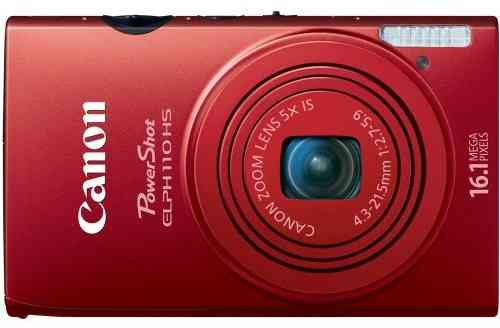
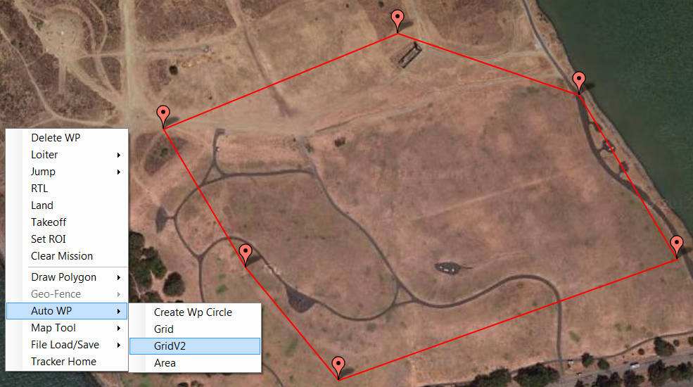

.. _common-chdk-camera-control-tutorial:

============================
CHDK Camera Control Tutorial
============================

Taking Pictures Automatically during Missions with the Canon Hacker Development Kit
===================================================================================

Looking for an easy and inexpensive way to take high quality pictures
during your missions? The Canon Hacker Development Kit (CHDK) allows you
to turn a Canon point-and-shoot camera into a dynamic payload through
some simple scripting. This tutorial will guide you through the process
of implementing this solution for automatic camera control.

First we'll introduce CHDK: what you'll need to get started and tips for
installing it. The first section will cover adding scripts, running
scripts, and securing the camera to your fixed-wing plane. This
straightforward method is great for basic automatic camera control.

Next we'll describe how to coordinate camera controls with autonomous
missions by integrating CHDK with ArduPilot. Although more complex, this
implementation provides excellent functionality for taking pictures
automatically at waypoints. Finally, we'll show a fun application where
you can map an area by creating a composite image of still photos.

Taking pictures automatically: What is CHDK?
============================================

`Canon Hacker Development Kit (CHDK) <http://chdk.wikia.com/wiki/CHDK>`__ is a free, experimental
development tool that allows you to temporarily hack a Canon camera.
With all the features of a DSLR unlocked to your control, a hacked
camera is a smart payload that can read scripted functions such as
shoot, zoom, and (importantly for later on) read the power applied to
its USB port.

To use CHDK, you will need:

**A supported Canon camera**

CHDK is made possible by the ability of Canon point-and-shoot cameras to
read software off an SD flash memory card. A team of developers has
created Canon Hacker Development Kit to take advantage of this
capability on *only certain Canon cameras*. For this tutorial, you will
need one of the Canon point-and-shoot cameras listed on the `CHDK wiki <http://chdk.wikia.com/wiki/Template:Supported_Cameras>`__ as
officially supported by CHDK.

**An SD card**

We recommend an SD card that can be written to every two seconds and can
store the amount of pictures you plan to take during your mission.
You'll also need an SD card reader for your computer.

.. image:: ../../../images/sd_card.jpg
    :target: ../_images/sd_card.jpg

**A CHDK USB cable**

We use the gentWIRE USB with two channels, available
`here <http://www.brooxes.com/newsite/BBKK/BBKK-PARTS.html>`__ (half way
down page). This cable is necessary for integrating CHDK with ArduPilot and is
not required to use the intervalometer script function.

Hacking your camera
-------------------

First you'll need to install CHDK onto your camera, so naturally, you'll
need `STICK: Simple Tool for Installing CHDK <http://zenoshrdlu.com/stick/stick.html>`__ (available for Windows,
Mac, and Linux). (You'll also need to have
`Java <http://www.java.com/en/download/manual.jsp>`__ installed on your
computer.)

Follow this link to the `STICK instructions page <http://zenoshrdlu.com/stick/stick.html>`__, click on “STICK zip
file” under the **Downloading and Installing** section to download
STICK. Once installed onto your computer, STICK is easy to use: take a
picture with your camera, connect the SD card to your computer, and drag
the picture into the STICK window. This nifty tool will download the
appropriate CHDK build and prepare your SD card automatically. The
`STICK instructions page <http://zenoshrdlu.com/stick/stick.html>`__ has
some helpful tips for issues caused by certain operating systems.

Adding a script to the SD card
------------------------------

CHDK allows you to automate your camera's functionality by running
scripts off an SD card. CHDK scripts can be written in
both \ `UBASIC <https://en.wikipedia.org/wiki/UBASIC>`__\ and \ `Lua <https://en.wikipedia.org/wiki/Lua_(programming_language)>`__:
simple, easy-to-use programming languages. For this tutorial, we'll use
UBASIC scripts with file extension **.bas**.

.. note::

   UBASIC script files must carry the extension **.bas** to function.

One of the easiest and most useful ways to apply CHDK to your mission is
to take pictures automatically at intervals during flight. We'll do this
by adding an `intervalometer <https://en.wikipedia.org/wiki/Intervalometer>`__ script
to the SD card. Our friends at `Drone Mapper <https://dronemapper.com/>`__ have created a great CHDK
intervalometer script that can be found in Drone Mapper's \ `CHDK documentation <https://s3.amazonaws.com/DroneMapper_US/documentation/DroneMapper_CHDK.pdf>`__
or `viewed by clicking here <https://download.ardupilot.org/downloads/wiki/other_files/DM-Intervalometer.txt>`__. Copy
the intervalometer script into a text editor and save the file as **DM_interval.bas**.

This script will measure time intervals for five minutes and trigger the
camera shutter every two seconds. These default parameters work well for
us (results in about 150 pictures), but if you would like to modify them
(for example, to take a pictures every five seconds), see \ `CHDK Wiki's page <http://chdk.wikia.com/wiki/CHDK_scripting>`__ regarding scripting
parameters for UBASIC.

To load the script onto the camera, unlock your SD card (by sliding the
switch on the slide of the SD card to the unlock position), connect it
to your computer, and open the SD card's file structure. Select the
**CHDK** folder followed by the **Scripts** folder. Copy the script file
(**DM_interval.bas**) into the **Scripts** folder.

3. Flying with your camera
--------------------------

Before you're ready for takeoff, you'll need to pack the camera into
your vehicle. For best results using plane, position the camera with the
lens pointing down in the center of the plane. You may need to modify
your plane's body to create a space for the camera. Be sure to set the
plane's center of gravity with the camera in place, and keep in mind the
safety of the camera in case of failure. Check out our setup for
inspiration; we used velcro strips to secure the camera in place.

Activating scripts before flight
--------------------------------

Prior to launching your plane, it is necessary to activate the
intervalometer script on the camera. Make sure the SD card is locked and
loaded into the camera and the camera is turned on. When you're ready to
launch your plane, enter ALT mode by pressing the **Print** or **Play**
button on the camera (for more information consult the `CHDK wiki <http://chdk.wikia.com/wiki/CHDK>`__). Press the **Menu** button to
access the main CHDK menu. Select **Load Script from File**;
select \ **DM_interval.bas**. Press the **shutter** button to run the
script. (You can also use the shutter button to stop the script.) Once
you start the script, the camera will automatically begin taking
pictures after a delay of five seconds, so be sure to take that into
account when launching your plane.

Integrating CHDK with ArduPilot
===============================

.. image:: ../../../images/chdk-cable.jpg
    :target: ../_images/chdk-cable.jpg

To integrate your CHDK setup with ArduPilot, you will need a CHDK cable
(pictured across) that connects the autopilot's output signal pins with the
camera's USB port. We used \ `Gentles' gentWIRE-USB2 cable <http://gentles.ltd.uk/gentwire/usb.htm>`__. (Stay tuned for a 3DR
CHDK cable.)

CHDK cables work by translating pulse width modulation (PWM) output by
the autopilot into USB power pulses that can be read by the camera. It does
this by establishing a range of how long power is applied to the USB
port (ex: 40-80 ms) and assigning that range to a PWM value
corresponding to a channel switch position (ex: channel 1 middle). The
table below shows the corresponding values between the switch position
on the RC transmitter, the autopilot's PWM output, and the camera's USB power.

+-------------------+-----------+------------------+
| Switch position   | PWM (µs)  | USB power (ms)   |
+-------------------+-----------+------------------+
| Channel 1 up      | 1,900     | <50              |
+-------------------+-----------+------------------+
| Channel 1 mid     | 1,500     | >40 and <80      |
+-------------------+-----------+------------------+
| Channel 1 down    | 1,100     | >70 and <110     |
+-------------------+-----------+------------------+
| Channel 2 up      | 1,900     | >100 and <140    |
+-------------------+-----------+------------------+
| Channel 2 mid     | 1,500     | >130 and <170    |
+-------------------+-----------+------------------+
| Channel 2 down    | 1,100     | >160 and <120    |
+-------------------+-----------+------------------+

Each switch position can be assigned to a script function. This means
that you can script up to six different camera controls such as
triggering the shutter and setting different levels of zoom. For this
tutorial, we'll show you how to set up three functions using only the
first channel, but this process can be followed to utilize the full six
options if you choose to.

Configuring the CHDK cable for use with ArduPilot
-------------------------------------------------

First we need to select an RC channel to assign to CHDK's channel 1.
Connect your plane's autopilot to Mission Planner. Go to **Configuration \|
Radio Calibration** to locate an available channel and its corresponding
three-position switch on your RC transmitter. For this tutorial, we'll
use channel 7. (If you decide to use a different channel, substitute
your channel wherever we input channel 7.) Don't disconnect your autopilot
yet.

Before we fly, we'll need to test the integration between this channel
and the CHDK cable by manually changing the switch position and
observing the result. In order to allow manual control of this channel,
we need to change an important parameter in Mission Planner. Under
**Configuration \| Standard Parameters**, scroll about 4/5 of the way
down to find the **Servo out function** parameters for each channel.
Find the parameter that corresponds to your camera control channel. For
us, it's **Servo out function (SERVO7_FUNCTION or RC7_FUNCTION)**.

.. note::

   Set this parameter to **Manual** whenever you want to control your
   camera using your RC transmitter; set to **Disabled** when you want the
   autopilot to control the camera automatically.

Since we're using the RC transmitter to test the CHDK cable, set **Servo
out function** to **Manual**. Select **Write Params** before
disconnecting your autopilot.

Once you've chosen your camera control channel, you'll need to connect
your CHDK cable to the autopilot's output pins. Connect either of the pin
connectors on the CHDK cable to the autopilot output pins corresponding to
your camera control channel (black cable on the outside). For example,
we connected our CHDK cable to the channel 7 output pins on the autopilot.
Make sure no input pins are connected to the autopilot for that channel.

For **Pixhawk**, connect the CHDK cable to aux out pin 5. However, this
pin outputs only 3.3V, and 5V are required to trigger CHDK. To convert
to 5V, you'll need to integrate a step-up converter (`like the one here from Sparkfun <https://www.sparkfun.com/products/10968>`__) in-line with
the cable to trigger CHDK.

Adding a script
---------------

Now that you've configured your CHDK cable, we'll add a script to
control the camera when commanded by the autopilot. Let's break down a CHDK
cable UBASIC script into its main parts.

::

    @param o Zoom-extended
    @default o 100
    @param i Zoom-stowed
    @default i 30
    @param s Zoom-shoot
    @default s 10

This section defines the parameters that will be used later by the
functions. **@param** names the parameter with a variable and a phrase;
**@default** specifies its value. These three parameters specify zoom
levels, so if you wanted to change a zoom level, you could easily do so
by entering a new value after the variable following **@default**.

::

    while 1
    do
    k = get_usb_power
    until k>0
    if k < 5 then gosub "ch1up"
    if k > 4 and k < 8 then gosub "ch1mid"
    if k > 7 and k < 11 then gosub "ch1down"
    if k > 10 and k < 14 then gosub "ch2up"
    if k > 13 and k < 17 then gosub "ch2mid"
    if k > 16 and k < 20 then gosub "ch2down"
    if k > 19 then print "error"
    wend
    end

This is the main body of the script. It tells CHDK to read the power
pulse from the USB port (**get_usb_power**) and, according to what
range it falls under, execute a specific function. The values here are
listed in centiseconds, which is why they differ from the table shown
above (5 centiseconds = 50 milliseconds).

::

    :ch1up
    print "Ch1Up-Shoot"; k
    set_zoom s
    shoot
    sleep 1000
    return

    :ch1mid
    print "Ch1Mid-Stowed"; k
    set_zoom i
    sleep 1000
    return

    :ch1down
    print "Ch1Down-Extended"; k
    set_zoom o
    sleep 1000
    return

    :ch2up
    return

    :ch2mid
    return

    :ch2down
    return

This is where the script defines what each function will do. Since we
aren't utilizing the channel 2 options, **ch2up**, **ch2mid**, and
**ch2down** functions are empty. The **ch1up** function will set the
zoom to the value specified by the variable **s** using the
**set_zoom** command and take a picture using the **shoot** command.
The **ch1mid** function uses **set_zoom** to set the lens to its stowed
position, and the **ch1down** function fully extends the lens. The
**print** command will output the specified text to the camera's display
along with the actual output value of the USB power pulse (**k**).

In short, the above script will cause the following behaviors:

When channel 7 is set to the up position, CHDK will set zoom to 10 and
take a picture.

When channel 7 is set to the mid position, CHDK will set zoom to 30
(stowed position).

When channel 7 is set to the down position, CHDK will set zoom to 100
(extended position).

`Click here to view the above script <https://download.ardupilot.org/downloads/wiki/other_files/3DR_Shoot.txt>`__,
copy into a text editor, and save as \ **3DR_Shoot.bas**. Now that
you're familiar with how the script works, you can easily change the
commands of each function. For example, you can add a **shoot** command
to **ch1down** or change one of the zoom level parameters. If you're
utilizing the channel two functions, you can easily add commands to
those functions in the same format shown above.

Add the script file to the SD card as described in the previous section.

Testing the CHDK cable
----------------------

Testing the CHDK cable will ensure that our camera controls execute as
expected and is a great opportunity to test for potential noise created
by your equipment setup.

.. image:: ../../../images/USB_Remote_01.png
    :target: ../_images/USB_Remote_01.png

To tell CHDK to listen to the cable, we need to set the Enable Remote
parameter. On the camera, access the CHDK menu, select **Remote
Parameters,** and select **Enable Remote** as shown. This setting must
be enabled to allow communication with the CHDK cable.

Connect the CHDK cable to the camera's USB port, and
run \ **3DR_Shoot.bas**. Test the result of each switch position. The
resulting behaviors should reflect those listed in the previous step.
Observe the USB pulse values output to the camera display, and compare
them with the ranges show in the code. If you encounter problems, see
the **Advanced Topics**\ section below for additional testing and
troubleshooting information.

Programming camera controls in Mission Planner
----------------------------------------------

Mission Planner allows you to program servo outputs as events at
waypoints. By using this feature, we can add a command to output a PWM
value (corresponding to a switch position and function) after the plane
achieves each waypoint.

Once you have your waypoints configured in Mission Planner as shown
below, select your first waypoint and click “Add Below”.

For your new command, set **Command** type to **DO_SET_SERVO**. (This
tells the autopilot that this command means output to a servo.) Set **Ser
No**\ (servo number) to the number of your camera control channel
(ex:**7**). (This tells the autopilot where to output: for us, servo channel 7
is the CHDK cable.) And set **PWM** to **1900**. (This value tells the
autopilot what to output: 1,900 microseconds of pulse width modulation
corresponds to the high position under which the shoot command is
located). Repeat this process for each waypoint at which you would like
to take a picture. The screen below shows a shutter command correctly
applied at each of three waypoints.

.. note::

    Columns in the Waypoints table accrue different meanings based on
    the type of command currently selected. These column definitions only
    become visible when the command is selected as different parameters
    apply to different types of commands.*

Since we're using the autopilot to control the camera, we need to set
the \ **Servo out function (RC7_FUNCTION or SERVO7_FUNCTION)** parameter to **Disabled**
(under **Standard Parameters**). Write waypoints and parameters to the
autopilot.

Ensure that your camera and autopilot are connected correctly.
Run \ **3DR_Shoot.bas** prior to launch. Fly your mission according to
standard practices and safety procedures.

Creating a composite image
==========================

One of our favorite applications of CHDK is creating a map of an area by
stitching automatically-captured pictures into a composite image. We'll
use the same
`3DR_Shoot.bas <https://download.ardupilot.org/downloads/wiki/other_files/3DR_Shoot.txt>`__\ script
that we used in the previous section. The process is similar to setting
shutter triggers at waypoints, only to make sure we capture the entire
area we need more frequent, more regular waypoints. We’ll do this
automatically using Mission Planner’s **Grid V2** automatic waypoint
function.

Setting waypoints with GridV2
-----------------------------

First locate the area you wish to map in Mission Planner. Right-click
and select \ **Draw Polygon\| Add Polygon Point**. Add polygon points
until you have created a polygon around the area you wish to map. Once
you are satisfied with your polygon, right-click and select **Auto WP
\| GridV2** as shown below.

Input a relative altitude (100 feet is fine if you are unsure). Input a
distance between lines; the larger the number, the fewer waypoints
you’ll end up with. When prompted, enter a distance between each
waypoint; the same rationale applies here. Enter line direction; the
waypoints below show a line direction of 70. When prompted to add camera
triggers, input “Yes”; *this will create a command after each waypoint,
it will not automatically set up your CHDK commands*. We recommend
experimenting with these settings until you find the waypoint
configuration that is right for your mission. You should now have a grid
of waypoints mapped onto your polygon as shown below.

Here is where we have to switch our automatic functionality for some
manual labor. GridV2 has created a command after each waypoint with
command type DO_DIGICAM_CONTROL. However, for our CHDK setup, we need
command type **DO_SET_SERVO**. For each DO_DIGICAM_CONTROL command,
change command type to \ **DO_SET_SERVO**, set **Ser No** to **7** (or
whichever channel you're using), and set **PWM** to **1,100** (to call
the 3DR_Shoot.bas function that takes a picture).

When run, this mission returns a set of images that can be stitched
together to create a map of the selected polygon.

Stitching images
----------------

`Microsoft Image Composite Editor (ICE) <http://research.microsoft.com/en-us/um/redmond/projects/ice/>`__
is a great, free tool for automatically stitching images together into a
composite. Just upload your images, and ICE will stitch them together.
Here's an example of one of our composites:

.. image:: ../../../images/marina_stitch_medium.jpg
    :target: ../_images/marina_stitch_medium.jpg

We hope this solution provides some enhanced functionality to your
missions and expands your autonomous imaging capabilities. For more
information, check out the Advanced Topics section below.

Appendix
========

Camera Settings
---------------

The following settings will help ensure that you get the best results
from your aerial imagery.  The picture settings should can be adjusted
based on your environment, but the listed values are a good place to
start. Both the Canon settings and CHDK settings will vary from camera
to camera.

CHDK settings have a tendency to be unintuitive and to reset themselves
at random, so be sure to understand what each setting does and check to
make sure they have not changed before you fly!

Canon Settings
~~~~~~~~~~~~~~

-  Flash: Off
-  Function

   -  ISO: **Auto**
   -  AWB: **Daylight**
   -  Image Size: **L**
   -  Image Quality: **Fine/Superfine**

-  Menu

   -  AF Frame: **Center**
   -  Digital Zoom: **Off**
   -  AF-Point Zoom: **Off**
   -  Servo AF: **Off**
   -  AF assist beam: **Off**
   -  Flash Settings

      -  Red Eye correction: **Off**
      -  Red-Eye Lamp: **Off**

   -  Date Stamp: **Date & Time**
   -  Power Saving...

      -  Auto Power Down: **Off**
      -  Display Off: **1 min**

   -  IS Settings...

      -  IS Mode: **Shoot Only**
      -  Powered IS: **Off**

   -  GPS: **On**

CHDK Settings
~~~~~~~~~~~~~

-  Function

   -  Autostart: On
   -  Save Params: ON
   -  Remote Parameters: Enable Remote

-  Menu

   -  Extra Photo Operations...

      -  Disable Overrides: **Disable**
      -  Override Shutter Speed: **1/1600**
      -  Value Factor: **1**
      -  Override Subj. Dist V: **65535**
      -  Value Factor: **1**
      -  Custom Auto ISO...

         -  Enable custom auto ISO
         -  Minimal: **1/1000**
         -  Clear override values @start: Disable

Advanced Topics
===============

CHDK Cable Troubleshooting and Testing
--------------------------------------

CHDK cables work by translating pulse width modulation (PWM) output by
the autopilot into USB power pulses that can be read by the camera. It does
this by establishing a range of how long power is applied to the USB
port (ex: 40-80 ms) and assigning that range to a PWM value
corresponding to a channel switch position (ex: Channel middle).The
table below shows the corresponding output values between the switch
position on the RC transmitter, the autopilot's PWM output, and the camera's
USB power. In practice, our Spektrum DX 8 outputs the values shown in
the rightmost column.

+-------------------+-----------+------------------+----------------------------------------+
| Switch position   | PWM (µs)  | USB power (ms)   | Spektrum DX8 USB power readings (ms)   |
+-------------------+-----------+------------------+----------------------------------------+
| Channel 1 up      | 1,100     | <50              | 30                                     |
+-------------------+-----------+------------------+----------------------------------------+
| Channel 1 mid     | 1,500     | >40 and <80      | 50 or 60                               |
+-------------------+-----------+------------------+----------------------------------------+
| Channel 1 down    | 1,900     | >70 and <110     | 90                                     |
+-------------------+-----------+------------------+----------------------------------------+
| Channel 2 up      | 1,100     | >100 and <140    | 130                                    |
+-------------------+-----------+------------------+----------------------------------------+
| Channel 2 mid     | 1,500     | >130 and <170    | 150 or 160                             |
+-------------------+-----------+------------------+----------------------------------------+
| Channel 2 down    | 1,900     | >160 and <120    | 190                                    |
+-------------------+-----------+------------------+----------------------------------------+

To verify that your transmitter behaves similarly, you may want to
perform a test to ensure that a valid USB power value is returned for
each switch position. View the `3DR CHDK Tester script here <https://download.ardupilot.org/downloads/wiki/other_files/3DRCHDKTester.txt>`__.
Copy the contents into a text editor and save as **3DRCHDKTester.bas**.
Load into your (unlocked) SD card by copying the file into the
**Scripts** folder (in the **CHDK** folder).

Configuring CHDK cable for Testing
~~~~~~~~~~~~~~~~~~~~~~~~~~~~~~~~~~

Before we can test the CHDK cable, we'll need to choose a channel for
camera control and configure the corresponding inputs. Connect your
plane's autopilot to Mission Planner. Go to **Configuration \| Radio
Calibration** to locate an available channel and its corresponding
switch on your RC transmitter. (We'll use channel 7.) Check the PWM
outputs for the up, mid, and down positions of the channel. Compare them
with the table shown above.

Before we disconnect the autopilot, we need to change an important parameter
that you'll be using often. Under **Configuration** -> **Standard
Parameters**, scroll about 4/5 of the way down to find the **Servo out
function** parameters for each channel. Find the parameter that
corresponds to your camera control channel. For us, it's **Servo out
function (SERVO7_FUNCTION or RC7_FUNCTION)**.

***Set this parameter to Manual whenever you want to control your camera
using your RC transmitter; set to Disabled when you want the autopilot to
control the camera automatically.***

Since we're using the RC transmitter to test the CHDK cable, set **Servo
out function** to **Manual**. Select Write Params before disconnecting
your autopilot.

Once you've chosen your camera control channel, you'll need to connect
your CHDK cable to the autopilot's output pins. Connect either of the pin
connectors on the CHDK cable to the autopilot output pins corresponding to
your camera control channel (black cable on the outside). For example,
we connected our CHDK cable to the channel 7 output pins on the autopilot.
Make sure no input pins are connected for that channel.

Testing the CHDK cable
~~~~~~~~~~~~~~~~~~~~~~

Testing the CHDK cable will ensure that our camera controls execute as
expected and is a great opportunity to test for potential noise created
by your equipment setup.

Connect the CHDK cable to the camera's USB port. Turn the camera on,
load the \ **3DRCHDKTester.bas** script (by selecting **Load Script from
File** from the main CHDK menu), and press the shutter button to run the
test script.

To perform the test, set each camera control channel position on your RC
transmitter and observe the outputs on the display. Verify that these
outputs are within the acceptable USB power ranges in the table above.
If you encounter problems, you may need to shield your cable to prevent
noise.

Shielding the cable
~~~~~~~~~~~~~~~~~~~

Coming soon.

GeoTagging Images
-----------------

For information regarding geotagging images, more information can be
found on `Sandro Beningo's step-by-step guide. <https://www.diydrones.com/profiles/blogs/geotagging-images-with-mission-planner>`__

Troubleshooting
---------------

**Problem**: The tester script runs but does not display any output on
the camera screen.

Cause 1: Do you have the parameter SERVOx_FUNCTION=1 ir RCx_FUNCTION=1 for manual
override of the RC channel you are using? You can see both the PWM input
and output on the **Configuration \| Failsafes** screen in the Mission
Planner.

Cause 2: Is your output rail powered? Even if you are getting the
correct PWM signal out on your camera control channel, the output needs
5V DC. You can power the output rail with a jumper on JP1 as shown,
which bridges the input power to the output, or by directly running
power to the output.

Cause 3: Do you have the remote enabled in CHDK? In the CHDK menus:
Remote parameters > enable remote. Leave the other remote settings as
is.
