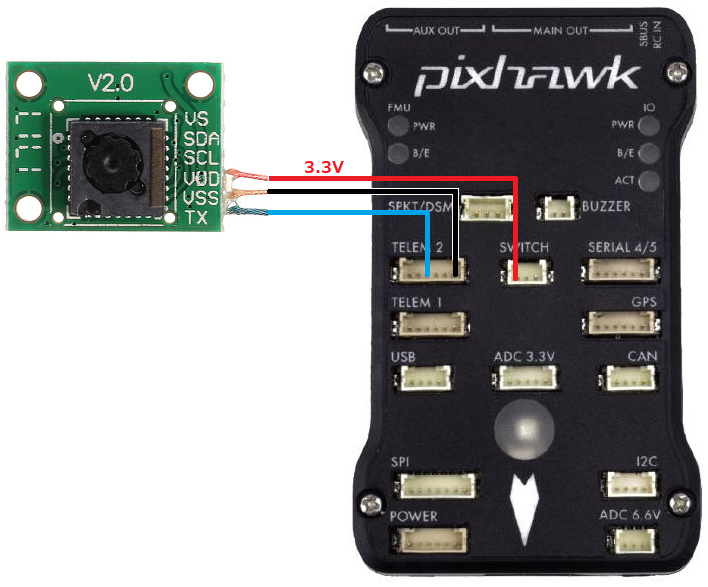

.. _common-cheerson-cxof:

===========================
Cheerson CX-OF Optical Flow
===========================

[copywiki destination="copter,plane,rover"]

The Cheerson CX-OF optical flow sensor is a lightweight and low cost optical flow sensor which can be used to improve horizontal position control especially in GPS denied environments.

..  youtube:: SSISkG58cDk
    :width: 100%

Where to Buy
------------

The sensor is available from various retailers incluing `Banggood.com <https://www.banggood.com/Cheerson-CX-OF-CXOF-RC-Quadcopter-Spare-Parts-Optical-Flow-Module-p-1215911.html>`__ and `AliExpress <https://www.aliexpress.com/item/Original-Cheerson-CX-OF-CXOF-RC-Quadcopter-Spare-Parts-Optical-Flow-Module-for-RC-Toys-Models/32838098799.html>`__.  More retailers can be found by searching for "CX-OF spare parts".

These alternatives have also been shown to work:

- `FPV RC Drone Optical Flow Module <https://www.aliexpress.com/item/1-3-2CM-FPV-RC-Drone-Optical-Flow-Module-Hovering-Altitude-Hold-Optical-Flow-Sensor-Balance/33002000486.html>`__
- `ThoneFlow-3901U UART Serial Version PMW3901 Optical Flow Sensor <https://www.seeedstudio.com/ThoneFlow-3901U-UART-Serial-Version-PMW3901-Optical-Flow-Sensor-p-4040.html>`__

These alternatives may work but this has not been confirmed:

- `JJRC H62 Flow sensor <https://www.banggood.com/JJRC-H62-RC-Quadcopter-Spare-Parts-Optical-Current-Board-H62-03-p-1302982.html>`__

Connection to Autopilot
-------------------------------

- The flow sensor should be mounted on the underside of the copter with the camera lens pointing downwards.  The side of the sensor with the "V2.0" label should be towards the front of the vehicle.  The image above is incorrect because the autopilot's arrow is pointing down while the sensor's "V2.0" label is close to the top.
- Connect the sensor's TX and VSS (aka GND) pins to one of the autopilot's serial ports.  In the image above the sensor is connected to a Pixhawk's Telem2 port
- Connect the sensor's VDD (aka VCC or 3.3V) to a 3.3V power source.  In the above diagram the Pixhawk's Switch port is used but another alternative would be the SPKT/DSM port's power pin

- Set :ref:`FLOW_TYPE <FLOW_TYPE>` = 4
- Set :ref:`SERIAL2_PROTOCOL <SERIAL2_PROTOCOL>` = 18 if using Serial2/Telem2, if connected to another serial port use the corresponding SERIALx_PROTOCOL parameter

Additional Notes
-----------------

- As with the :ref:`PX4Flow sensor <common-px4flow-overview>` a range finder is required to use the sensor for autonomous modes including :ref:`Loiter <loiter-mode>` and :ref:`RTL <rtl-mode>`
- :ref:`FlowHold <flowhold-mode>` does not require the use of a rangefinder
- The sensor has been successfully tested to altitudes of about 40m
- Performance can be improved by setting the :ref:`sensors position parameters <common-sensor-offset-compensation>`.  For example if the sensor is mounted 2cm forward and 5cm below the frame's center of rotation set :ref:`FLOW_POS_X <FLOW_POS_X>` to 0.02 and :ref:`FLOW_POS_Z <FLOW_POS_Z>` to 0.05.

Testing and Setup
-----------------

- See :ref:`common-optical-flow-sensor-setup` for setup guides.
- Note that recommended value for :ref:`EK2_FLOW_DELAY <EK2_FLOW_DELAY>` or :ref:`EK3_FLOW_DELAY <EK3_FLOW_DELAY>` for this sensor is 80. 
