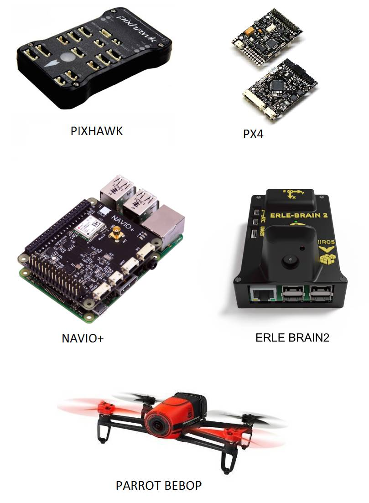

.. _common-choosing-a-flight-controller:

=====================
Choosing an Autopilot
=====================

ArduPilot runs on many different autopilot boards, the most
important of which are linked from the topic :ref:`AutoPilot Hardware Options <common-autopilots>`.

Selecting the right board depends on the physical restraints of the
vehicle, features desired, and the applications that you want to run.
Factors to consider are:

#. Sensor Redundancy: ArduPilot supports redundant IMUS, GPS, etc. Many controllers have multiple IMUs integrated on board.
#. Number of Servo/Motor Outputs
#. Number of UARTs: Telemetry radios, GPS's, Companion Computers, etc can be attached via these ports
#. External Buses: I2C, CAN, etc. allow many types of devices, such as airspeed sensors, LED controllers, etc. to be attached to the autopilot.
#. Number of Analog I/O: Some controllers have analog I/O available for such features as inputting receiver signal strength (RSSI) or battery voltage/current or other analog sensors.
#. Integrated Features: Such as on-board OSD (On Screen Display), integrated battery monitoring sensors
#. Size: Many vehicles have limited space for the autopilot.
#. Expense: Controller prices range from ~$25 to much more, depending on feature set.

 Broadly speaking:

-  :ref:`Pixhawk <common-pixhawk-overview>` is highly recommended for
   general use where sensor redundancy is desired and flexible external expansion.
-  The "CUBE", CUAV V5, and Holybro Durandal/KakuteF7 AIO series of controllers offer mechanical vibration isolation of the IMUs built-in. 
-  :ref:`Pixracer <common-pixracer-overview>` is recommended for small
   frames that require no more than 6 PWM outputs, with sensor redundancy.
-  :ref:`Emlid NAVIO2 <common-navio2-overview>` Linux Autopilots
   should be considered for UAV Vision applications.

.. tip::

   There are also numerous clones and minor variants of the boards
   linked above. Many of these may be perfectly capable replacements.

-  If redundant sensors are not required, many inexpensive controllers originally targeted for mini-quadcopter use are now supported by ArduPilot and are also listed in :ref:`AutoPilot Hardware Options <common-autopilots>`.

[site wiki="copter, plane" heading="off"]

.. note::

   The APM2.6 board is no longer supported for Copter or Plane. The
   last firmware builds that can be installed are AC v3.2.1 and Plane
   3.3.0.

[/site]

