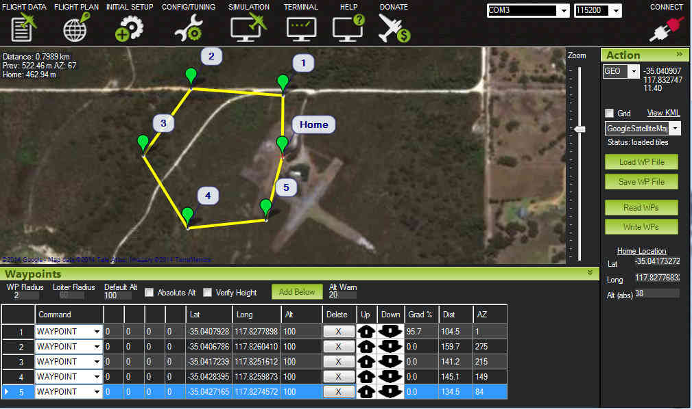
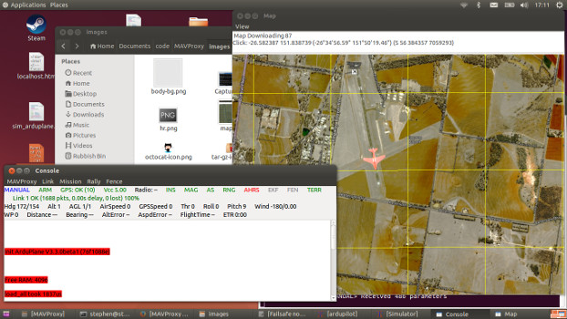
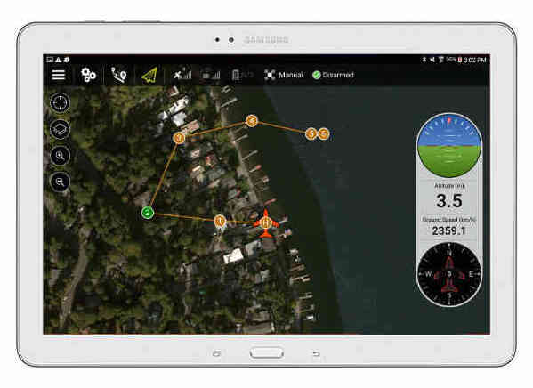
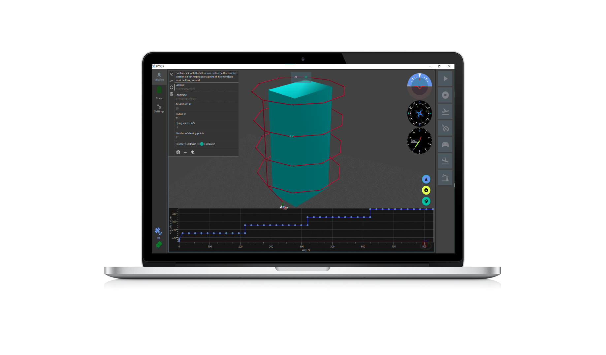
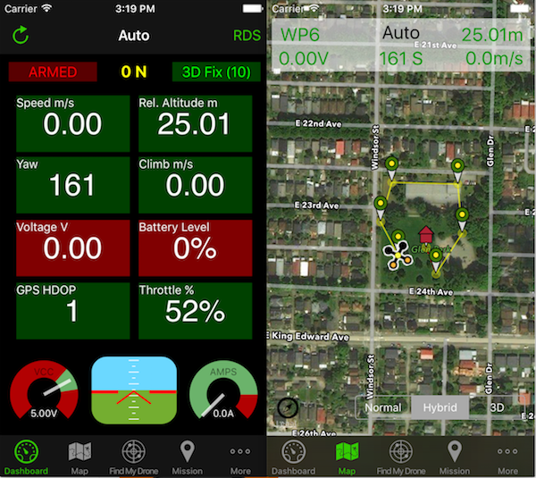
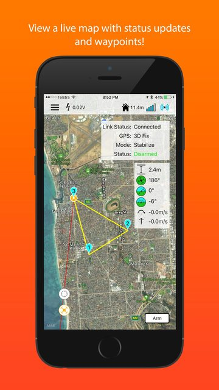

.. _common-choosing-a-ground-station:
[copywiki destination="plane,copter,rover,blimp"]
=========================
Choosing a Ground Station
=========================

This page gives a high-level overview of the available Ground Control
Stations (GCS) and provides links so you can make the appropriate
choice.

Overview
========

A ground station is typically a software application, running on a
ground-based computer,phone,or transmitter, that communicates with your UAV via :ref:`wireless telemetry <common-telemetry-landingpage>` or USB cable. It displays real-time data
on the UAVs performance and position and can serve as a “virtual
cockpit”, showing many of the same instruments that you would have if
you were flying a real plane. A GCS can also be used to control a UAV in
flight, uploading new mission commands and setting parameters. It is
often also used to monitor the live video streams from a UAV’s cameras.

A GCS is also required to setup the configuration of the autopilot prior to its use and to update the autopilot's firmware.

There are at least ten different ground control stations. On desktop there is *Mission
Planner*, *APM Planner 2*, *MAVProxy*, *QGroundControl*, *UgCS*, and *LOGOS*. For Tablet/Smartphone there are
*QGroundControl*, *Tower* (DroidPlanner 3), *MAVPilot*, *AndroPilot* and *SidePilot* that can be
used to communicate with ArduPilot.

The decision to select a particular GCS often depends on your vehicle
and preferred computing platform:

-  **Ready-to-fly** users may prefer the portability and ease of use of
   *QGroundControl*, or another GCS running on a tablet or
   phone.
-  **DIY/Kit** users and developers often have to access configuration
   and analysis tools, and would therefore need (at least initially)
   *Mission Planner*, *QGroundControl*, *APM Planner 2* or another more full-featured GCS.
-  **Code Developers** will appreciate some of *MAVProxy's* features.

Desktop GCSs
============

Mission Planner
---------------

Full featured and widely used GCS.

-  **Platform**: Windows, Mac OS X (Using Mono)
-  **Licence**: `Open source <https://github.com/ArduPilot/MissionPlanner/blob/master/COPYING.txt>`__
   (GPLv3)

-  `Download <https://firmware.ardupilot.org/Tools/MissionPlanner/MissionPlanner-latest.msi>`__
-  :ref:`Wiki <planner:home>`
-  `Support Forum <https://discuss.ardupilot.org/c/ground-control-software/mission-planner>`__
-  `Issues List <https://github.com/ArduPilot/MissionPlanner/issues>`__
-  `Source Code <https://github.com/ArduPilot/MissionPlanner>`__

APM Planner 2.0
---------------

The best autopilot for use on MAC and Linux platforms. It has a smaller
user base and a reduced feature set when compared with Mission Planner.

- **Platform**: Windows, Mac OS X, Linux
- **Licence**: `Open source <https://github.com/ArduPilot/apm_planner/blob/master/license.txt>`__
   (GPLv3)

   .. image:: ../../../images/planner2_choose_agcs.jpg
    :target: ../_images/planner2_choose_agcs.jpg

- :ref:`Wiki <planner2:home>`
- `Support Forum <https://discuss.ardupilot.org/c/ground-control-software/apm-planner-2-0>`__
- `Issues List <https://github.com/ArduPilot/apm_planner/issues>`__
- `Source Code <https://github.com/ArduPilot/apm_planner>`__

MAVProxy
--------

Linux GCS often used by code developers. Primarily a command line
interface with graphical modules for map and mission editing. Written in
Python, and extensible via python modules.

-  **Platform**: Linux
-  **Licence**: `Open source <https://github.com/tridge/MAVProxy/blob/master/COPYING.txt>`__
   (GPLv3)

-   :ref:`Wiki <mavproxy:home>`
-  `Issues List <https://github.com/ArduPilot/MAVProxy/issues>`__
-  `Source Code <https://github.com/ArduPilot/MAVProxy>`__

QGroundControl
--------------

QGroundControl works with MAVLink capable autopilots including ArduPilot.
It's unique among the GCS offerings as it runs on all platforms desktop and mobile.

-  **Platform**: Windows, Mac OS X, Linux, Android and iOS
-  **Licence**: `Open Source <http://www.qgroundcontrol.org/license>`__
   (GPLv3)

-  `Website <http://qgroundcontrol.com/>`__
-  `Support Forum <https://discuss.px4.io/c/qgroundcontrol/15>`__

UgCS - Universal Ground Control Station
---------------------------------------

Universal and easy to use ground control station with a 3D interface. 
Supports APM, Pixhawk as well as drones from other manufacturers such as DJI, Mikrokopter and more.
Intended for enthusiasts as well as professional users.

It is capable of communicating with and controlling multiple drones simultaneously. 

UgCS supports multiple map layers as well as different map providers. Some of the features of UgCS include - DEM Import, ADS-B transponder and receiver support, Click & Go mode, Joystick mode, image geotagging and video recording. UgCS also comes with a telemetry player, allowing the replay of all flights. 

UgCS comes with in-built no-fly zones around all major airports as well as the ability to create custom no-fly zones.

Supports multi-node installation, meaning that it is possible to connect multiple pilots with UgCS laptops in the field to a central ground control server.

-  **Platform**: Windows, Mac OS X, Ubuntu
-  **Licence**: Proprietary with a free licence available as well (UgCS Open)

.. image:: https://www.ugcs.com/files/2016-04/1459769168_elevation-profile.jpeg
    :target:  https://www.ugcs.com/files/2016-04/1459769168_elevation-profile.jpeg

-  `UgCS Website <http://www.ugcs.com>`__
-  `DIY Drones Group for UgCS Users <https://diydrones.com/group/ugcs>`__
-  `UgCS Github Repository <https://github.com/ugcs>`__

LOGOS
-----

GCS designed to streamline the planning of complex missions that include area scanning, taking photos, & videos. It provides a 3D view mode, binding of physical structures and an in-built simulator that helps to better visualize planned missions.

-  **Platform**: Windows
-  **Licence**: Proprietary. Can be used freely, but advanced features are not available without purchase.

-  `Download <https://aerologos.by/download>`__
-  `Website <https://aerologos.by/>`__
-  `Youtube <https://www.youtube.com/@AerologosBusinessAccount/>`__

Mobile GCSs
===========

QGroundControl
--------------

QGroundControl works with MAVLink capable autopilots including ArduPilot.
It's unique among the GCS offerings as it runs on all platforms desktop and mobile.

-  **Platform**: Windows, Mac OS X, Linux, Android and iOS
-  **Licence**: `Open Source <http://www.qgroundcontrol.org/license>`__
   (GPLv3)

-  `Website <http://qgroundcontrol.com/>`__
-  `Support Forum <https://discuss.px4.io/c/qgroundcontrol/15>`__

Tower
-----

Tower (a.k.a. "DroidPlanner 3") is an Android GCS for phones and
tablets. It is intended for end users and enthusiasts, and includes
features like follow-me, “dronies” (i.e. “selfies” but taken with a
drone) and special missions for 3D mapping.

-  **Platform**: Android Phones and Tablets
-  **Licence**: `Open source <https://github.com/DroidPlanner/Tower/blob/develop/LICENSE.md>`__
   (GPLv3)

.. image:: ../../../images/tower_droid_planner3_structure_scan.jpg
    :target: ../_images/tower_droid_planner3_structure_scan.jpg

-  `Download Tower <https://play.google.com/store/apps/details?id=org.droidplanner.android>`__
   (and `3DR Services <https://play.google.com/store/apps/details?id=org.droidplanner.services.android>`__)
   from Google Play.
-  `Android compatible hardware list <https://github.com/arthurbenemann/droidplanner/wiki/Compatible-Devices>`__
-  `Wiki <https://github.com/DroidPlanner/Tower/wiki>`__
-  `Support Forum <https://discuss.ardupilot.org/c/ground-control-software/tower>`__
-  `Issues List <https://github.com/DroidPlanner/Tower/issues>`__
-  `Source Code <https://github.com/DroidPlanner/droidplanner>`__

.. note::

   Legacy versions (`DroidPlanner 2 <https://play.google.com/store/apps/details?id=org.droidplanner>`__
   and `Droid Planner 1 <https://play.google.com/store/apps/details?id=com.droidplanner>`__)
   can also be downloaded from Google Play.

MAV Pilot 1.4
-------------

A GCS in your pocket that supports predominantly ArduPilot autopilot on iPhone/iPad. Supports for Plane, Copter & Rover vehicle types

See website for how-to on how connect it to your autopilot

-  **Platform**: iPhone, iPad
-  **Licence**: Proprietary

-  `Release announcement Blog & Discussion <https://diydrones.com/profiles/blogs/mav-pilot-1-4-for-iphone-released>`__
-  `Support Blog <http://www.communistech.com/support/>`__
-  `Support Forum <http://www.communistech.com/forums/>`__
-  `iTunes Store link <https://itunes.apple.com/ca/developer/communis-tech/id649232032>`__

SidePilot
---------

ArduPilot compatible GCS that runs on iPhone/iPad.

See website for how-to on how connect it to your autopilot

-  **Platform**: iPhone, iPad
-  **Licence**: Proprietary

-  `Release announcement Blog & Discussion <https://diydrones.com/profiles/blogs/sidepilot-app-version-1-1-formerly-imavlink>`__
-  `Website <http://sidepilot.net>`__
-  `Support Forum <http://sidepilot.net/forum>`__
-  `iTunes Store link <https://itunes.apple.com/us/app/sidepilot/id1138193193?ls=1&mt=8>`__

AndroPilot
----------

Android GCS intended for enthusiasts.

.. note::

   AndroPilot is not under active development. Its suitability for newer FW needs to be confirmed.

-  **Platform**: Android Phones and Tablets
-  **Licence**: `Open Source <https://github.com/geeksville/arduleader/blob/master/LICENSE.md>`__
   (GPLv3)

.. image:: ../../../images/Andropilot_-_Android_Apps_on_Google_Play.jpg
    :target: ../_images/Andropilot_-_Android_Apps_on_Google_Play.jpg

-  `Downloads (Google Play) <https://play.google.com/store/apps/details?id=com.geeksville.andropilot>`__
-  `Android compatible hardware list <https://github.com/geeksville/arduleader/wiki/Android%20Device%20Compatibility%20List>`__
-  `Wiki <https://github.com/geeksville/arduleader/wiki>`__
-  `Support Forum <https://discuss.ardupilot.org/c/ground-control-software/other-gcs>`__
-  `Issues List <https://github.com/geeksville/arduleader/issues>`__
-  `Source Code <https://github.com/geeksville/arduleader/tree/master/andropilot>`__

Additional GCS hardware
=======================

Android
-------

For Android devices, you will need:

-  Android based tablet or smartphone. *QGroundControl* can utilize Bluetooth, WIFI, or USB connectivity to the autopilot from the phone. For USB the device must be ablke to act as a USB host (OTG). 

A connectivity method to vehicle's autopilot:
-  :ref:`SiK Telemetry Radio System <common-sik-telemetry-radio>` or other radio telemetry (:ref:`common-telemetry-landingpage`) with OTG cable can be used for long range, in-the-air, connectivity to a similar vehicle telemetry unit.
-  WIFI (:ref:`common-esp8266-telemetry`)
-  Bluetooth (:ref:`common-mission-planner-bluetooth-connectivity`)
-  for benchtop USB connectivity, a USB OTG cable (typically less than $2 on `ebay <http://www.ebay.com/sch/i.html?_trksid=m570.l3201&_nkw=usb+otg+cable&_sacat=0>`__ and`Amazon <http://www.amazon.com/T-Flash-Adapter-Samsung-GT-i9100-GT-N7000/dp/B005FUNYSA/ref=sr_1_5?ie=UTF8&qid=1376262351&sr=8-5&keywords=android+otg+cable>`__).
-  Some other telemetry method (:ref:`common-telemetry-landingpage`)

iOS
---

For iOS devices, you will need:

-  iOS Based devices such as an iPad or iPhone. If running iPad, the cellular version is recommended for better GPS support.
-  Wifi or Bluetooth LE link to the Drone
-  Bridge Connection to a :ref:`SiK Telemetry Radio System <common-sik-telemetry-radio>` via Wifi or Bluetooth LE

  See iOS App Vendors for more details.

Desktop PCs (Windows/Mac/Linux)
-------------------------------

For Desktop devices you will need:

-  A USB cable, BT module, WIFI adapter, or other connectivity means as listed here (:ref:`common-telemetry-landingpage`)

