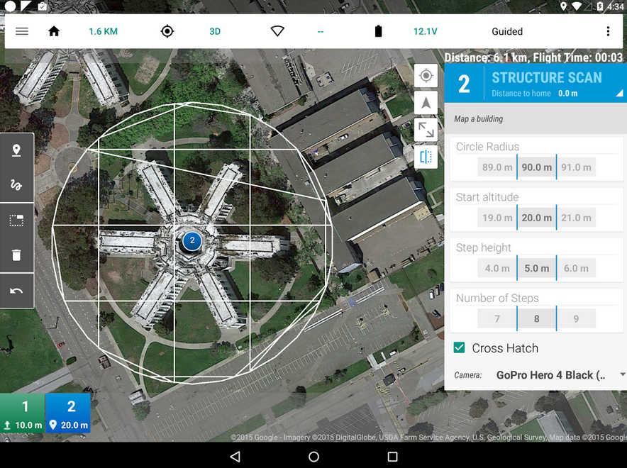
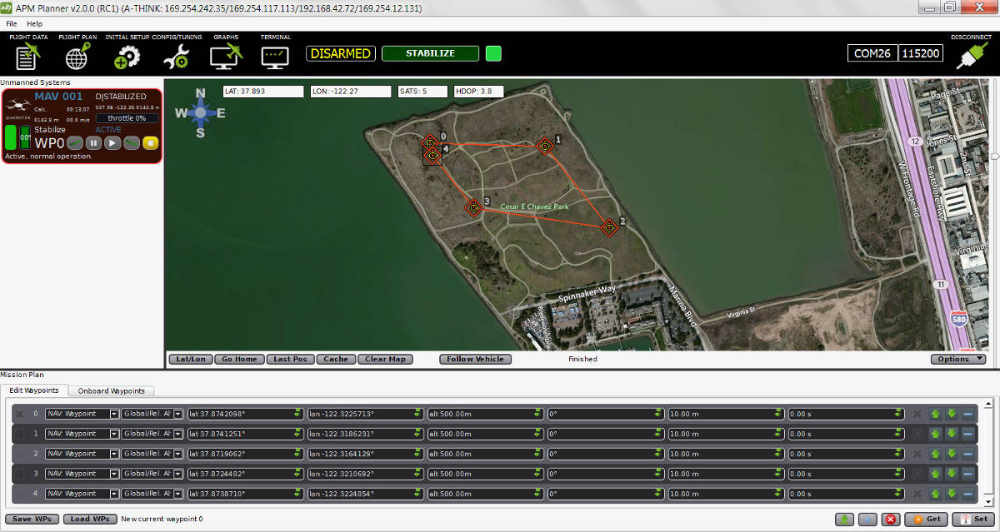
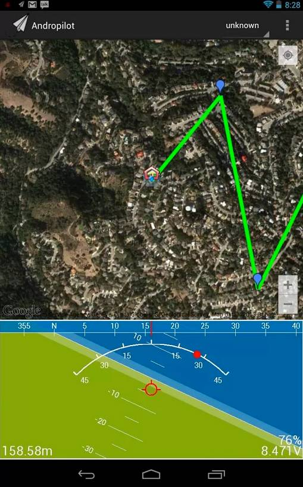

.. _common-choosing-a-ground-station:

=========================
Choosing a Ground Station
=========================

This page gives a high-level overview of the available Ground Control
Stations (GCS) and provides links so you can make the appropriate
choice.

Overview
========

A ground station is typically a software application, running on a
ground-based computer, that communicates with your UAV via :ref:`wireless telemetry <common-telemetry-landingpage>`. It displays real-time data
on the UAVs performance and position and can serve as a “virtual
cockpit”, showing many of the same instruments that you would have if
you were flying a real plane. A GCS can also be used to control a UAV in
flight, uploading new mission commands and setting parameters. It is
often also use to monitor the live video stream from a UAV’s cameras.

There are at least nine different ground control stations (*Mission
Planner*, *APM Planner 2*, *MAVProxy*, *UgCS*, *Tower* (DroidPlanner 3),
*AndroPilot*, *MAVPilot*, *iDroneCtrl* and *QGroundControl*) that can be
used to communicate with ArduPilot (i.e.
:ref:`Copter <copter:home>`,
:ref:`Plane <plane:home>`,
:ref:`Rover <rover:home>`,
:ref:`AntennaTracker <antennatracker:home>`).

The decision to select a particular GSC often depends on your vehicle
and preferred computing platform:

-  **Ready-to-fly** users may prefer the portability and ease of use of
   *Tower* (Droid Planner 3), or another GCS running on a tablet or
   phone.
-  **DIY/Kit** users and developers often have to access configuration
   and analysis tools, and would therefore need (at least initially)
   *Mission Planner*, *APM Planner 2* or another more full-featured GCS.

.. note::

   This wiki primarily refers to set-up and configuration using the
   Mission Planner, because it was created first and is the most
   full-featured GCS.

Comparison
==========

Tower
-----

Tower (a.k.a. "DroidPlanner 3") is an Android GCS for phones and
tablets. It is intended for end users and enthusiasts, and includes
features like follow-me, “dronies” (i.e. “selfies” but taken with a
drone) and special missions for 3D mapping.

-  **Platform**: Android Phones and Tablets
-  **Licence**: `Open source <https://github.com/DroidPlanner/Tower/blob/develop/LICENSE.md>`__
   (GPLv3)

-  `Download Tower <https://play.google.com/store/apps/details?id=org.droidplanner.android>`__
   (and `3DR Services <https://play.google.com/store/apps/details?id=org.droidplanner.services.android>`__)
   from Google Play.
-  `Android compatible hardware list <https://github.com/arthurbenemann/droidplanner/wiki/Compatible-Devices>`__
-  `Wiki <https://github.com/DroidPlanner/Tower/wiki>`__
-  `Support Forum <http://ardupilot.com/forum/viewforum.php?f=15>`__
-  `Issues List <https://github.com/DroidPlanner/Tower/issues>`__
-  `Source Code <https://github.com/DroidPlanner/droidplanner>`__

.. note::

   Legacy versions (`DroidPlanner 2 <https://play.google.com/store/apps/details?id=org.droidplanner>`__
   and `Droid Planner 1 <https://play.google.com/store/apps/details?id=com.droidplanner>`__)
   can also be downloaded from Google Play.
   
UgCS - Universal Ground Control Station
---------------------------------------

Universal and easy to use ground control station with a 3D interface. Supports APM, Pixhawk as well as drones from other manufacturers such as DJI, Mikrokopter and more.
Intended for enthusiasts as well as professional users.

It is capable of communicating with and controlling multiple drones simultaneously. 

UgCS supports multiple map layers as well as different map providers. Some of the features of UgCS include - DEM Import, ADS-B transponder and receiver support, Click & Go mode, Joystick mode, image geotagging and video recording. UgCS also comes with a telemetry player, allowing the replay of all flights. 

UgCS comes with in-built no-fly zones around all major airports as well as the ability to create custom no-fly zones.

Supports multi-node installation, meaning that it is possible to connect multiple pilots with UgCS laptops in the field to a central ground control server.

-  **Platform**: Windows, Mac OS X, Ubuntu
-  **Licence**: Proprietary with a free licence available as well (UgCS Open)

.. image:: https://www.ugcs.com/files/2016-04/1459769168_elevation-profile.jpeg
    :target:  https://www.ugcs.com/files/2016-04/1459769168_elevation-profile.jpeg

-  `UgCS Website <http://www.ugcs.com>`__
-  `DIY Drones Group for UgCS Users <http://diydrones.com/group/ugcs>`__
-  `UgCS Github Repository <https://github.com/ugcs>`__

Mission Planner
---------------

Full featured and widely used GCS. Intended for both developers and
enthusiasts.

-  **Platform**: Windows, Mac OS X (Using Mono)
-  **Licence**: `Open source <https://github.com/ArduPilot/MissionPlanner/blob/master/COPYING.txt>`__
   (GPLv3)

.. image:: ../../../images/MP-FP-Screen.jpg
    :target: ../_images/MP-FP-Screen.jpg

-  :ref:`Wiki <planner:home>`
-  `Support Forum <http://ardupilot.com/forum/viewforum.php?f=12>`__
-  `Issues List <https://github.com/ArduPilot/MissionPlanner/issues>`__
-  `Source Code <https://github.com/ArduPilot/MissionPlanner>`__

APM Planner 2
-------------

The best autopilot for use on MAC and Linux platforms. It has a smaller
user base and reduced feature set when compared with Mission Planner.
Intended for developers and enthusiasts.

-  **Platform**: Windows, Mac OS X, Linux
-  **Licence**: `Open source <https://github.com/ArduPilot/apm_planner/blob/master/license.txt>`__
   (GPLv3)

-  :ref:`Wiki <planner2:home>`
-  `Support Forum <http://ardupilot.com/forum/viewforum.php?f=82>`__
-  `Issues List <https://github.com/ArduPilot/apm_planner/issues>`__
-  `Source Code <https://github.com/ArduPilot/apm_planner>`__

MAVProxy
--------

Linux GCS often used by Plane developers. Primarily a command line
interface with graphical modules for map and mission editing. Written in
Python, and extensible via python modules.

-  **Platform**: Linux
-  **Licence**: `Open source <https://github.com/tridge/MAVProxy/blob/master/COPYING.txt>`__
   (GPLv3)

-  `Getting Started <http://ardupilot.github.io/MAVProxy/html/index.html>`__
-  `Issues List <https://github.com/ArduPilot/MAVProxy/issues>`__
-  `Source Code <https://github.com/ArduPilot/MAVProxy>`__

AndroPilot
----------

Android GCS intended for enthusiasts.

-  **Platform**: Android Phones and Tablets
-  **Licence**: `Open Source <https://github.com/geeksville/arduleader/blob/master/LICENSE.md>`__
   (GPLv3)

-  `Downloads (Google Play) <https://play.google.com/store/apps/details?id=com.geeksville.andropilot>`__
-  `Android compatible hardware list <https://github.com/geeksville/arduleader/wiki/Android%20Device%20Compatibility%20List>`__
-  `Wiki <https://github.com/geeksville/arduleader/wiki>`__
-  `Support Forum <http://ardupilot.com/forum/viewforum.php?f=14>`__
-  `Issues List <https://github.com/geeksville/arduleader/issues>`__
-  `Source Code <https://github.com/geeksville/arduleader/tree/master/andropilot>`__

MAV Pilot
---------

ArduPilot compatible GCS that runs on iPhone/iPad. Also supports PX4
Flight Stack and ArDrone2.0 with Flight Recorder.

See website for how-to on how connect it to your autopilot

-  **Platform**: iPhone, iPad
-  **Licence**: Proprietary

-  `Release announcement Blog & Discussion <http://diydrones.com/profiles/blogs/mav-pilot-v1-0-for-iphone-is-available-in-the-app-store>`__
-  `Support Blog <http://www.communistech.com/support/>`__
-  `Support Forum <http://www.communistech.com/forums/>`__
-  `iTunes Store link <https://itunes.apple.com/ca/developer/communis-tech/id649232032>`__

Fighting Walrus iDroneCtrl
--------------------------

iDroneCtrl is a free iOS app from Fighting Walrus, LLC. It uses Fighting
Walrus' iDroneLink radio (915 MHz or 433 MHz) along with an iPhone or
iPad to talk to your APM-powered UAV.

-  **Platform**: iPhone, iPad
-  **Licence**: Proprietary, Free (previously `open source <https://github.com/fightingwalrus/iGCS>`__).

.. image:: ../../../images/iDroneLinkOnPhone.jpg
    :target: ../_images/iDroneLinkOnPhone.jpg

The $99 iDroneLink can be purchased from
`fightingwalrus.com <http://fightingwalrus.com/>`__.

-  `Downloads (Apple Store) <https://itunes.apple.com/us/app/idronectrl/id948077202?mt=8&ign-mpt=uo%3D4>`__
-  `Issues List/Support <https://github.com/fightingwalrus/iGCS/issues>`__

QGroundControl
--------------

Developed for our sister autopilot system, the "Native PX4 stack"
*QGroundControl* can connect and display attitude information and
parameter lists but is not customised to work with the ArduPilot
firmware as much as the other ground stations listed above.

-  **Platform**: Windows, Mac OS X, Linux, Android
-  **Licence**: `Open Source <http://www.qgroundcontrol.org/license>`__
   (GPLv3)

.. image:: ../../../images/QGroundControlTabletImage.jpg
    :target: ../_images/QGroundControlTabletImage.jpg

-  `Website <http://www.qgroundcontrol.org/>`__
-  `Support Forum <https://groups.google.com/forum/#!forum/qgroundcontrol>`__
-  `Gitter <https://gitter.im/mavlink/qgroundcontrol>`__

.. warning::

   Januray 2016: Full support for ArduPilot firmware vehicles in
   QGroundControl is now in beta. This includes full Setup and
   Configuration, Mission Planning, Flight Display as well as streaming
   video. Also QGroundControl is now supported on Android tablets.

   -  The Beta link in here:
      `www.qgroundcontrol.org/apm <http://www.qgroundcontrol.org/apm>`__
   -  Download link:
      `www.qgroundcontrol.org/downloads <http://www.qgroundcontrol.org/downloads>`__

Additional GSC hardware
=======================

Android
-------

For Android devices, you will need:

-  Android based tablet that can act as a USB host. Google Nexus tablet
   are recommended, and the compatible hardware lists for the different
   GSCs are listed in the table above.
-  :ref:`SiK Telemetry Radio System <common-sik-telemetry-radio>` or
   similar (915 Mhz for US, 433 for Europe) which includes the
   bidirectional ground and air telemetry units.
-  USB OTG cable (typically less than $2 on
   `ebay <http://www.ebay.com/sch/i.html?_trksid=m570.l3201&_nkw=usb+otg+cable&_sacat=0>`__
   and
   `Amazon <http://www.amazon.com/T-Flash-Adapter-Samsung-GT-i9100-GT-N7000/dp/B005FUNYSA/ref=sr_1_5?ie=UTF8&qid=1376262351&sr=8-5&keywords=android+otg+cable>`__).

   |AndroidGCS_USB_dongle|

Desktop PCs (Windows/Mac/Linux
------------------------------

For Desktop devices you will need:

-  :ref:`SiK Telemetry Radio System <common-sik-telemetry-radio>` or
   :ref:`similar <common-telemetry-landingpage>` (915 Mhz for US, 433 for
   Europe) which includes the bidirectional ground and air telemetry
   units.

iPhone/iPad
-----------

The Fighting Walrus iDroneCtrl requires the iDroneLink radio
transmitter. This can be purchased from
`fightingwalrus.com <http://fightingwalrus.com/>`__.

