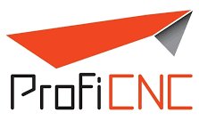
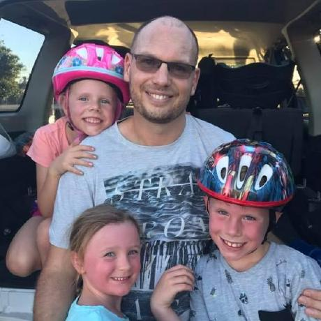
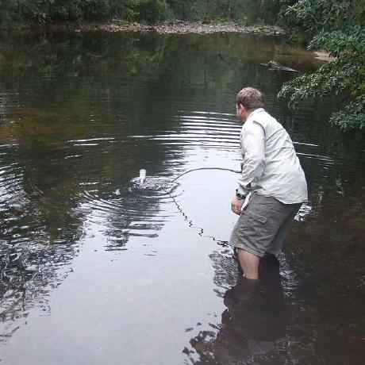
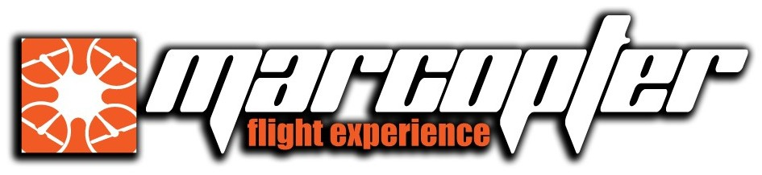
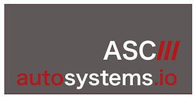
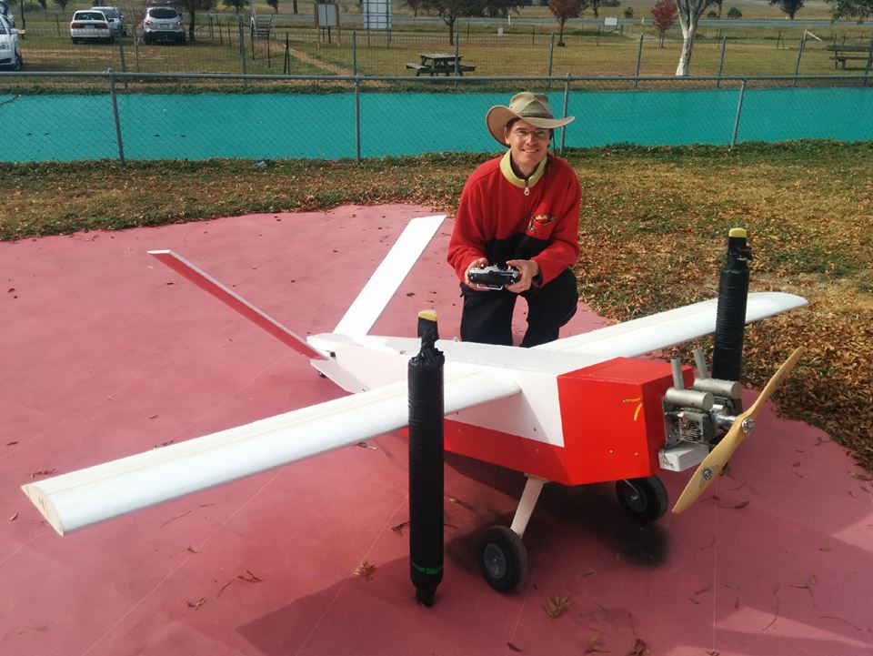
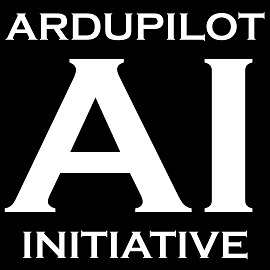
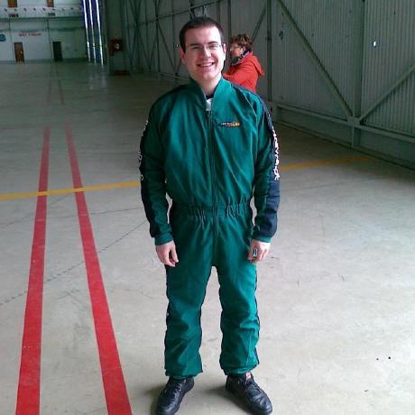
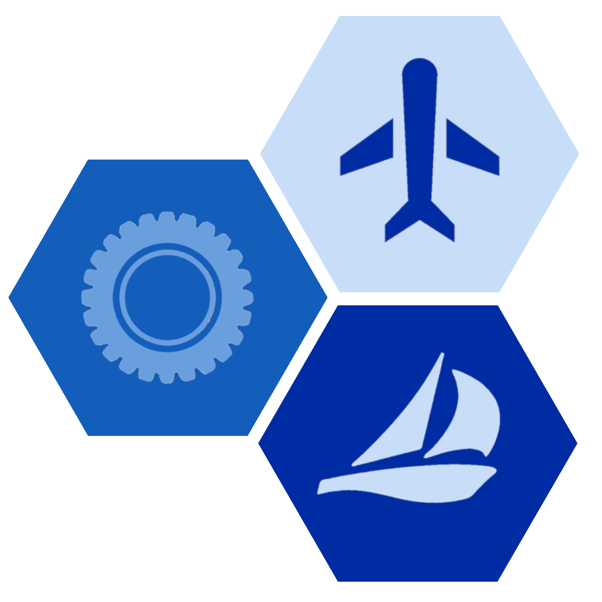

.. _common-commercial-support:

==================
Commercial Support
==================

The following is a list of individuals and companies that can provide commercial (i.e. paid)
support for ArduPilot including vehicle design, tuning, log analysis, bug fixes and enhancements.

.. tip::

   This is for commercial support.  For unpaid support by volunteers please visit the `forums <https://discuss.ardupilot.org/>`__

.. raw:: html

    <table border="1" class="docutils">
    <colgroup>
    <col width="20%" />
    <col width="80%" />
    </colgroup>
    <thead valign="bottom">
    <tr class="row-odd">
        <th class="head">Provider</th>
        <th class="head">Description</th>
    </tr>
    </thead>
    <tbody valign="top">
    <tr class="row-even">
        <td>
  Mexico
</td>
        <td>

            
Jaime Machuca, <a href="mailto:jaime@element.aero?Subject=ArduPilot%20commercial%20support" target="_top">jaime@element.aero</a>, tel:+52 33 3805 4627

            
 

            
Vehicle Design/Integration, Vehicle Setup

            
Trouble Shooting and support (log review, vehicle support)

            
Customization of ArduPilot code, Companion Computer setup

            

        </td>
    </tr>
    <tr class="row-odd">
        <td>
  Australia
</td>
        <td>

            
Philip Rowse, <a href="mailto:Philip@proficnc.com?Subject=ArduPilot%20commercial%20support" target="_top">Philip@proficnc.com</a>

            
 

            
Philip has years of experience designing autopilot hardware

            
including the Pixhawk2 which is used in the 3DR Solo.

            
Autopilot Hardware design, Accessory customization, Mechanical

            
consulting, Systems engineering, Intricate knowledge of Pixhawk

            

        </td>
    </tr>
    <tr class="row-even">
        <td>
  Australia
</td>
        <td>

            
Leonard Hall, <a href="mailto:leonard@freespacesolutions.com.au?Subject=ArduPilot%20commercial%20support" target="_top">leonard@freespacesolutions.com.au</a>

            
 

            
Leonard is responsible for ArduPilot’s multicopter attitude,

            
navigation and motor control libraries and developed AutoTune.

            
Multirotor Tuning,Airframe design and performance optimisation

            
Navigation and attitude controller features,Flight mode design

            

        </td>
    </tr>
    <tr class="row-odd">
        <td>
  Canada
</td>
        <td>

            
Bill Bonney, <a href="mailto:bill@communistech.com?Subject=ArduPilot%20commercial%20support" target="_top">bill@communistech.com</a>

            
 

            
provides bespoke software development needs for ArduPilot and

            
other UAV ecosystems including emerging IoT and wearables tech

            
Ground Control Station development (Qt, iPhone/iPad/iOS, Android)

            
Autopilot Firmware Development &amp; Technical Support

            

        </td>
    </tr>
    <tr class="row-even">
        <td>
  Thailand
</td>
        <td>

            
Jani Hirvinen, <a href="mailto:jani@jdrones.com?Subject=ArduPilot%20commercial%20support" target="_top">jani@jdrones.com</a>, +66 (0)2 726 8540

            
 

            
jDrones is a leading integrator of ArduPilot into small UAVs

            
Autopilot/Airframe/Electronics design and manufacturing

            
Accessory customization, Mechanical engineering/consulting

            
Software engineering, Training services, Maintenace, GCS design

            

        </td>
    </tr>
    <tr class="row-odd">
        <td>
  Italy
</td>
        <td>

            
Laser Navigation SRL, <a href="mailto:info@virtualrobotix.com?Subject=ArduPilot%20commercial%20support" target="_top">info@virtualrobotix.com</a>

            
 

            
Customization of Nuttx OS, ArduPilot and Mission Planner

            
New vehicle design, integration, setup and support

            
Troubleshooting and support (log review, vehicle support)

            
Custom design of advanced Companion Computer, ROS integration

            

        </td>
    </tr>
    <tr class="row-even">
        <td>
  Australia
</td>
        <td>

            
RFDesign Pty Ltd, <a href="mailto:info@rfdesign.com.au?Subject=ArduPilot%20commercial%20support" target="_top">info@rfdesign.com.au</a>, +61 (0)7 3272 8769

            
 

            
Designers and Manufacturers of long range telemetry solutions

            
(RFD900), Antenna design and placement for UAV platforms, System

            
integration of sensors, Custom circuit and PCB design, Prototypes

            
manufacturing support for Prototype and Volume production

            

        </td>
    </tr>
    <tr class="row-odd">
        <td>
  Italy
</td>
        <td>

            
Marco Robustini, <a href="mailto:robustinimarco@gmail.com?Subject=ArduPilot%20commercial%20support" target="_top">robustinimarco@gmail.com</a>, +393381060074

            
 

            
ArduCopter lead tester, Autopilot/Airframe/Electronics design,

            
Manufacturing, Troubleshooting and support, Navigation and

            
Attitude controller features, Systems engineering/consulting

            
Mechanical engineering/consulting, Training and testing services

            

        </td>
    </tr>
    <tr class="row-even">
        <td>
  Australia
</td>
        <td>

            
David Buzz Bussenschutt, <a href="mailto:davidbuzz@gmail.com?Subject=ArduPilot%20commercial%20support" target="_top">davidbuzz@gmail.com</a>

            
 

            
Consultation Services, Customizations of ArduPilot code

            
Microcontroller Development including Pixhawk (ARM Cortex),

            
RFD900/SiK (8051), esp8266 wifi, Web Software Development

            
Ground Control Station development, Vehicle Design.

            

        </td>
    </tr>
    <tr class="row-odd">
        <td>
  USA
</td>
        <td>

            
Bill Bonney, Patrick Krekelberg, <a href="mailto:info@autosystems.io?Subject=ArduPilot%20commercial%20support" target="_top">info@autosystems.io</a>

            
 

            
More than just consulting, offers complete end-to-end solutions

            
Autopilot/Airframe/Electronics design and manufacturing,

            
Mechanical engineering/consulting, Systems engineering/consulting

            
Software engineering for autopilots, Application dev

            

        </td>
    </tr>
    <tr class="row-even">
        <td>
  Australia
</td>
        <td>

            
Andrew Tridgell, <a href="mailto:andrew@aerialrobotics.com.au?Subject=ArduPilot%20commercial%20support" target="_top">andrew@aerialrobotics.com.au</a>

            
 

            
ArduPilot lead developer. Can help your business make the most of

            
ArduPilot. From feature development to log analysis and Tuning.

            
Andrew has the experience and expertise in all areas of ArduPilot

            
Experienced with international clients large and small

            

        </td>
    </tr>
    <tr class="row-odd">
        <td>
  USA
</td>
        <td>

            
ArduPilot Initiative, <a href="mailto:info@ardupilotinitiative.com?Subject=ArduPilot%20commercial%20support" target="_top">info@ardupilotinitiative.com</a>

            
 

            
ArduPilot Initiative provides tailored services to professional

            
and commercial users of ArduPilot. Services include log analysis,

            
new features, integrating sensors/payloads, developing hardware

            
and tuning assitance

            

        </td>
    </tr>
    <tr class="row-even">
        <td>
  Ukraine
</td>
        <td>

            
Aerotech LLC, <a href="mailto:info@avia-technologies.com?Subject=ArduPilot%20commercial%20support" target="_top">info@avia-technologies.com</a>

            
 

            
Consultation Services, Customizations of ArduPilot code, Airframe

            
Custom electronics and mechanical design and manufacturing,

            
Plane Setup, Training and testing, Groundstation systems design

            
Groundstation systems design and manufacturing

            

        </td>
    </tr>
    <tr class="row-odd">
        <td>
  Portugal
</td>
        <td>

            
Francisco Ferreira, <a href="mailto:ardupilot@oxinarf.pt" target="_top">ardupilot@oxinarf.pt</a>

            
 

            
Leveraging the experience as ArduPilot's code reviewer, Francisco

            
provides consulting services, especially focused on custom firmware

            
development and support.

            

        </td>
    </tr>
    <tr class="row-odd">
        <td>
  United States
</td>
        <td>

            
AION ROBOTICS, <a href="mailto:info@aionrobotics.com" target="_top">info@aionrobotics.com</a>

            
 

            
Largest manufacturer of professional ArduPilot ground vehicles.

            
Provides commercial integration services, development and support.

            

        </td>
    </tr>
    <tr class="row-odd">
        <td>
  Germany
</td>
        <td>

            
UAV-DEV GmbH, Mirko Denecke, <a href="mailto:info@uav-dev.com" target="_top">info@uav-dev.com</a>

            
 

            
ArduPilot integration, setup, support and troubleshooting.

            
Customizations of ArduPilot code, ArduPilot ROS integration.

            

        </td>
    </tr>
    <tr class="row-odd">
        <td>
  USA
</td>
        <td>

            
ELECTRIC KITE, Brandon MacDougall, <a href="mailto:BrandonM@west.net" target="_top">BrandonM@west.net</a>

            
 

            
3D organic designer/modeller, simulation for the ArduPilot community.

            
Airframe building, testing and consulting, troubleshooting.

            

        </td>
    </tr>
    <tr class="row-odd">
        <td>
  France
</td>
        <td>

            
Hivebotics, Pierre Kancir, <a href="mailto:pierre.kancir@hivebotics.fr" target="_top">pierre.kancir@hivebotics.fr</a>

            
 

            
With several years of developpement with ArduPilot, Pierre

            
provides consulting services focused on code customization,

            
review and support.

            
Experienced in testing both on real and simulation,

            
he can help to bring an automated testing framework.

            

        </td>
    </tr>
    <tr class="row-odd">
        <td>
  UK
</td>
        <td>

            
KH Unmanned, Matthew Kear and Peter Hall, <a href="mailto:info@khunmanned.com" target="_top">info@khunmanned.com</a>

            
 

            
Consulting services include: ArduPilot code development (C++, Lua)

            
specialising in vehicle dynamics. Vehicle setup support and log

            
analysis. For UK-based clients we offer a tuning service.

            
Mechanical analysis (FEA). Aerodynamic analysis (CFD).  

            

        </td>
    </tr>
    </tbody>
    </table>

-----------------------------------

How to get added to this list
=============================

If you or your company wants to be listed here please email partners@ardupilot.org.
To be added to this page we request the applicant has made a contribution to ArduPilot
or a related project in some way. This includes code, documentation or helping
people on the forums. The intention with this policy is to ensure that companies
listed here will be active participants in the community.

    

            

[copywiki destination="copter,plane,rover,planner,planner2,antennatracker,dev,ardupilot,mavproxy"]
