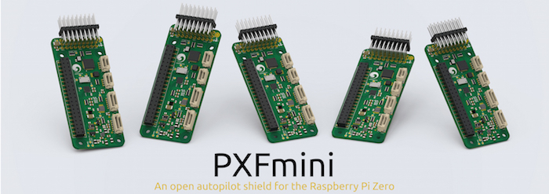
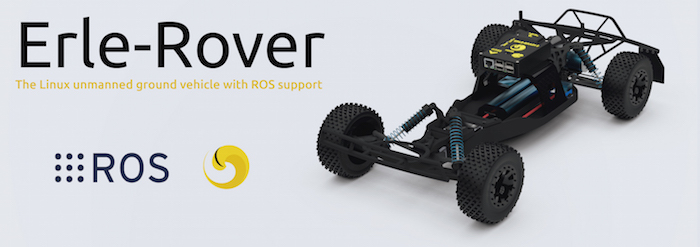

.. _common-commercial-support:

==================
Commercial Support
==================

We are proud to provide the following list of individuals and companies
who can provide commercial support for ArduPilot. We hope this will help
you get the most out of the ArduPilot project.

.. tip::

   This is for commercial support, not first tier technical support,
   please don't expect responses to enquiries that can be answered on the
   `forums <http://discuss.ardupilot.org/>`__ 

How to get added to this list
=============================

If you want to be listed here (and you or your company provide paid-for
support for ArduPilot) please email the request to `the ArduPilot team <mailto:ardupilot.devel@gmail.com>`__.

.. tip::

   Please help keep this information up to date. If you find a listed
   company/individual cannot be contacted please notify `the ArduPilot team <mailto:ardupilot.devel@gmail.com>`__ so we can remove them! 

Support Providers
=================

Droidika S.A. de C.V.
---------------------

Circunvalacion Ote #689

Col. Ciudad Granja

Zapopan, Jal. 45030

Mexico

Contact: Jaime Machuca

Tel.: +52 33 3777 5327

Email: jaime@droidika.com

**Capabilities:**

-  Vehicle Design/Integration
-  Vehicle Setup
-  Trouble Shooting and support (log review, vehicle support)
-  Local 3DR Service site for Mexico (tier 1 and tier 2)
-  Customization of Ardupilot code
-  Companion Computer setup

--------------

ProfiCNC
--------

424 Nicholson Street

Black Hill  VIC  3350

Australia

Contact: Philip Rowse

Email: Philip@proficnc.com

Web: www.proficnc.com

Philip has years of experience designing autopilot hardware including
the Pixhawk2 which is used in the 3DR Solo.

**Capabilities:**

-  Autopilot Hardware design
-  Accessory customization
-  Mechanical consulting
-  Systems engineering
-  Intricate knowledge of the Pixhawk system (designer of  Pixhawk 2,
   and Pixhawk Fire)
-  Co-designed the PX4 CAN ESC

--------------

Leonard Hall
------------

Contact: Leonard Hall

Email: leonardthall@gmail.com

Leonard is responsible for many core pieces of Ardupilot's multicopter
code including critical parts of the attitude, navigation and motor
control libraries.  He also developed the multicopter "AutoTune" feature
and is generally considered the expert in tuning Ardupilot's multicopter
vehicles.  He was responsible for discovering the ideal tune for many of
3DR's vehicles including the IRIS, Y6, X8, Spectre and Solo.  He also
developed the Ardupilot tune for the Bebop1 and Bebop2.

**Capabilities:**

-  Multirotor Tuning
-  Airframe design and performance optimisation
-  Navigation and attitude controller features
-  Flight mode design and implementation
-  Troubleshooting and support (log review, vehicle support)

--------------

Communis Tech Inc.
------------------

Contact: Bill Bonney

Email: \ bill@communistech.com

DIYDrones: \ http://diydrones.com/profile/BillBonney

web: http://www.communistech.com/

Capabilities:

Communis Tech Inc provides bespoke software development needs
for ArduPilot and other UAV ecosystems including emerging IoT and
wearables tech. Communis Tech Inc. is based in Vancouver, Canada.

-  Ground Control Station development (Qt, iPhone/iPad/iOS, Android)
-  Autopilot Firmware Development & Technical Support
-  Microcontroller Development
-  Bluetooth Development (Classic 2.0 and Low Energy 4.x)
-  WiFi Development

--------------

jDrones Asia
------------

Contact: Jani Hirvinen

Email: \ jani@jdrones.com

Location: Thailand/SE-Asia

Website: `jdrones.com <http://jdrones.com>`__

jDrones is a leading integrator of ArduPilot into small UAVs. Since
creating the original ArduCopter frame design in 2010 jDrones has grown
to provide a wide range of components and consulting services, and is
always looking to provide innovative solutions to the needs of both
hobbyist and professional users

**Capabilities:**

-  Autopilot/Airframe/Electronics design and manufacturing
-  Accessory customization
-  Mechanical engineering/consulting
-  Systems engineering/consulting
-  Software engineering
-  Original ArduCopter designer/manufacturer
-  Training services
-  Maintenance services
-  Groundstation systems design/manufacturing

--------------

Grant Morphett
--------------

Contact: Grant Morphett

Email: grant@gmorph.com

Location: Canberra/Australia

**Capabilities:**

I spend all my time developing the ArduPilot software and operating
vehicles such as Planes, Multirotors, Rovers & Boats to test the
software and subsequently analysing logs.

-  ArduPilot software developer all vehicle types
-  ArduPilot Rover maintainer
-  Troubleshooting and support (log review, vehicle support)

--------------

Erle Robotics
-----------------

- Website: `erlerobotics.com <http://erlerobotics.com>`__
- Email: contact@erlerobot.com
- Documentation: `Erle Robotics docs <http://erlerobotics.com/docs>`__
- Phone: +34 945 30 68 20

\ **Bilbao Offices, Spain**

Calle Uribitarte 6 2a planta

Bilbao 48001 

Vizcaya, Spain 

**Vitoria Offices, Spain**

Calle Venta de la Estrella, 6 Pab. 130

Vitoria-Gasteiz 01006

Álava, Spain

**Capabilities:**

-  Autopilot hardware design (creators of
   `Erle-Brain <https://erlerobotics.com/blog/product/erle-brain/>`__,
   `Erle-Brain 2 <https://erlerobotics.com/blog/product/erle-brain-v2/>`__ and
   several shields for Linux autopilots e.g.: the
   `PXFmini <http://erlerobotics.com/blog/product/pxfmini/>`__)
-  Deep understanding of the APM code
-  Vehicle design, integration and setup
-  Troubleshooting and support (log review, vehicle support)
-  New vehicle creation and support
-  Robot Operating System (ROS) commercial support
-  Robot Operating System 2 (ROS 2) commercial support
-  Robot and drone simulation services using Gazebo

--------------

Laser Navigation SRL (Virtualrobotix)
-------------------------------------

**Contact:**

Email: \ info@virtualrobotix.com

Phone: +390363968520

Website and shop:
`www.virtualrobotix.it <http://www.virtualrobotix.it/index.php/it-IT/>`__

Community: `www.virtualrobotix.com <http://www.virtualrobotix.com>`__

Skype: virtualrobotix

*Address:*

Via Matteotti,34

Calcio (BG) - 24054 -

Italy

**Capabilities:**

Autopilot hardware design :

-  VR Brain 5: Professional Level Flight Control Board support : APM
   Copter , Plane , Rover based on STM32F4 micro controller.
-  VR uBrain 5: Entry Level Flight Control Board support : APM Copter ,
   Plane , Rover based on STM32F4 micro controller.
-  VR Brain LX: R&D support : APM Copter, Plane , Rover based on RPI2
   core CPU
-  VR Brain 6 core : Professional Level Flight Control Board support :
   APM Copter , Plane , Rover based on STM32F4-F7 (WIP) micro
   controller.
-  VR GPS 8: Advanced GNSS system support GPS , GLONASS , EGNOSS, BEIDU
   constellation and integrate HMC5983 magnetometer.
-  VR Link: Telemetry module on 868 - 433 mhz support VR Brain and
   uBrain .

Software and firmware development :

-  Support customization of Nuttx operating system and ArduPilot
   functionality.
-  Support customization of Mission Planner and VR Pad Station
   application ( Ground Station based on Android Operating Systems).
-  Vehicle design, integration and setup
-  Troubleshooting and support (log review, vehicle support)
-  New vehicle creation and support
-  Custom design of advanced Companion Computer , integration with ROS
   and support in development of SLAM advanced functionality and
   advanced payload managment.
-  Advanced support of startup projectss (some kickstarter drone
   companies develop products with support of our dev team).

--------------

RFDesign Pty Ltd
----------------

**Contact:**

Email: info@rfdesign.com.au

Phone: +61 (0)7 3272 8769

Website: http://rfdesign.com.au

-  Designers and Manufacturers of long range telemetry solutions
   (RFD900)
-  Antenna design and placement for UAV platforms
-  System integration of sensors
-  Custom circuit and PCB design
-  Manufacturing support for Prototype and Volume production

--------------

Marcopter
---------

.. image:: ../../../images/marcopter_logo.jpg
    :target: ../_images/marcopter_logo.jpg

Contact: Marco Robustini

Email: \ robustinimarco@gmail.com

Location: Italy

Phone: `+393381060074 <tel:%2B393381060074>`__ Website: `www.marcopter.com <http://www.marcopter.com>`__

Youtube: https://www.youtube.com/user/erarius

Community: https://www.facebook.com/groups/edexpert

Skype: erario

Since 2001 I have been the lead tester of “APM:Copter”, with all the
“Ardupilot” software i’ve achieved almost 5.000 flight hours. I’m
“Autopilot Specialist”, i work with many drones companies as a
consultant and test pilot.

-  APM:Copter lead tester
-  Autopilot/Airframe/Electronics design, manufacturing, system
   integration and and performance optimisation
-  Troubleshooting and support (log review, vehicle support)
-  Navigation and attitude controller features
-  Systems engineering/consulting
-  Mechanical engineering/consulting
-  Training and testing services
-  Maintenance services

--------------

David "Buzz" Bussenschutt
-------------------------

**Contact:**

10 Seidler St

Yeronga QLD 4104

Australia

Contact: David "Buzz"

Email: davidbuzz@gmail.com

Web: <coming soon>

**Capabilities:**

-  Consultation Services
-  Customizations of Ardupilot/APM code
-  Microcontroller Development - including Arduino/APM(atmel),
   Pixhawk/PX4(ARM Cortex), RFD900/SiK (8051), esp8266 wifi (Tensilica
   RISC) etc.

   Web Software Development - HTML, PHP, SQL , Javascript, etc
-  Server/Network Systems Administration/Integration - including
   Private, Cloud, AWS, Google etc
-  Ground Control Station development - Mission Planner tweaks, MavProxy
   modules, dronekit
-  Vehicle Design/Integration - Plane and Copter
-  Vehicle Setup - Plane and Copter
-  Mechanical consulting
-  Systems engineering
-  Companion Computer setup
-  Trouble Shooting and support (log review, vehicle support)
-  Autopilot Hardware and/or Accessory customization

--------------

Autonomous Systems Cooperative (ASC///)
---------------------------------------

.. image:: ../../../images/asc-logo-small.png
    :target: ../_images/asc-logo-small.png

Contact: Bill Bonney, Rob Lefebvre or Patrick Krekelberg

Email: \ info@autosystems.io 

Location: North America

Website: `http://autosystems.io <http://autosystems.io>`__

ASC is founded by two core developers from the ArduPilot ecosystem and has close connections with ArduPilot developers around the world.

ASC offer more than just consulting on Ardupilot code, but complete end-to-end solutions. R&D, vehicle design, rapid prototyping micro-manufacturing, program management, autopilot code, payload integration, user interfaces.  ASC also offer assistance with operations, flight training, etc.  As little or as much as required to get customer’s ideas off the ground, or along it!  Companies can focus on integrating mobile robotics into their business and developing new revenue streams, instead of having to undertake the long and difficult process of developing UAS expertise and technology in-house.

**Capabilities:**

-  Autopilot/Airframe/Electronics design and manufacturing
-  Mechanical engineering/consulting
-  Systems engineering/consulting
-  Software engineering for flight controllers
-  Application development (Qt, iOS, Android, Windows)

--------------

AerialRobotics Australia Ptd Ltd
--------------------------------

.. image:: ../../../images/aerialrobotics.jpg
   :target: ../_images/aerialrobotics.jpg

Contact: Andrew Tridgell

Email: andrew@aerialrobotics.com.au

Location: Canberra, Australia

Website: http://aerialrobotics.com.au

AerialRobotics Australia can help your business make the most of
ArduPilot. From custom feature development to log analysis and tuning,
Andrew has the experience and expertise to maximise the benefit you
get from the ArduPilot platform.

Andrew is a lead developer of fixed wing support for ArduPilot, along
with the lead developer for all QuadPlane variants and the systems
lead for ArduPilot sensors, hardware drivers and platform
support. Aerialrobotics Australia is experienced at working with
international clients to provide top quality support anywhere in the
world.

--------------            

.. note::

   To be added to this page we require that the applicant has made a
   contribution to ArduPilot or a related project in some way. That
   includes code, documentation or helping people out on the forums. The
   intention with this policy is to ensure that companies listed here will
   be active participants in the community.

[copywiki destination="ardupilot,copter,plane,rover,planner,planner2,antennatracker,dev"]
