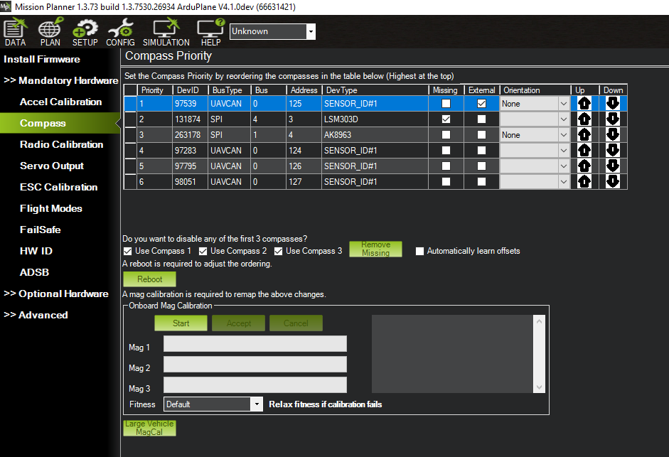

.. _common-compass-setup-advanced:

======================
Advanced Compass Setup
======================

This article provides advanced guidance for how to setup the system compass(es) and advanced compass related features.

.. tip::

   Users who have only internal compasses or an external compass using a UBlox GPS + compass combination,such as :ref:`UBlox GPS + Compass Module <common-installing-3dr-ublox-gps-compass-module>`, and have mounted it in the default orientation can usually perform a simple "Onboard Calibration" as described in :ref:`Compass Calibration <common-compass-calibration-in-mission-planner>`).

Overview
========

Accurately setting up the compass is critical because it is the primary
source of heading information. Without an accurate heading the vehicle
will not move in the correct direction in autopilot modes (i.e. AUTO,
LOITER, PosHold, RTL, etc). This can lead to circling (aka
"toiletbowling") or fly-aways.

ArduPilot allows multiple compasses to be connected, but only three are used at one time. And usually, only the primary compass is used, unless there are consistency problems with its readings versus other compasses and/or other sensors. In this case, the autopilot will automatically determine which of the first three compasses to use.

While many autopilots have an internal compass or compasses, many applications will instead use an external compass. This provides more reliable data
than an internal compass because of the separation from other
electronics. See :ref:`common-autopilots` for details about the specific autopilot to determine how many built-in compasses the autopilot may have, if any.

Most users will only need to  perform the normal :ref:`Compass Calibration<common-compass-calibration-in-mission-planner>` but details are also given on the less-used  :ref:`CompassMot <common-compass-setup-advanced_compassmot_compensation_for_interference_from_the_power_wires_escs_and_motors>` 

Compass Settings
================

The *Mission Planner Compass Setup screen* can be found in menu
**Setup \| Mandatory Hardware \| Compass** in the sidebar. This
screen is used for setting compass ordering, priority, calibration, and use. No other settings are required for normal use.

   Mission Planner: Advanced Compass Setup and Calibration

Compass Ordering and Priority
-----------------------------

During boot, ArduPilot automatically detects the compasses present in the system, adds them to a list, and assigns the first three a priority (1-3) linked to their DEV ID (``COMPASS_PRIOx_ID``), according to the order in which they are discovered. This priority determines which compass is used by the EKF lanes. The primary compass (highest priority, 1) will be used by all lanes, and fallback to the next viable compass in the first three priorities, if the primary becomes unhealthy.

The list of discovered compasses and their priority is maintained across boots.

If a user wishes to change to a different compass for one of the three priorities, he can change the ``COMPASS_PRIOx_ID`` to that compass's ``COMPASS_DEV_IDx`` ID value. If a ``COMPASS_PRIOx_ID`` is set to zero, the compasses will be moved up contiguously, in order, to fill that priority slot on the next reboot. This is easily done in Mission Planner with the arrows on the right side.

.. warning:: never change a compass's ``COMPASS_DEV_IDx`` ID value manually and then reboot!

If a previously discovered compass is missing or not detected on boot, and is in one of the three priority positions, a pre-arm failure will occur warning the user. The user will need to either remove the compass from the priority position, or correct the problem in order to prevent the pre-arm failure. Mission Planner provides a button to remove an undetected compass on the above screen.

.. note:: Compasses not present or detected during a calibration will automatically be removed.

Compass Enables
---------------

Any one of the first three compasses can be disabled. This would leave only the remaining ones to be used by the autopilot. You may wish to disable any internal compasses if you are consistently seeing the “inconsistent compasses” pre-arm message often and you are sure that the external compass is calibrated.

  .. note::

      Compasses should always be enabled for Copter/Rover, but may be disabled (not recommended, if one is available) for Plane.

Orientation
-----------

The :ref:`AHRS_ORIENTATION<AHRS_ORIENTATION>` must be set correctly for the compass calibration to be successful. In addition,the :ref:`common-accelerometer-calibration` should be completed before the Compass Calibration.

The setting of the orientation of external compasses is no longer required. It's determined automatically during calibration now.

However, if the need to double-check the orientation of a compass should arise:

-  When rotating your aircraft through all axes each of the compasses should move in the same direction, and should be of approximately the same values:

- Northern Hemisphere:
   - Z-component should be *positive*
   - when pitching the vehicle down, the X component should *increase* in value
   - when rolling the vehicle right, the Y component should *increase* in value

- Southern Hemisphere:
   - Z-component should be *negative*
   - when pitching the vehicle down, the X component should *decrease* in value
   - when rolling the vehicle right, the Y component should *decrease* in value

Other parameters
----------------

Earlier versions of ArduPilot did not incorporate the world magnetic model database, and a locations magnetic declination might need to manually entered, or learned through flight. This is not necessary now. In addition, this allows the declination to be continuously updated on long distance flights. 

Also, learning the compass offsets in flight, instead of ground calibration, is an option for vehicles difficult to move in order to calibrate. But is not recommended, since the Large Vehicle MagCal option is now available. See :ref:`common-compass-calibration-in-mission-planner` page for details.

[site wiki="copter"]
.. _common-compass-setup-advanced_compassmot_compensation_for_interference_from_the_power_wires_escs_and_motors:

CompassMot — compensation for interference from the power wires, ESCs and motors
================================================================================

This is recommended for vehicles that have only an internal compass and
on vehicles where there is significant interference on the compass from
the motors, power wires, etc. CompassMot only works well if you have a
:ref:`battery current monitor <common-powermodule-landingpage>`
because the magnetic interference is linear with current drawn.  It is
technically possible to set-up CompassMot using throttle but this is not
recommended.

Please follow these instructions:

-  Enable the current monitor (aka :ref:`Power Module <common-powermodule-landingpage>`)
-  Disconnect your props, flip them over and rotate them one position
   around the frame.  In this configuration they should push the copter
   down into the ground when the throttle is raised
-  Secure the copter (perhaps with tape) so that it does not move
-  Turn on your transmitter and keep throttle at zero
-  Connect your vehicle's LiPo battery
-  Connect your autopilot to your computer with the usb cable
-  Open the **Initial Setup \| Optional Hardware \| Compass/Motor Calib** screen
-  Press the **Start** button

      .. image:: ../../../images/CompassCalibration_CompassMot.png
         :target: ../_images/CompassCalibration_CompassMot.png

-  You should hear your ESCs arming beep
-  Raise the throttle slowly to between 50% ~ 75% (the props will spin!)
   for 5 ~ 10 seconds
-  Quickly bring the throttle back down to zero
-  Press the **Finish** button to complete the calibration
-  Check the % of interference displayed.  If it is less than 30% then
   your compass interference is acceptable and you should see good
   Loiter, RTL and AUTO performance.  If it is 31% ~ 60% then the
   interference is in the "grey zone" where it may be ok (some users are
   fine, some are not).  If it is higher than 60% you should try moving
   your APM/PX further up and away from the sources of interference or
   consider purchasing an external compass (or 
   :ref:`GPS+compass module<common-positioning-landing-page>` (some of these)).

[/site]

.. _automatic-compass-offset-calibration:

Automatic Offset Calibration
============================

In the 4.0 releases of ArduPilot, an automatic offset learning feature is available. The :ref:`COMPASS_LEARN<COMPASS_LEARN>` parameter determines how this feature works. This is for advanced users and not recommended.

- If set to 3, the offsets will be learned automatically during flight, be saved, and this parameter reset to 0. Position control modes (Loiter, Auto, etc.) should not be used while the offsets are being learned.

.. note:: Setting :ref:`COMPASS_LEARN<COMPASS_LEARN>` to 1 or 2 is not recommended. These modes are deprecated and are either non-functional, or still in development.

  The procedure for :ref:`COMPASS_LEARN<COMPASS_LEARN>` = 3 is:

  1. set :ref:`COMPASS_LEARN<COMPASS_LEARN>` = 3. The message “CompassLearn: Initialised” will appear on the MP’s message tab (it does not appear in red letters on the HUD).
  2. “Bad Compass” will appear but this is nothing to be worried about. We will hopefully make this disappear before the final release.
  3. Arm and drive/fly the vehicle around in whatever mode you like, do some turns “CompassLearn: have earth field” should appear on MP’s message tab and then eventually “CompassLearn: finished”.
  4. If you want you can check the :ref:`COMPASS_LEARN<COMPASS_LEARN>` parameter has been set back to zero (you may need to refresh parameters to see this) and the COMPASS_OFS_X/Y/Z values will have changed.
  5. This method can also be evoked using the RCxOPTION for "Compass Learn". It will activate when the channel goes above 1800uS and automatically complete and save.

.. note: These methods do not fully calibrate the compass, like Onboard Calibration does, setting the scales and (in 4.0 vehicle releases) automatically determining the compass orientation.

Compass error messages
======================

-  **Compass Health**: The compass has not sent a signal for at least
   half a second.
-  **Compass Variance**: In the EKF solution, compass heading disagrees
   with the heading estimate from other inertial sensors. Clicking the
   EKF button on the Mission Planner HUD will show the magnitude of the
   error.
-  **Compass Not Calibrated**: The compass needs to be calibrated.
-  **Compass Offsets High**: One of your compass offsets exceeds 600,
   indicating likely magnetic interference. Check for sources of
   interference and try calibrating again.

Refining Calibration Parameters using a Flight Log
==================================================

The compass offsets, scales, diagonals, and even motor compensation can be determined from a flight dataflash log of the vehicle using an analysis utility. 

.. toctree::
    :maxdepth: 1

    Magfit Python Utility <common-magfit>