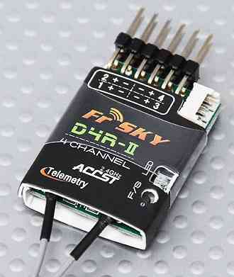

.. _common-compatible-rc-transmitter-and-receiver-systems-erle-brain-2:

=============================================================
Compatible RC Transmitter and Receiver Systems (Erle-Brain 2)
=============================================================

This article provides an overview of the RC Transmitter and Receiver
Systems that can be used with Erle-Brain 2, along with guidance on how
they are connected.

Overview
========

Erle-Brain 2 is compatible with PPM-Sum RC receivers. For traditional
single-wire-per-channel (PWM) receivers a `PPM encoder <http://www.hobbyking.com/hobbyking/store/catalog/62753.jpg>`__
can be used to convert the receiver outputs to PPM-SUM.

Officially supported RCs
========================

Turnigy TGY-i6
--------------

.. image:: http://www.hobbyking.com/hobbyking/store/catalog/62709s5(1).jpg
    :target: ../_images/62709s5(1).jpg

This RC receiver comes with 6 pin output, one per each PPM channel. As
Erle-Brain only accepts PPM-Sum input type, conversion from 8 PPM
channel to one PPM-Sum is needed.

This conversion is made using a PPM Encoder. This module sums up the 8
PPM channels into a PPM-Sum type, which is supported by Erle-Brain.

For more information see the
`manual <http://www.hobbyking.com/hobbyking/store/uploads/1022671243X1465900X53.pdf>`__
and the `offial documentation <http://erlerobotics.com/docs/Robots/Common_Parts/Radio_Control.html>`__.

Setting up connections
~~~~~~~~~~~~~~~~~~~~~~

Follow the next diagram to wire correctly RC receiver to the PPM
Encoder:

.. image:: http://erlerobotics.com/docs/img/Robots/common_parts/ppmencoder_connection.png
    :target: ../_images/ppmencoder_connection.png

.. note::

   This connection already done in Erle Kits.

FlySky TH9x
-----------

.. image:: http://www.deep-deal.com/media/catalog/product/f/s/fs-th9x-9ch-radio-model-rc.jpg
    :target: ../_images/fs-th9x-9ch-radio-model-rc.jpg

This RC has 9 channels and is highly recommended if you need to control
one or more optional components (for example a gimbal or EPM).

For more information, check out the
`manual <http://www.hobbyking.com/hobbyking/store/uploads/358697369X13667X46.pdf>`__.
In order to connect this module, you only need to follow
`this <http://erlerobotics.com/docs/Artificial_Brains_and_Autopilots/Erle-Brain_2/Hardware/RC_Input.html>`__
official documentation section.

.. note::

   You'll also need a PPM encoder to use this RC under
   Erle-Brain2

Other RCs
=========

In addition to the officially supported RCs, you can connect any PPM-SUM
type RC receiver.

Turnigy Transmitter Compatible With FRSky Transmitter Module
------------------------------------------------------------

.. image:: ../../../images/Turnigy9XR.jpg
    :target: ../_images/Turnigy9XR.jpg

FRSky Transmitter Adapter Module and PPM-Sum Receiver
-----------------------------------------------------

The FR-Sky PPM Sum Receiver and conversion module below will work with
Turnigy 9x, 9XR (above) and other RC transmitters.

FRSky makes several receivers, only some of which are compatible with
PPM-Sum. You can check for compatibility at `FRSky's web site <http://www.frsky-rc.com/product/product.php?cate_id=12&cate_name=Receivers>`__.

The receiver shown is PPM-Sum compatible and is recommended (4 channel
receivers still do 8 channel PPM-Sum).

.. note::

   The list above is from `pixhawk.org here <https://pixhawk.org/peripherals/radio-control/futaba/start?s[]=sbus#sbussbus_2>`__.
