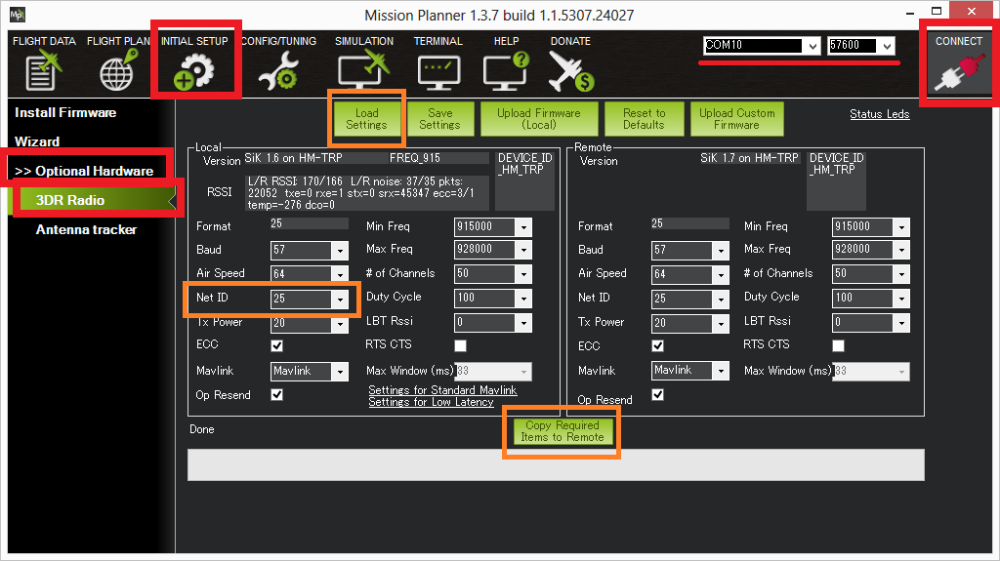

.. _common-configuring-a-telemetry-radio-using-mission-planner:

===================================================
Configuring a Telemetry Radio using Mission Planner
===================================================

This article explains how to configure Telemetry Radios using *Mission
Planner*.

.. tip::

   Many users will not need to configure their radios! One case where
   you might do so is when you use your vehicle with others — in which case
   you will need to specify different radio channels (Net ID).

Overview
========

*Mission Planner* supports configuring your radios using a simple GUI
interface.

To make changes:

-  Connect one of the radios to your computer using the micro USB cable.
-  Power the radio attached to the vehicle by plugging in the vehicle's
   battery.
-  Open the Mission Planner and go to the **Initial Setup \| Optional
   Hardware \| SiK Radio** page.
-  Select the correct COM port and set the baud rate to 57600. Ensure
   the "Connect" button is in a disconnected state as shown in the image
   below..
-  Press the **Load Settings** button and both the *Local* and *Remote*
   areas should fill in with values including the firmware Version

-  The most common entry to change is the ``Net ID``. The default is 25
   for most radios but if you plan to fly in an area with other pilots
   who may be using the same radio it is best to change this to another
   number.
-  After making changes, click the **Copy Required Items to Remote** and
   press **Save Settings**

Other parameters you may choose to update:

-  **Baud** (default 57) : the rate at which the mission planner or
   vehicle communicates with the local radio. "57" = 57600 bits per
   second.
-  **Air Speed** (default 64) : the rate at which the two radios will
   communicate with each other. "64" = 64kbps (kilobits per second).
   Setting a lower rate will increase the range of the radio but reduce
   the rate of data (i.e. the amount of data that can be sent in a given
   time) across the link.
-  **ECC** (default is "on"): controls whether error correction is on or
   off. When on "12/24 Golay error correcting code" is used which
   involves sending a 16 bit CRC byte along with the data to ensure that
   bad data is thrown away. Unfortunately this also halves the data rate
   across the link but it is recommended to leave ECC on especially when
   when the vehicle is far from home base because transmission errors
   increase greatly with distance.
-  **MAVlink** (default is "MAVLink") : this controls whether the
   transmission is optimised for MAVLink packets or not. Set to "Low
   Latency" if using a joystick or an android tablet's virtual joystick
   to manually fly the vehicle. Note that information on the radio
   signal strength (rssi) and error rate is only sent if this parameter
   is set to its default, "MAVLink".
-  **Tx Power** (default 20) : the transmission power where
   1=1.3milliWats, 2=1.5mW, 5=3.2mW, 8=6.3mW,11=12.5mW, 14=25mW,
   17=50mW, 20=100mW. This should be set to conform with your local
   regulations. 
   Some per-country information 
   :ref:`is linked here <common-telemetry-radio-regional-regulations>`.
-  **Duty Cycle** (default 100) : the maximum percentage of time that
   the radio will transmit packets. Some regions of the world allow for
   higher transmit power or more frequencies if you have a duty cycle
   below a given threshold. So for example in Europe you can transmit on
   a wider range of frequencies in the 433 band if your duty cycle is
   below 10%. Telemetry traffic is quite 'bursty', so the average
   transmit time is not generally high. When you set a duty cycle below
   100% then your available bandwidth will be reduced, so you will find
   it will only work well for telemetry at higher air speeds. A radio
   can be set to receive only by setting its Duty Cycle to zero.
-  **Max Window** (default 33) : ensure the GCS can send a packet to the
   vehicle ever 33msec. This should be kept as a low number (like 33)
   when the "MAVLink" setting is "Low Latency"
-  **LBT Rssi** (default 0) : holds the threshold used for "listen
   before talk" which allows it to comply with some country's regulatory
   requirements. When non-zero the radio listens for quiet period of
   time where no signals from other radios are received before
   transmitting. This parameter holds the receiver signal strength below
   which the airwaves are considered "quiet". If this param is set to
   zero then LBT is disabled. Setting this to 25 (the min) is -121 dBm.
   Each increment above 25 raises the threshold by about 0.5dB so for
   example 40 equals a signal strength of 7.5dB. The full formula is:

   ::

       signal_dBm = (RSSI / 1.9) - 127

   The LBT implementation in the radio uses a minimum listen time of
   5ms, plus randomised listen time as per the European 9.2.2.2 rules.
   Note that in many regions you need to implement LBT in conjunction
   with AFA (Adaptive Frequency Agility). The radio implements AFA as
   long as you have ``NUM_CHANNELS`` set to more than 1.
-  **RTS CTS** hardware flow control. If you are using a ArduPilot
   firmware version released after mid 2016 and you have connected your
   radio to Pixhawk Telem1 Telem2 or other RTS/CTS supporting telemetry
   port then you can activate this, or set it to auto to improve
   performance.
