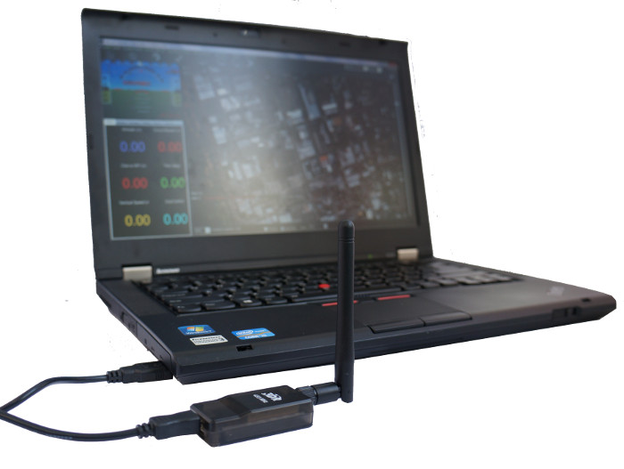
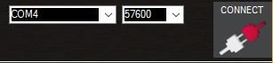

.. _common-connect-mission-planner-autopilot:

====================================
Connect Mission Planner to AutoPilot
====================================

This article explains how to connect *Mission Planner* to an autopilot
in order to receive telemetry and control the vehicle.

.. note::

   There are separate instructions for connecting in order to :ref:`Load Firmware <common-loading-firmware-onto-pixhawk>`.

Setting up the connection
=========================

To establish a connection you must first choose the communication
method/channel you want to use, and then set up the physical hardware
and Windows device drivers. You can connect the PC and autopilot using
USB cables, :ref:`Telemetry Radios <copter:common-telemetry-landingpage>`,
:ref:`Bluetooth <common-mission-planner-bluetooth-connectivity_detailed_connecting_with_mission_planner>`,
IP connections etc.

.. note::

   The driver for your connection hardware must be present on Windows
   as this makes your connection's COM port and default data rate available
   to *Mission Planner*.

.. figure:: ../../../images/pixhawk_usb_connection.jpg
   :target: ../_images/pixhawk_usb_connection.jpg
   :width: 450px

   Pixhawk USB Connection

   Connection using SiK Radio

On *Mission Planner*, the connection and data rate are set up using the
drop down boxes in the upper right portion of the screen.

Once you've attached the USB or Telemetry Radio, Windows will
automatically assign your autopilot a COM port number, and that will
show in the drop-down menu (the actual number does not matter). The
appropriate data rate for the connection is also set (typically the USB
connection data rate is 115200 and the radio connection rate is 57600).

Select the desired port and data rate and then press the **Connect**
button to connect to the autopilot. After connecting **Mission Planner**
will download parameters from the autopilot and the button will change
to **Disconnect** as shown:

.. tip::

   The "select port" dropdown also contains TCP or UDP port options
   that can be used to connect to an autopilot over a network.

Troubleshooting
===============

If Mission planner is unable to connect:

-  Check that the correct baud rate is used for the selected method
   (115200 on USB or 57600 on Radio/Telemetry)
-  If using a COM port on Windows, check that the connection's COM port
   exists in the Windows Device Manager's list of serial ports.
-  If using a USB port, try a different physical USB port
-  if using a UDP or TCP connection, check that your firewall is not
   blocking the IP traffic.

You should also ensure that the autopilot controller board has
appropriate ArduPilot firmware installed and has booted correctly (on
Pixhawk there are useful :ref:`LEDs <common-leds-pixhawk>` and
:ref:`Sounds <common-sounds-pixhawkpx4>` which can tell you the state of the autopilot).

Related topics
==============

:ref:`Mission Planner Bluetooth Connectivity <common-mission-planner-bluetooth-connectivity_detailed_connecting_with_mission_planner>`

[copywiki destination="copter,plane,rover,planner"]
