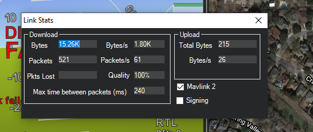
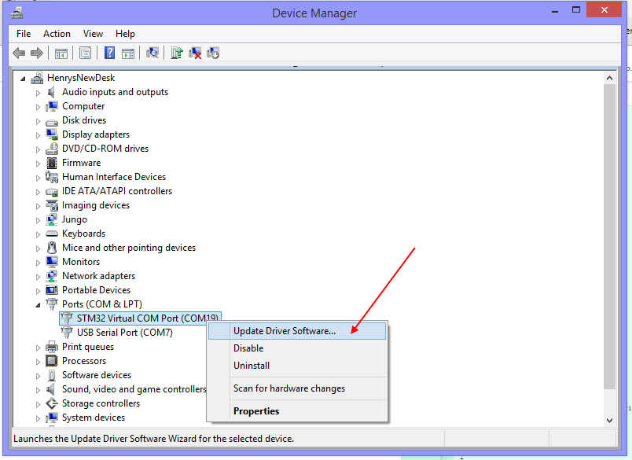
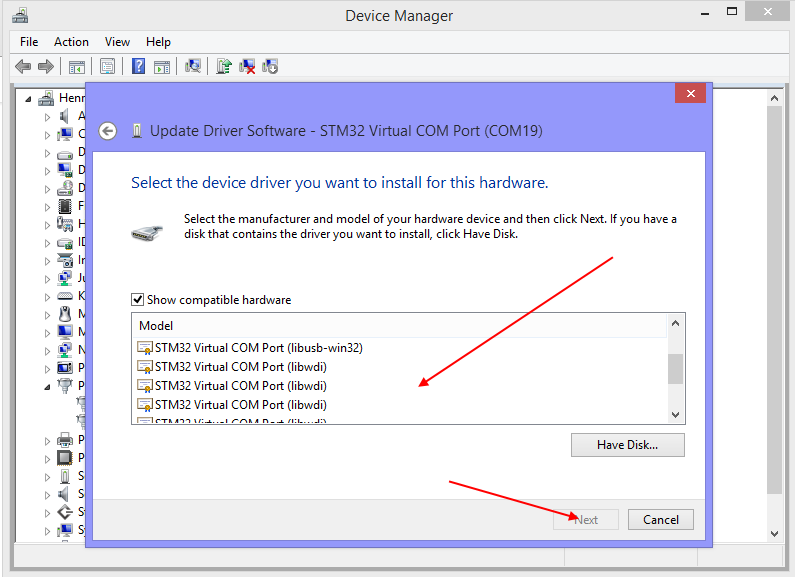

.. _common-connect-mission-planner-autopilot:

====================================
Connect Mission Planner to AutoPilot
====================================

This article explains how to connect *Mission Planner* to an autopilot
in order to receive telemetry and control the vehicle.

.. note::

   There are separate instructions for connecting in order to :ref:`Load Firmware <common-loading-firmware-onto-pixhawk>` for existing Ardupilot firmware installations, or for boards :ref:`without existing Ardupilot firmware <common-loading-firmware-onto-chibios-only-boards>` .

Setting up the connection
=========================

To establish a connection you must first choose the communication
method/channel you want to use, and then set up the physical hardware
and Windows device drivers. You can connect the PC and autopilot using
USB cables, :ref:`Telemetry Radios <copter:common-telemetry-landingpage>`,
:ref:`Bluetooth <common-mission-planner-bluetooth-connectivity_detailed_connecting_with_mission_planner>`,
IP connections etc.

.. note::

   The driver for your connection hardware must be present on Windows
   as this makes your connection's COM port and default data rate available
   to *Mission Planner*.

.. figure:: ../../../images/pixhawk_usb_connection.jpg
   :target: ../_images/pixhawk_usb_connection.jpg
   :width: 450px

   Pixhawk USB Connection

.. figure:: ../../../images/new-radio-laptop.jpg
   :target: ../_images/new-radio-laptop.jpg
   :width: 450px

   Connection using SiK Radio

On *Mission Planner*, the connection and data rate are set up using the
drop down boxes in the upper right portion of the screen.

.. image:: ../../../images/MisionPlanner_ConnectButton.png
    :target: ../_images/MisionPlanner_ConnectButton.png

Once you've attached the USB or Telemetry Radio, Windows will
automatically assign your autopilot a COM port number, and that will
show in the drop-down menu (the actual number does not matter). The
appropriate data rate for the connection is also set (typically the USB
connection data rate is 115200 and the radio connection rate is 57600).

Select the desired port and data rate and then press the **Connect**
button to connect to the autopilot. After connecting **Mission Planner**
will download parameters from the autopilot and the button will change
to **Disconnect** as shown:

.. image:: ../../../images/MisionPlanner_DisconnectButton.png
    :target: ../_images/MisionPlanner_DisconnectButton.png

.. tip::

   The "select port" dropdown also contains TCP or UDP port options
   that can be used to connect to an autopilot over a network.

The "Stats..." hotlink beneath the port selection box, if clicked, will give information about the connection, such as if :ref:`Signing security<common-MAVLink2-signing>` is active, link stats, etc. Sometimes this window pops up beneath the current screen and will have to be brought to the front to be seen.

Troubleshooting
===============

If Mission Planner is unable to connect:

-  Check that the correct baud rate is used for the selected method
   (115200 on USB or 57600 on Radio/Telemetry)
-  If attaching via USB, be sure that a few seconds after power up have passed before attempting to connect. If you attempted to connect during the bootloader initialization time, Windows may get the wrong USB information. Connection attempts after this may require that the USB connection be  unplugged and re-plugged,then wait for bootloader to enter the main code ( few seconds), then attempt the connection. Occasionally, MP must be restarted if an attempt to connect is made while in the bootloader initialization period.
-  If using a COM port on Windows, check that the connection's COM port
   exists in the Windows Device Manager's list of serial ports.
-  If your autopilot has an F7 or H7 processor and has CAN ports, then see the section below, :ref:`Troubleshooting Composite Connections <troubleshooting-composite-connections>` 
-  If using a USB port, try a different physical USB port
-  If using a UDP or TCP connection, check that your firewall is not blocking IP traffic

You should also ensure that the autopilot controller board has
appropriate ArduPilot firmware installed and has booted correctly (on
Pixhawk there are useful :ref:`LEDs <common-leds-pixhawk>` and
:ref:`Sounds <common-sounds-pixhawkpx4>` which can tell you the state of the autopilot).

If using a remote link (not USB) and Mission Planner connects, but does not download parameters or you cannot get commands, like mode changes acted upon,then the autopilot probably has Signing turned on. See :ref:`common-MAVLink2-signing`.

.. _troubleshooting-composite-connections:

Troubleshooting Composite Connections
=====================================

Autopilots with F7 or H7 processors and having CAN interfaces use firmware that presents two USB interfaces: One for the normal MAVLink connection, and one for SLCAN serial connections to the CAN interface for configuration and firmware updates.This is called a composite USB device.

By default, the MAVLink USB interface is SERIAL0 and the SLCAN USB interface is the highest SERIALx port the board presents. The Windows driver currently installed with Mission Planner may select to use either one, and since both are set by default in ArduPilot firmware for MAVLINK protocol, it will work fine, whichever one it chooses as the COM port. 

However, there is a situation where the user will find that it will not connect to the obvious COM port in the Mission Planner dropdown box.This occurs when the user accidentally changes the protocol of whichever SERIALx port the Windows driver is using as the MAVLink COM port to something other than MAVLink. This can easily happen if the user takes an existing parameter file from a vehicle configuration used with a different autopilot that has the protocol changed. For example, the user has a plane with non F7/H7 CAN capable autopilot and upgrades it to one that is, then loads his existing parameter file while setting up the plane with the new autopilot. As soon as the parameter file is loaded and the autopilot is rebooted, communication is lost and cannot be re-established. 

What has occurred, is that the protocol for the SERIALx port that Windows was using has been changed. Almost always, this is the highest numbered SERIALx port since that is commonly set to -1 on non-CAN capable autopilots, and the Windows COM port driver has selected this interface as the COM port instead of SERIAL0.

The procedure to recover is as follows:

.. _loading-composite-USB:

- Go to Windows Device Manager and find the COM port being used by the autopilot in the Ports listings. It will have the COM Port # you used to connect initially to Mission Planner. Right click and it will present "Update driver software" as one of the options. Click it.

- Click the "Browse my computer......" option and then click the "Choose from a list..." option and you will see this screen:

- Scroll down the top list until "Composite USB" option appears and click it.

- Now reconnect your autopilot to the PC and two COM ports will be presented. One will connect (the remaining one with MAVLink Protocol) and the other will not. If you do not connect to one, try the other. But DO NOT disconnect the autopilot from the PC or the composite driver will unload and you will have to start over.

- Now that you are connected to Mission Planner, change back the protocol of the Serialx port protocol to 2 (MAVLink2). You can now disconnect and reconnect the autopilot and it will present only one COM port and you should be able to connect from now on. Do not change this protocol from now on unless trying to utilize the SLCAN interface. It may be a bit unfamiliar since the Mission Planner SERIALx port being used is no longer the normal SERIAL0 but rather,the highest port, but this does not affect anything in the autopilot's configuration and operation.

Related topics
==============

:ref:`Mission Planner Bluetooth Connectivity <common-mission-planner-bluetooth-connectivity_detailed_connecting_with_mission_planner>`

[copywiki destination="plane,copter,rover,planner"]
