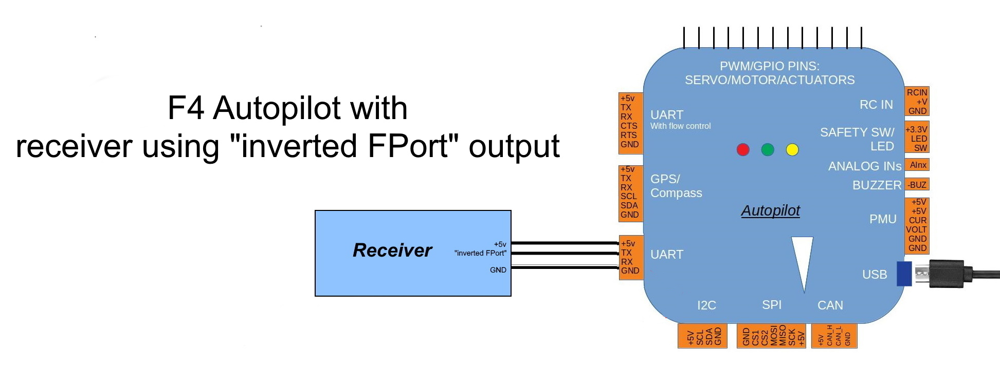
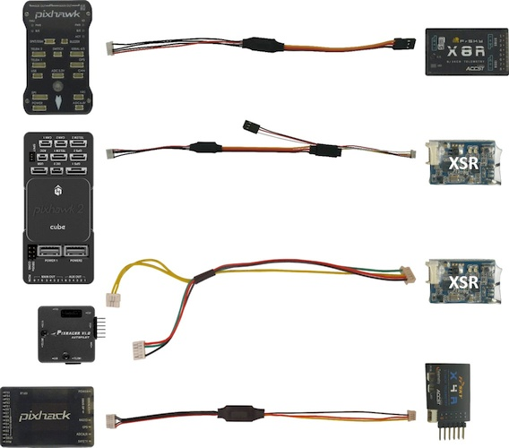

.. _common-connecting-sport-fport:

===================================
Connecting to FrSky Sport and FPort
===================================

Some FrSky receivers have the ability to relay telemetry data from the vehicle to the transmitter.

This was done initially via their SPort capability. And later, via an additional new protocol called :ref:`FPort<common-Fport-receivers>` which also includes the RC data to the autopilot.

In order to connect to these ports on the FrSky reciever, any UART on the autopilot (normally a "TELEM" port) is used. However, both SPort and FPort are bi-directional protocols and require signal inversion in both directions in order to interface to the autopilot's UART.

.. note:: if Sport is being used to send telemetry, then RC data must still be sent to the autopilot via its RCin pin as PPM or SBus from the FrSky receiver. See :ref:`common-flight-controller-wiring`.

If the autopilot uses an F7 or H7 processor, then this can be done by appropriately configuring the UART port on the autopilot. However, most F4 based autopilots do not have this capability and required inverters externally. A few F4 autopilots have these on the boards themselves and label the port "FrSky Telem", but most do not. Those require an added :ref:`bi-directional inverter <frsky_cables>` connected between the autopilot and the receiver's SPort or FPort.

.. note:: F4 autopilots with on-board inversion (Pixracer,MindPX V2) default to having the inversion on, only requiring that the TX and RX pins be tied together and connected to the Sport/Fport on the receiver and the appropriate ``SERIALx_PROTOCOL`` be set for that port.

In addition, some FrSky receivers provide an optional pad with the SPort or FPort already "inverted", so no external inversion is required if that is used. The various connection configurations are shown below (FPort is used in the diagrams, but just substitute SPort for the FPort labels in the images when using SPort connections):

Connections
===========

.. image:: ../../../images/FPort-wiring-a.jpg
    :target: ../_images/FPort-wiring-a.jpg

.. image:: ../../../images/FPort-wiring-c.jpg
    :target: ../_images/FPort-wiring-c.jpg

.. note:: some boards can have the FPort connected to the UARTs RX pin instead of TX pin as shown above. See :ref:`common-Fport-receivers` for more information.

.. _frsky_cables:

Bi-Directional Inverter cables
------------------------------

Craft and Theory Pixhawk to FrSky Telemetry Cables
^^^^^^^^^^^^^^^^^^^^^^^^^^^^^^^^^^^^^^^^^^^^^^^^^^

`Craft and Theory <http://www.craftandtheoryllc.com/product-category/frsky-smartport-telemetry-cables/>`__ supplies cost-effective all-in-one X-receiver cables with connectors for the various FrSky receivers.

Yaapu Telemetry Cable
^^^^^^^^^^^^^^^^^^^^^
On `Amazon <https://www.amazon.com/Telemetry-Converter-Pixhawk-Taranis-Receiver/dp/B07KJFWTCB>`__

DIY cable for SmartPort
^^^^^^^^^^^^^^^^^^^^^^^
You can make your own cable using the following components (Frsky no longer produces, but still is available from some E-Bay sellers):

.. image:: ../../../images/Telemetry_FrSky_Pixhawk-SPORT.jpg
    :target: ../_images/Telemetry_FrSky_Pixhawk-SPORT.jpg

-  TTL-to-RS232 converter such as the `FrSky FUL-1  <http://www.ebay.com/sch/i.html?_trksid=p2050601.m570.l1313.TR11.TRC1.A0.H0.Xfrsky+ful-1.TRS0&_nkw=frsky+ful-1&_sacat=0&_from=R40>`__
-  `SPC cable <https://www.ebay.com/sch/i.html?_from=R40&_trksid=m570.l1313&_nkw=frsky+spc+cable&_sacat=0&LH_TitleDesc=0&_osacat=0&_odkw=spc+cable>`_
-  `DF13 6 position connector <https://www.unmannedtechshop.co.uk/df13-6-position-connector-30cm-pack-of-5/>`__
   which will be cut and soldered to the TTL-to-RS232 converter
-  `Molex Picoblade <http://www.molex.com/molex/products/family?key=picoblade&channel=products&chanName=family&pageTitle=Introduction&parentKey=wire_to_board_connectors>`__
   4 position telemetry wire which will be cut and soldered to the
   TTL-to-RS232 converter (should be included with the receiver)

Or a more compact version using the following components:

-`MAX3232 RS-232 to TTL converter breakout board <https://www.ebay.com/sch/i.html?_from=R40&_trksid=m570.l1313&_nkw=max3232+rs-232+to+TTL&_sacat=0&LH_TitleDesc=0&_osacat=0&_odkw=max3232+breakout&LH_TitleDesc=0>`__

-Any silicon `diode <https://www.ebay.com/sch/i.html?_from=R40&_trksid=p2334524.m570.l1313.TR4.TRC1.A0.H0.X1n4148.TRS0&_nkw=1n4148&_sacat=0&LH_TitleDesc=0&_osacat=0&_odkw=1n4118&LH_TitleDesc=0>`__

 .. figure:: ../../../images/DIY_SPort_Cable.jpg
      :width: 50%
      :align: center

      DIY FRSky Smartport adapter cable

.. warning ::  DO NOT PLUG THE TELEMETRY CABLE TO THE AUTOPILOT OR RECIEVER WHILE POWER IS ON!