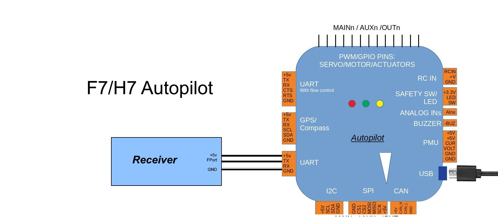

.. _common-connecting-sport-fport:

===================================
Connecting to FrSky Sport and FPort
===================================

Some FrSky receivers have the ability to relay telemetry data from the vehicle to the transmitter.

This was done initially via their SPort capability. And later, via an additional new protocol called :ref:`FPort<common-Fport-receivers>` which also includes the RC data to the autopilot.

In order to connect to these ports on the FrSky reciever, any UART on the autopilot (normally a "TELEM" port) is used. However, both SPort and FPort are bi-directional protocols and require signal inversion in both directions in order to interface to the autopilot's UART.

If the autopilot uses an F7 or H7 processor, then this can be done by appropriately configuring the UART port on the autopilot. However, most F4 based autopilots do not have this capability and required inverters externally. A few F4 autopilots have these on the boards themselves and label the port "FrSky Telem", but most do not. Those require an added bi-directional inverter connected between the autopilot and the receiver's SPort or FPort. in addition, some FrSky receivers provide an optional pad with the SPort or FPort already "inverted", so no external inversion is required if that is used. The various connection configurations are shown below (FPort is used in the diagrams, but just substitute SPort for the FPort labels in the images when using SPort connections):

Connections
===========

.. image:: ../../../images/FPort-wiring-a.jpg
    :target: ../_images/FPort-wiring-a.jpg

.. image:: ../../../images/FPort-wiring-b.jpg
    :target: ../_images/FPort-wiring-b.jpg

.. note:: some boards can have the FPort connected to the UARTs RX pin instead of TX pin as shown above. See :ref:`common-Fport-receivers` for more information.

